# EduScribe AI — Software Low-Level Design (LLD) Document

**Document Type:** Low-Level Design (LLD)
**Source of Truth:** EduScribe AI Technical Design Documentation
**Scope:** This document expands the existing EduScribe AI design documentation into a detailed engineering-level specification. No new architecture, technology, workflow, or feature is introduced. Every section below is a deeper elaboration of a section that already exists in the source documentation, preserving the same terminology, the same component boundaries, and the same design decisions.

---

## Table of Contents

1. Requirements
2. Features
3. Workflow
   - 3.1 End-to-End Pipeline
   - 3.2 Prompt Pipeline
4. Semantic Chunking
5. Chunk Data Model
6. Topic Detection
7. Knowledge Gap Analysis
8. Detailed Explanation Generation
9. Example Generation
10. Image Integration
11. Quality Gates
12. Markdown Generation
13. HTML Generation
14. PDF Generation
15. LLM Provider Architecture
16. LiteLLM
17. PydanticAI
18. Model Routing
19. Retry Strategy
20. Fallback Strategy
21. API Key Rotation
22. Backend Task Flow
23. Technology Stack
24. Important Notes

---

## 1. Requirements

### 1.1 Introduction
The Requirements chapter defines the contractual boundary of the EduScribe AI system — what the system must do (functional requirements), how well it must do it (non-functional requirements), and under what environmental assumptions it is expected to operate. In a Low-Level Design document, requirements are not aspirational statements; they are the criteria against which every downstream module (chunking, topic detection, explanation generation, provider management, export pipeline) is evaluated. Every subsequent chapter in this document exists specifically to satisfy one or more of the requirements defined here.

### 1.2 Design Objective
The objective of this chapter is to formally separate **what** the system must achieve from **how** it achieves it. This separation allows the architecture (multi-stage LLM pipeline, multi-provider fallback, semantic chunking, quality gates) to be justified against a fixed, traceable set of requirements rather than against ad-hoc engineering preference. Each requirement stated here is intentionally phrased so that it can be mapped one-to-one to a concrete module described later in this document.

### 1.3 Detailed Explanation

**Functional Requirements** describe the observable behavior of the system from the perspective of a student or instructor using EduScribe AI:

- The system must convert a lecture video into structured, in-depth educational notes rather than a brief summary. This requirement directly drives the "Atomic Generation" and "Pedagogical Depth" principles that shape the Detailed Explanation Generation module (Chapter 8).
- The system must extract and keep synchronized four distinct data streams per lecture: the audio transcript, the OCR-derived text from slides and whiteboards, timestamps, and extracted video frames. This requirement is the direct justification for the Chunk Data Model (Chapter 5), which is the structure responsible for holding all four streams together as a single unit.
- The system must detect lecture structure automatically — decomposing a lecture into macro-topics and then into micro-subtopics — rather than depending on manual tagging by an instructor or student. This is fulfilled by the Topic Detection module (Chapter 6).
- The system must generate standalone, pedagogically complete explanations per subtopic, covering intuition, examples, applications, and pitfalls. This is fulfilled jointly by Detailed Explanation Generation (Chapter 8) and Example Generation (Chapter 9).
- The system must export the final notes into Markdown, HTML, and PDF formats. This requirement is fulfilled by the three-stage export pipeline described in Chapters 12–14.
- The system must support multiple LLM providers with automatic failover, so that generation does not stop entirely because a single provider's quota is exhausted or the provider experiences an outage. This is fulfilled by the LLM Provider Architecture (Chapter 15) together with the Fallback Strategy (Chapter 20).
- The system must support future features such as quizzes, flashcards, mind maps, and RAG-based tutoring without requiring the entire video to be reprocessed. This requirement is satisfied structurally — not by building those features now, but by ensuring the Chunk Data Model and Knowledge Tree are reusable, persistent structures rather than transient computation artifacts.

**Non-Functional Requirements** describe the quality attributes the system must exhibit regardless of which feature is being executed:

- **Reliability** — the LLM layer must have no single point of failure. This is why the architecture never calls a single provider directly; it always routes through the LLM Manager, which is capable of switching providers transparently.
- **Scalability** — long-running AI operations (transcription, OCR, note generation, PDF rendering) must not block the request/response cycle of the API. This requirement is fulfilled through the Backend Task Flow (Chapter 22), which offloads these operations to asynchronous workers.
- **Maintainability** — provider-specific logic, prompt logic, business logic, and presentation logic must remain clearly separated so that a change in one layer does not force a change in another.
- **Cost-efficiency** — free-tier APIs must be prioritized, and computationally cheap tasks must be routed to lightweight models rather than to the most capable (and most expensive) model available. This requirement directly produces the Model Routing strategy (Chapter 18).
- **Auditability** — every prompt, response, latency measurement, token count, and cost figure must be logged, so that prompt quality and provider performance can be evaluated over time.

**Environmental Assumption** — the transcription component of the system (MLX Whisper) is explicitly built and optimized for Apple Silicon hardware. This is stated as a design fact in the source documentation, not as an incidental detail, and it has downstream implications for every module that depends on transcript availability, since transcript generation is the very first step of the pipeline.

### 1.4 Internal Workflow
Requirements do not have an "internal workflow" in the runtime sense — they are static constraints. However, they do have a **traceability workflow**: each functional requirement is decomposed into one or more modules, each module produces an output artifact, and that artifact is validated (via Quality Gates, Chapter 11) against the requirement that produced it. This traceability chain — Requirement → Module → Artifact → Validation — is what allows the system to claim, at any point, that it is meeting its stated requirements.

### 1.5 Design Rationale
Requirements were deliberately split into functional and non-functional categories because the two categories are validated differently. Functional requirements are validated by inspecting the output (does the note contain a worked example, a complexity analysis, a recap?). Non-functional requirements are validated by inspecting system behavior over time (did the pipeline continue functioning when a provider's quota was exhausted? did the API remain responsive while a 500MB video was being transcribed?). Keeping both categories explicit prevents a common failure mode in AI-generation systems, where "the output looks fine" is mistaken for "the system is reliable."

### 1.6 Advantages
- Provides a single, unambiguous reference point against which every module in this document can be justified.
- Makes the cost-efficiency requirement explicit early, which shapes every subsequent architectural decision involving LLM usage (chunking granularity, model routing, retry limits).
- Separates "what must be true of the output" from "what must be true of the system," avoiding conflation between content quality and system robustness.

### 1.7 Limitations
The environmental assumption tying transcription to Apple Silicon is a structural limitation baked directly into the requirements: since MLX Whisper is the transcription engine specified in the source documentation, the Requirements chapter implicitly inherits a platform dependency that affects the very first stage of the End-to-End Pipeline (Chapter 3.1).

### 1.8 Conclusion
The Requirements chapter is the foundation from which every other chapter in this LLD is derived. Functional requirements define the shape of the output (structured, subtopic-level, multi-format notes); non-functional requirements define the shape of the system that produces that output (reliable, asynchronous, cost-aware, auditable). Every module described in the remaining chapters exists because one of these requirements demanded it.

---

## 2. Features

### 2.1 Introduction
Where the Requirements chapter defines obligations, the Features chapter defines the concrete design principles and mechanisms EduScribe AI implements to satisfy those obligations. Each feature listed here corresponds to an architectural decision that recurs throughout the rest of the system — these are not surface-level capabilities but structural principles that govern how every module is built.

### 2.2 Design Objective
The objective of this chapter is to enumerate the core design principles that differentiate EduScribe AI's architecture from a naive "transcript-to-summary" pipeline, and to describe, at a conceptual level, the mechanism by which each principle is enforced.

### 2.3 Detailed Explanation

**Structural Discovery.** Before any explanatory content is generated, the system performs a diagnostic pass over the entire lecture — the Lecture Analysis stage. This diagnostic pass produces metadata (subject, difficulty, prerequisites, teaching style) that is consumed by every later stage. The principle underlying this feature is "understand before you generate": generation quality depends on the model already knowing the shape of the lecture before it begins writing about any single part of it.

**Atomic Generation.** Rather than producing one large document in a single LLM call, EduScribe AI generates notes on a per-subtopic basis. Each subtopic explanation is generated as an independent unit of work. This directly prevents the dilution problem inherent to global summarization, where detailed sub-concepts get compressed away because the model is trying to cover an entire lecture in one pass.

**Multimodal Integrity.** Every claim made in the generated notes must be traceable back to the source material — the audio transcript, the OCR text, the timestamp, and the visual frame. This is enforced structurally by the Chunk Data Model (Chapter 5), which binds all four data types together at the chunk level, so that no stage of the pipeline can process one modality (e.g., transcript) in isolation from the others (e.g., OCR, frames).

**Pedagogical Depth.** Output must read as an "explanation," not a "summary." This distinction is operationalized in the Detailed Explanation Generation prompt (Chapter 8), which explicitly instructs the model to explain the "why" behind a concept — including derivations, comparisons to alternative (less efficient) approaches, and internal reasoning — rather than restating what the instructor said.

**Holistic Framework.** Every major topic follows a fixed educational template: Intuition (conceptual hook) → Practical Examples → Real-World Applications → Common Pitfalls/Misconceptions → Synthesis Recap. This template is what gives every generated topic a consistent shape regardless of subject matter, whether the lecture is on Binary Search or on a different domain entirely.

**Token-Agnostic Quality.** The system places no artificial ceiling on the length of a generated explanation. Length is dictated exclusively by the complexity of the subtopic being explained. This principle is what necessitates multi-stage prompting in the first place — a single-pass summarization prompt could never produce token-agnostic depth, because it is inherently bounded by the practical limits of a single request.

**Multi-Provider LLM Layer.** Automatic provider failover, API key rotation, and task-based model routing together ensure that the token-agnostic, multi-stage generation strategy described above does not create a single point of failure. Because atomic, per-subtopic generation multiplies the number of LLM calls required per lecture, provider resilience is not optional — it is a structural requirement of the atomic generation feature itself.

**Semantic Chunking.** The lecture is divided according to conceptual boundaries rather than fixed token counts, with slight overlap between adjacent chunks to preserve continuity. This feature is the mechanism that makes Structural Discovery and Atomic Generation possible in practice — without semantically coherent chunks, topic detection and subtopic detection would operate on fragmented, boundary-broken input.

**Knowledge Tree.** All topic and subtopic mentions, even when a concept is revisited multiple times across the lecture, are deduplicated and merged into a single hierarchical structure. This feature directly prevents duplicate note generation for a concept the instructor returns to later in the lecture.

**Quality Gates.** Automated checks are applied to the generated content (e.g., "every algorithm must include a worked example"). Failed checks trigger regeneration of only the affected subtopic, not the entire document, keeping the correction process both targeted and cost-efficient.

**Image Integration.** OCR-derived diagrams, formulas, and handwritten notes are embedded directly next to the explanation section that discusses them, rather than being listed separately or ignored.

**Multi-Format Export.** The final notes are converted through a defined chain — Markdown → HTML → PDF — using Jinja2 templating, Markdown-it-py rendering, and WeasyPrint PDF generation, respectively.

**Observability.** Every prompt/response cycle is logged through Langfuse, capturing latency, token usage, and cost, so that prompt quality and provider performance remain measurable over time.

### 2.4 Internal Workflow
The features described above are not independent — they form a dependency chain. Semantic Chunking must occur before Structural Discovery can operate on coherent input. Structural Discovery (Lecture Analysis) must complete before Atomic Generation can begin, because atomic generation depends on the topic/subtopic hierarchy that Structural Discovery — via Topic Detection — produces. The Knowledge Tree depends on Atomic Generation having identified all topic occurrences across all chunks. Quality Gates operate after Atomic Generation, validating its output. Multi-Format Export is the terminal stage, operating only after Quality Gates have passed. Observability runs orthogonally throughout, capturing telemetry from every LLM-touching feature.

### 2.5 Design Rationale
Each feature exists to counteract a specific, named failure mode of naive summarization systems: Structural Discovery counteracts context-blind generation; Atomic Generation counteracts dilution; Multimodal Integrity counteracts unverifiable claims; Pedagogical Depth counteracts shallow restatement; the Holistic Framework counteracts inconsistent topic coverage; Token-Agnostic Quality counteracts premature truncation; the Multi-Provider LLM Layer counteracts single-vendor fragility; Semantic Chunking counteracts concept fragmentation; the Knowledge Tree counteracts duplication; Quality Gates counteract undetected omissions; Image Integration counteracts loss of visual context; and Multi-Format Export counteracts single-format lock-in for the end user.

### 2.6 Advantages
- Every feature is traceable to a specific requirement from Chapter 1, avoiding speculative or unjustified functionality.
- The features collectively form a pipeline where each stage's output is the next stage's precondition, which simplifies reasoning about failure (a defect can be localized to the stage whose precondition was violated).
- Because features like Quality Gates operate at subtopic granularity, correction cost stays proportional to the size of the defect rather than to the size of the document.

### 2.7 Limitations
Token-Agnostic Quality, while beneficial for depth, has a direct and unavoidable cost implication: an uncapped explanation length interacts with the free-tier, quota-limited nature of the LLM providers described in Chapter 15 — a feature already flagged in the source documentation as requiring active quota monitoring.

### 2.8 Conclusion
The Features chapter operationalizes the requirements into a coherent set of design principles. Each feature is not a standalone capability but a structural commitment that shapes multiple downstream modules simultaneously — which is why, in the chapters that follow, the same feature names (semantic boundaries, atomicity, quality gates, multi-provider resilience) recur repeatedly across otherwise distinct chapters.

---

## 3. Workflow

### 3.1 End-to-End Pipeline

#### 3.1.1 Introduction
The End-to-End Pipeline is the top-level orchestration sequence that transforms a raw lecture video into a fully exported set of educational notes. It is the single authoritative sequence diagram for the entire system: every other chapter in this document describes one stage of this pipeline in greater detail.

#### 3.1.2 Design Objective
The objective of the End-to-End Pipeline is to impose a strict, linear dependency order on otherwise heterogeneous processing stages (audio processing, computer vision, natural language understanding, and document rendering), ensuring that no stage begins before its required inputs are available.

#### 3.1.3 Detailed Explanation
The pipeline begins with raw video ingestion, from which two extraction processes run in parallel: transcript generation (Whisper) and OCR/frame processing (PaddleOCR + OpenCV). These outputs are not consumed independently; they are merged during Semantic Chunking, which is the first stage to require both streams simultaneously. From semantic chunks, the system performs Topic Detection to identify macro-topics, followed by Subtopic Detection to decompose each macro-topic into specific, addressable units of explanation. The results of subtopic detection are merged into a Knowledge Tree, which deduplicates repeated topic mentions across the lecture. Only after the Knowledge Tree is finalized does Detailed Explanation Generation begin, operating one subtopic at a time. Once an explanation exists, Example Generation and Visual Reference attachment occur as a distinct step, followed by the three-stage export chain: Markdown generation, HTML generation, and PDF generation.

#### 3.1.4 Internal Workflow

```
Video
  ↓
Transcript (Whisper) + OCR (PaddleOCR) + Frame Extraction (OpenCV)
  ↓
Semantic Chunking
  ↓
Topic Detection (Macro-Topics)
  ↓
Subtopic Detection (Micro-Subtopics)
  ↓
Knowledge Tree (deduplicated, hierarchical)
  ↓
Detailed Explanation Generation (per subtopic)
  ↓
Examples and Visual References
  ↓
Markdown Generation
  ↓
HTML Generation
  ↓
PDF Generation
```

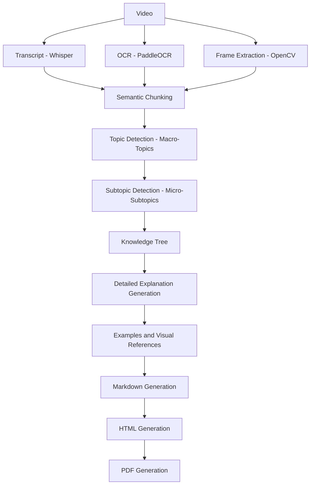

#### 3.1.5 Design Rationale
The pipeline is deliberately linear rather than a graph of independent parallel tasks, because each stage's output is a structural precondition for the next. Topic detection cannot run correctly on unchunked transcript, since the chunk boundaries are what encode "conceptual completeness" in the first place. Explanation generation cannot begin before the Knowledge Tree exists, since generating an explanation for a topic that will later be merged with another occurrence of the same topic would produce duplicate, conflicting content.

#### 3.1.6 Advantages
- A single, unambiguous processing order simplifies debugging: a defect in the output can always be traced back to exactly one pipeline stage.
- Parallelism is preserved where it is safe (transcript vs. OCR/frame extraction) and removed where it is not (chunking must wait for both streams).

#### 3.1.7 Conclusion
The End-to-End Pipeline is the master orchestration sequence of EduScribe AI. Every chapter from Section 4 onward in this document (Semantic Chunking, Chunk Data Model, Topic Detection, and so on) corresponds to exactly one node in this pipeline, described here at the level of a system-wide sequence and expanded, chapter by chapter, at module level.

---

### 3.2 Prompt Pipeline

#### 3.2.1 Introduction
The Prompt Pipeline is the LLM-facing counterpart to the End-to-End Pipeline. While the End-to-End Pipeline describes the movement of data through the system (video → chunks → topics → notes → export files), the Prompt Pipeline describes the sequence of distinct, single-responsibility LLM calls that transform structured input into structured educational output.

#### 3.2.2 Design Objective
The objective of the Prompt Pipeline is to decompose what would otherwise be a single, overloaded "summarize this lecture" instruction into a sequence of narrowly scoped prompts, each with exactly one responsibility, so that each individual LLM call can be evaluated, debugged, and regenerated independently of the others.

#### 3.2.3 Detailed Explanation
A single summarization prompt applied to an entire transcript is described in the source documentation as producing shallow, incomplete output — it tends to mention an algorithm and its complexity while omitting prerequisites, worked examples, common implementation mistakes, and practical applications. The Prompt Pipeline avoids this by assigning each of these concerns to its own dedicated stage.

The pipeline begins with **Stage 1: Lecture Analysis**, which does not produce any explanatory content; instead, it identifies the lecture's subject, difficulty, prerequisites, teaching style, and primary learning objectives, outputting this as structured JSON metadata that every later stage consumes.

**Stage 2: Topic Detection** identifies the macro-topics of the lecture, each associated with a start and end timestamp, without attempting to explain any of them.

**Stage 3: Subtopic Detection** operates on each topic independently, decomposing it into its internal structure (for example, "Binary Search" decomposing into Definition, Prerequisites, Algorithm, Dry Run, Complexity, and Applications).

**Stage 4: Knowledge Gap Analysis** is a distinctive stage that identifies information a beginner would require but which the lecture only briefly mentions or assumes entirely — definitions the instructor never explicitly stated, missing prerequisite concepts, implicit reasoning, and potential misconceptions. Its output is not shown to the end user directly; it guides Stage 5 so that generated notes function as complete learning resources rather than as a reformatted transcript.

**Stage 5: Detailed Explanation Generation** is the core content-producing stage, processing exactly one subtopic per invocation and instructing the model to teach the concept — covering definition, intuition, motivation, step-by-step reasoning, visual explanation, mathematical derivation where applicable, worked examples, code examples for programming lectures, real-world applications, common mistakes, best practices, interview perspective, and key takeaways. No upper bound is placed on explanation length.

**Stage 6: Example Generation** operates as an independent stage from explanation generation, producing simple examples, intermediate examples, real-world applications, numerical examples, programming examples, and visual examples tied to lecture frames.

The source documentation's pipeline diagram additionally lists "Common Mistakes" and "Revision Notes" as intermediate stages positioned between example generation and formatting, and the stage numbering explicitly continues at **Stage 9: Markdown Generation** — the final AI-facing stage, which converts the structured educational content produced by the preceding stages into well-formatted Markdown as an independent task, deliberately separated from content generation so that formatting logic can evolve without altering the explanation or example prompts.

#### 3.2.4 Internal Workflow

```
Video
  ↓
Transcript + OCR + Frames
  ↓
Stage 1: Lecture Analysis        (subject, difficulty, prerequisites, teaching style)
  ↓
Stage 2: Topic Detection         (macro-topics + timestamps)
  ↓
Stage 3: Subtopic Detection      (micro-subtopics per topic)
  ↓
Stage 4: Knowledge Gap Analysis  (implicit/missing prerequisite info)
  ↓
Stage 5: Detailed Explanation Generation (per subtopic, no length ceiling)
  ↓
Stage 6: Example Generation      (simple / intermediate / real-world / numerical / code / visual)
  ↓
Stage 9: Markdown Generation
  ↓
HTML Generation
  ↓
PDF Generation
```

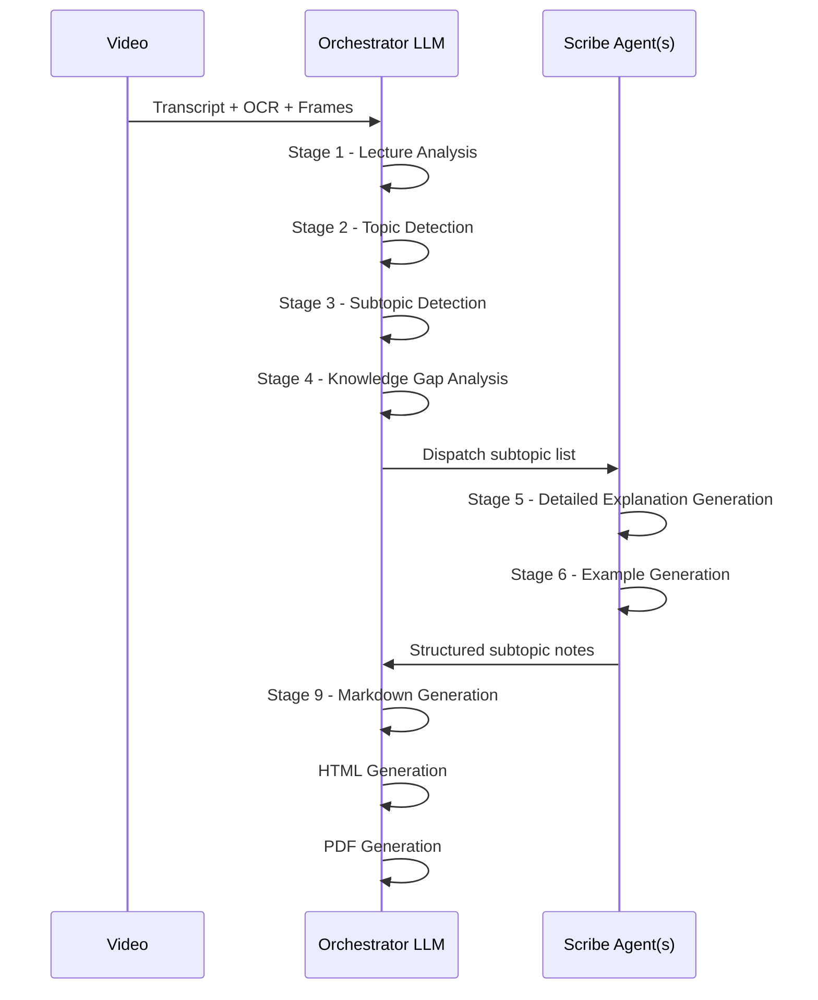

#### 3.2.5 Design Rationale
Each stage is deliberately restricted to a single responsibility so that a single LLM call is never asked to simultaneously understand, structure, and explain a lecture. This mirrors the "Atomic Generation" feature from Chapter 2: just as notes are generated per-subtopic, prompts are scoped per-responsibility. This design also means that improving the quality of one stage (for example, refining the Knowledge Gap Analysis prompt) never requires modifying any other stage's prompt.

#### 3.2.6 Advantages
- Each stage's output is independently structured (JSON where applicable), simplifying validation via PydanticAI (Chapter 17).
- Debugging is localized: if generated notes are missing prerequisite context, the fault can be isolated to Stage 4 rather than requiring a full pipeline re-audit.
- Later stages (Stage 5 onward) always operate on the structured output of earlier stages rather than on the raw transcript, reducing redundant re-processing.

#### 3.2.7 Limitations
The stage sequence, as documented, defines Stages 1 through 6 explicitly and then continues at Stage 9, with the pipeline diagram additionally referencing "Common Mistakes" and "Revision Notes" as intermediate steps. This numbering gap is inherited directly from the source documentation and is preserved here rather than resolved, per the instruction to introduce no new assumptions.

#### 3.2.8 Conclusion
The Prompt Pipeline is the LLM-execution backbone of EduScribe AI's content generation process. It converts the single-responsibility principle from general software engineering into a concrete prompting strategy, ensuring that lecture understanding, structural organization, and pedagogical explanation are always handled as separate, independently verifiable operations.

---

## 4. Semantic Chunking

### 4.1 Introduction
Semantic Chunking is the component responsible for dividing merged transcript and OCR content into coherent, self-contained units before any topic detection or explanation generation occurs. It is positioned immediately after data ingestion in the End-to-End Pipeline and is a precondition for every subsequent AI-facing stage.

### 4.2 Design Objective
The objective of Semantic Chunking is to eliminate the "mid-sentence break" and "mixed-concept" problems that arise from fixed-size, token-based chunking, ensuring that every unit of text handed to the LLM pipeline represents one complete educational idea.

### 4.3 Detailed Explanation
Token-based chunking divides a transcript at fixed intervals (for example, every 1,000 tokens) irrespective of where a concept naturally begins or ends. The source documentation illustrates the resulting failure directly: a single explanation of Binary Search could be split across two chunks, with the algorithm description appearing in one chunk and the complexity analysis appearing in a separate chunk; alternatively, one chunk might contain the tail end of Binary Search together with the beginning of Merge Sort, forcing the LLM to reason about two unrelated concepts as if they were one.

Semantic Chunking replaces this fixed-size strategy with **boundary detection** — chunk edges are placed at points where the lecture's content actually transitions from one concept to another. The system combines multiple signals to detect these transitions: changes in lecture topic, significant pauses in speech, slide transitions, changes in OCR-extracted text, the appearance of new headings on slides, explicit instructor transition phrases ("Now let's discuss…", "Next…", "Moving on…"), and major shifts in vocabulary. No single signal is treated as authoritative; the boundary decision is a combination of these indicators.

Two additional structural rules govern chunk creation. First, **chunk overlap**: because educational concepts rarely end abruptly at a single sentence, adjacent chunks share a small semantic overlap — for example, if Chunk A ends with "Definition" and "Algorithm," Chunk B may begin with "Algorithm," "Example," and "Complexity," so that the "Algorithm" section is not lost at the boundary. This overlap is determined by concept continuity, not by a fixed token count, distinguishing it from traditional token-overlap strategies. Second, **chunk linking**: if the lecturer returns to an earlier concept later in the lecture, the system links the new chunk to the earlier chunk covering the same concept instead of duplicating the content — this is the mechanism that feeds directly into the deduplication performed later by the Knowledge Tree (Chapter 6).

### 4.4 Internal Workflow

```
Video
  ↓
Whisper Transcript
  ↓
OCR Text
  ↓
Merge Transcript + OCR
  ↓
Semantic Boundary Detection
  ↓
Chunk Creation
  ↓
Chunk Validation
  ↓
Chunk Storage
```

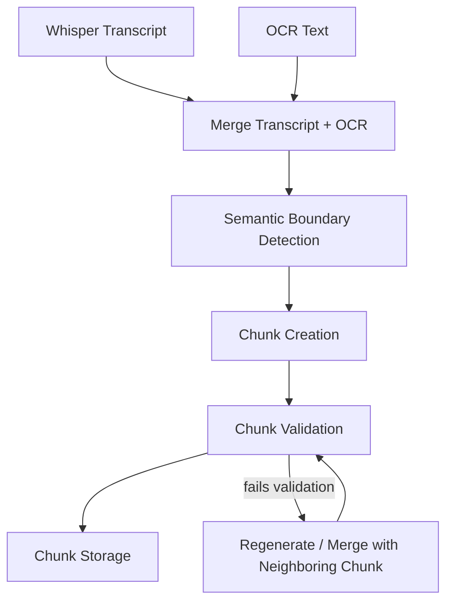

Only chunks that pass validation are forwarded to the LLM pipeline. Chunk validation checks include: transcript availability, OCR consistency with the transcript, timestamp correctness, minimum information density, semantic completeness (the chunk is not cut mid-concept), and duplicate detection. Chunks that fail validation are either regenerated or merged with a neighboring chunk rather than discarded outright.

Chunks are not stored as isolated units — they form a connected relationship graph:

```
Chunk 1 → Chunk 2 → Chunk 3 → Chunk 4
```

Each chunk references its previous and next neighbor, which allows later stages to recover context. For example, if Chunk 5 begins with the phrase "As discussed previously…", the system can automatically retrieve Chunk 4 to restore the missing context rather than treating Chunk 5 as an isolated, context-free unit.

### 4.5 Design Rationale
Semantic Chunking exists because every downstream AI stage — Topic Detection, Subtopic Detection, Detailed Explanation Generation — depends on receiving conceptually complete input. If chunk boundaries were arbitrary, Topic Detection would be forced to reconstruct concept boundaries that chunking should have already established, effectively duplicating work at a later, more expensive stage of the pipeline. Placing boundary detection as early as possible in the pipeline is therefore a direct consequence of the "Structural Discovery" feature principle described in Chapter 2.

### 4.6 Advantages
- Preserves the logical flow of the lecture rather than fragmenting it at arbitrary token boundaries.
- Produces more accurate topic detection, since Topic Detection operates on chunks that already respect concept boundaries.
- Reduces hallucination risk, since the model is never asked to reason across two unrelated concepts crammed into the same chunk.
- Establishes a reusable structural foundation for chunk-dependent features described elsewhere in the source documentation (flashcards, quiz generation, mind maps, RAG), since each of these consumes the same chunk objects that Semantic Chunking produces.

### 4.7 Limitations
Because boundary detection relies on multiple heuristic signals (pauses, transition phrases, OCR changes, vocabulary shifts) rather than a single deterministic rule, chunk quality is directly dependent on the reliability of the underlying transcript and OCR extraction — a lecture with poor audio quality or visually noisy slides would produce weaker boundary signals, which is precisely why Chunk Validation exists as a mandatory gate before storage.

### 4.8 Conclusion
Semantic Chunking is the foundational data-preparation stage of EduScribe AI. It converts an undifferentiated stream of transcript and OCR text into a validated, relationship-aware set of conceptually complete units, and its output — the chunk — is the atomic unit that every subsequent stage of the pipeline, from Topic Detection through to future RAG-based features, is built to consume.

---

## 5. Chunk Data Model

### 5.1 Introduction
The Chunk Data Model defines the structured representation of a single semantic chunk once it has passed validation. It is the concrete schema that operationalizes the "Multimodal Integrity" feature described in Chapter 2 — the binding of transcript, OCR text, timestamps, and frame references into one addressable unit.

### 5.2 Design Objective
The objective of the Chunk Data Model is to ensure that every chunk carries not just its transcript content but the complete set of metadata required by every downstream consumer of that chunk — Topic Detection, Subtopic Detection, Notes Generation, and future chunk-dependent features — without requiring those consumers to re-derive metadata that chunking has already computed.

### 5.3 Detailed Explanation
A chunk is not merely a slice of transcript text. Every chunk stores structured metadata across four categories:

- **Temporal Metadata** — start timestamp, end timestamp, lecture duration, estimated reading time.
- **Visual Metadata** — frame references, OCR confidence, number of associated images.
- **Content Metadata** — keywords, topic hints, difficulty estimate, chunk summary.
- **Relationship Metadata** — previous chunk, next chunk, parent topic, child subtopics.

This structured representation is what allows downstream components to access transcript content, visual content, and contextual/relationship content through a single, uniform object, rather than requiring each downstream component to separately query multiple independent data sources.

### 5.4 Internal Workflow

The canonical chunk record, as defined in the source documentation, is represented as JSON:

```json
{
  "chunk_id": 15,
  "lecture_id": 2,
  "start_time": "00:12:20",
  "end_time": "00:18:45",
  "topic_hint": "Binary Search",
  "transcript": "...",
  "ocr_text": ["Binary Search", "O(log n)", "Sorted Array"],
  "frame_ids": ["frame_24.jpg", "frame_25.jpg"],
  "previous_chunk": 14,
  "next_chunk": 16,
  "confidence": 0.97
}
```

An earlier, simpler variant of the same structure is also defined in the source documentation at the chunking-strategy level, confirming that the fields `chunk_id`, `start_time`, `end_time`, `transcript`, `ocr_text`, and `frames` are the minimum required fields, with `lecture_id`, `topic_hint`, `previous_chunk`, `next_chunk`, and `confidence` representing the fuller, relationship-aware form of the same object.

Chunk storage is organized hierarchically at the database level:

```
Lectures
  ↓
Chunks
  ↓
Topics
  ↓
Subtopics
  ↓
Generated Notes
```

This organization is what simplifies future retrieval: a query for "all notes belonging to a lecture" can traverse this hierarchy top-down, and a query for "which chunk supports this piece of generated text" can traverse it bottom-up.

### 5.5 Design Rationale
The Chunk Data Model is intentionally over-specified relative to what a single downstream consumer (say, Topic Detection) strictly needs, because the same chunk object is reused across multiple, otherwise-unrelated features: Topic Detection, Subtopic Detection, Notes Generation, Flashcards, Quiz Generation, Mind Maps, and RAG all consume the same chunk structure, described in the source documentation as chunking being "the foundation for almost every AI feature." Under-specifying the schema now would force schema migrations later, once those additional features are implemented.

### 5.6 Advantages
- A single schema serves every chunk-consuming feature, avoiding duplicated or inconsistent chunk representations across modules.
- Relationship metadata (`previous_chunk`, `next_chunk`) enables context recovery without requiring a full-lecture re-scan.
- Confidence scoring is captured directly on the chunk, allowing downstream consumers to make informed decisions about how much to trust a given chunk's content.

### 5.7 Conclusion
The Chunk Data Model is the structural contract that makes every other module in this document interoperable. By encoding temporal, visual, content, and relationship metadata directly onto the chunk object, it ensures that no downstream stage of the pipeline needs to reconstruct information that Semantic Chunking has already computed.

---

## 6. Topic Detection

### 6.1 Introduction
Topic Detection is the stage responsible for imposing hierarchical structure onto the set of validated chunks produced by Semantic Chunking. It operates in two tiers, converting an undifferentiated sequence of chunks into a navigable macro/micro topic hierarchy.

### 6.2 Design Objective
The objective of Topic Detection is to produce a strict, machine-readable roadmap of the lecture's content — identifying both the major pillars of the lecture and the specific concepts within each pillar — so that subsequent generation stages know exactly what units of content need to be explained, without omitting or misrepresenting any technical nuance.

### 6.3 Detailed Explanation
Topic Detection uses a **two-tiered detection strategy**. In **Tier 1**, the Orchestrator identifies "Macro-Topics" — the main pillars of the lecture, such as "Binary Search" within a lecture on searching algorithms. In **Tier 2**, each macro-topic is decomposed into "Micro-Subtopics" — the specific algorithms, definitions, or proofs that fall under that macro-topic, such as Definition, Prerequisites, Algorithm, Dry Run, Complexity, and Applications for the "Binary Search" macro-topic.

This hierarchy is output as strict JSON, which serves as the roadmap consumed by all later generation stages. After all chunks have been processed, repeated topic mentions are merged: if "Binary Search" appears across multiple chunks (for example, because the instructor first introduces it, then later revisits it during a Q&A segment), the system collects all associated information beneath a single topic node in the Knowledge Tree rather than generating duplicate notes for each occurrence.

### 6.4 Internal Workflow

**Tier 1 output (macro-topics, with timestamps):**
```json
{
  "topics": [
    { "title": "Binary Search", "start": "00:05:20", "end": "00:18:30" }
  ]
}
```

**Tier 2 output (micro-subtopics per topic):**
```json
{
  "topic": "Binary Search",
  "subtopics": ["Definition", "Prerequisites", "Algorithm", "Dry Run", "Complexity", "Applications"]
}
```

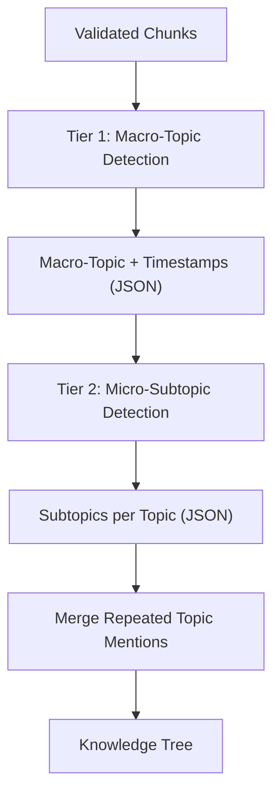

### 6.5 Design Rationale
The two-tier split exists because macro-topic identification and micro-subtopic identification are fundamentally different tasks: the former requires understanding the overall shape of the lecture (which is why it depends on Structural Discovery / Lecture Analysis output), while the latter requires deep, topic-specific decomposition. Separating them into two tiers allows each to be validated independently — a Tier 1 error (missing an entire macro-topic) is a structurally different failure from a Tier 2 error (missing a subtopic within an otherwise correctly identified macro-topic), and each is easier to detect and correct in isolation.

### 6.6 Advantages
- Strict JSON output makes the topic hierarchy machine-verifiable via PydanticAI (Chapter 17), rather than relying on free-text parsing.
- Timestamps attached at the macro-topic level allow later explanation stages to reference the corresponding video segment.
- Merging repeated topic mentions at this stage prevents duplicate note generation downstream, directly feeding the Knowledge Tree's deduplication behavior.

### 6.7 Conclusion
Topic Detection transforms a flat sequence of validated chunks into a structured, two-tier hierarchy that becomes the authoritative table of contents for the entire generated document. Every subsequent content-generation stage — Knowledge Gap Analysis, Detailed Explanation Generation, Example Generation — operates against the topic/subtopic units this stage produces, not against raw chunk text.

---

## 7. Knowledge Gap Analysis

### 7.1 Introduction
Knowledge Gap Analysis is a distinctive stage in the Prompt Pipeline (Stage 4) that identifies information necessary for a beginner's understanding of a topic but which is missing, implicit, or only briefly mentioned in the lecture itself.

### 7.2 Design Objective
The objective of Knowledge Gap Analysis is to prevent generated notes from being a faithful but incomplete reformatting of the transcript — ensuring instead that the notes function as a complete learning resource, even when the instructor omitted or assumed certain foundational information during the live lecture.

### 7.3 Detailed Explanation
Lecture transcripts frequently omit information that instructors explain only verbally, gesture toward without stating explicitly, or assume the audience already possesses. If EduScribe AI simply converted the transcript into notes verbatim, these implicit gaps would be inherited directly into the output, leaving the student with the same conceptual blind spots that existed in the live lecture. Knowledge Gap Analysis addresses this by explicitly asking the LLM to identify:

- Definitions that were assumed but never explicitly stated by the instructor.
- Missing prerequisite concepts that a beginner would need before the current topic makes sense.
- Implicit reasoning — logical steps the instructor skipped because they were "obvious" to an expert but not to a novice.
- Additional context required for full understanding.
- Potential misconceptions students might form from the way the material was presented.

Critically, this stage's output is not surfaced to the end user as a standalone artifact. It is consumed internally, guiding Stage 5 (Detailed Explanation Generation) so that the resulting explanation proactively fills these gaps rather than leaving them for the student to discover independently.

### 7.4 Internal Workflow

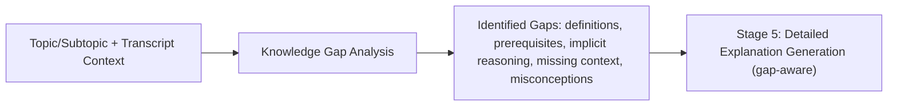

### 7.5 Design Rationale
Positioning Knowledge Gap Analysis as its own dedicated stage — rather than folding gap-detection instructions directly into the explanation-generation prompt — follows the same single-responsibility principle that governs the entire Prompt Pipeline (Chapter 3.2). Asking one prompt to simultaneously detect gaps and write a polished explanation risks the model prioritizing fluent prose over rigorous completeness checking; separating the two tasks ensures gap detection receives dedicated reasoning attention before any explanatory text is drafted.

### 7.6 Advantages
- Directly operationalizes the "Pedagogical Depth" feature principle from Chapter 2 by targeting the specific failure mode — implicit assumptions — that separates a transcript reformatting from a genuine explanation.
- Produces reusable diagnostic output that could, in principle, also inform Quality Gates (Chapter 11), since a subtopic whose known gaps were never addressed in the final explanation would represent an incomplete output.

### 7.7 Conclusion
Knowledge Gap Analysis is the mechanism by which EduScribe AI distinguishes itself from a transcript-to-notes converter. By explicitly surfacing what the lecture assumed but never stated, it ensures the downstream explanation stage produces content suitable for a student encountering the topic for the first time — directly fulfilling the system's stated vision of simulating the pedagogical depth of an experienced instructor.

---

## 8. Detailed Explanation Generation

### 8.1 Introduction
Detailed Explanation Generation (Stage 5 of the Prompt Pipeline) is the core content-producing module of EduScribe AI. It is the stage where the system's central design philosophy — "explanation, not summary" — is directly enacted.

### 8.2 Design Objective
The objective of this module is to treat every subtopic as an isolated, standalone lesson, generating explanatory depth that would be structurally impossible to achieve within a single-pass, whole-lecture summarization prompt.

### 8.3 Detailed Explanation
Each subtopic is generated using what the source documentation calls an "Expanded Pedagogical Prompt." Rather than stating a fact or formula directly, the model is instructed to explain the derivation, the variables involved, and the reasoning behind why particular constants or conditions exist. This produces a document intended to function as a standalone educational resource, not a collection of disconnected bullet points.

For every subtopic, the generation prompt requires the following components, in order: definition in simple language; why the concept exists (motivation); prerequisites; a step-by-step explanation; a worked example; a visual explanation using the associated lecture frames; common mistakes; edge cases; complexity analysis where applicable; real-world applications; an interview or examination perspective; and key takeaways.

The source documentation's illustrative example makes the distinction between summary and explanation concrete: rather than writing "Binary Search repeatedly divides the search space in half," the model is expected to explain why linear search becomes inefficient at scale, introduce the requirement that the array must be sorted, describe how the middle element is chosen, walk through every comparison step, provide a complete worked example with actual values, analyze time complexity, discuss common implementation mistakes such as integer overflow when calculating the midpoint, and conclude with practical applications such as searching databases or dictionaries. Relevant OCR text and lecture screenshots are embedded wherever they reinforce a specific part of the explanation, directly implementing the Image Integration feature (Chapter 10).

Critically, **no upper limit is placed on explanation length**. If a concept genuinely requires several pages to be properly explained, the model is expected to produce that length of output rather than truncating for brevity. This is the direct implementation of the "Token-Agnostic Quality" principle from Chapter 2.

### 8.4 Internal Workflow

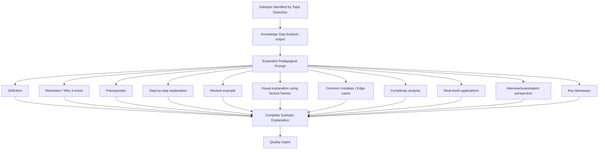

Input to this module is a single subtopic (identified by Topic Detection) together with its associated chunk data (transcript, OCR text, frame references) and the Knowledge Gap Analysis output for that subtopic. Processing consists of the single Expanded Pedagogical Prompt invocation described above. Output is the fully composed subtopic explanation, which is passed forward to Example Generation (Chapter 9) and subsequently to Quality Gates (Chapter 11) for validation.

### 8.5 Design Rationale
Generating explanations one subtopic at a time — rather than one lecture at a time — is what allows this stage to honor the "no length ceiling" requirement without running into the practical limits that a single, whole-lecture request would encounter. It also means that if Quality Gates later reject a specific subtopic's explanation, only that subtopic needs to be regenerated, not the entire lecture's worth of notes.

### 8.6 Advantages
- Produces genuinely standalone educational content, since each subtopic explanation is generated with the explicit instruction to teach the concept as an isolated lesson.
- Embeds visual references directly at the point of relevance, rather than as a disconnected appendix.
- Because generation is atomic per subtopic, regeneration triggered by Quality Gates is inherently cheap and localized.

### 8.7 Limitations
Because explanation length is uncapped, this stage is the primary driver of LLM token consumption in the entire pipeline — a direct consequence acknowledged in the source documentation's Technology Stack chapter, which notes that this design choice has "direct cost implications given the free-tier/quota constraints" of the LLM providers described in Chapter 15.

### 8.8 Conclusion
Detailed Explanation Generation is the module in which EduScribe AI's core value proposition is realized: a subtopic-level, first-principles explanation that mirrors the depth an experienced instructor would provide in office hours, rather than the compressed depth of a lecture summary.

---

## 9. Example Generation

### 9.1 Introduction
Example Generation (Stage 6 of the Prompt Pipeline) is a dedicated stage that produces concrete examples for each concept, deliberately separated from the explanation-generation prompt described in Chapter 8.

### 9.2 Design Objective
The objective of this module is to ensure that every concept is reinforced through multiple types of concrete examples, based on the premise — stated directly in the source documentation — that students learn concepts more effectively through examples than through explanation text alone.

### 9.3 Detailed Explanation
For each concept, the system generates six categories of examples: simple examples, intermediate examples, real-world applications, numerical examples (when applicable to the subject matter), programming examples (when applicable), and visual examples that draw on the lecture's extracted frames. Separating example generation into its own stage — rather than embedding example instructions inside the Stage 5 explanation prompt — is explicitly justified in the source documentation as allowing future improvements to example quality without requiring any change to the explanation prompt itself.

### 9.4 Internal Workflow

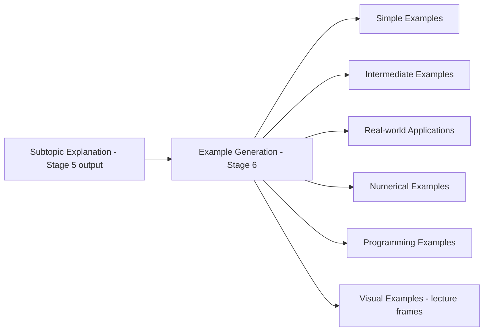

### 9.5 Design Rationale
By decoupling example generation from explanation generation, the two prompts can be independently versioned, independently improved, and independently regenerated if a Quality Gate check specifically flags a missing worked example — without risking any unintended alteration to the surrounding explanatory prose.

### 9.6 Advantages
- Guarantees consistent example coverage across every concept, since example categories are fixed and explicitly enumerated rather than left to the discretion of a single combined prompt.
- Enables independent iteration on example quality, isolated from explanation quality.
- Directly supports the Quality Gate requirement that "every algorithm should include at least one worked example" (Chapter 11), since worked-example production is this stage's explicit responsibility.

### 9.7 Conclusion
Example Generation operationalizes the pedagogical principle that concrete examples reinforce abstract explanation. As a stage kept structurally distinct from Detailed Explanation Generation, it allows EduScribe AI to guarantee example coverage as a first-class, independently verifiable output rather than as an incidental byproduct of the explanation prompt.

---

## 10. Image Integration

### 10.1 Introduction
Image Integration governs how OCR-derived and frame-derived visual material — diagrams, formulas, tables, and handwritten notes — is incorporated into the generated notes.

### 10.2 Design Objective
The objective of this module is to ensure that visual material captured during ingestion is never discarded or listed as a disconnected appendix, but is instead referenced directly within the explanation section that discusses it.

### 10.3 Detailed Explanation
Whenever OCR extraction or frame extraction identifies a diagram, formula, table, or handwritten annotation, that visual element is referenced in the explanation text rather than being ignored. The placement rule is explicit: images are positioned beside the section of the explanation that discusses them, rather than being grouped separately at the end of the document. This directly reflects the "Multimodal Integrity" feature principle from Chapter 2 — a claim made in the generated text must be anchored to its visual source wherever a visual source exists.

### 10.4 Internal Workflow

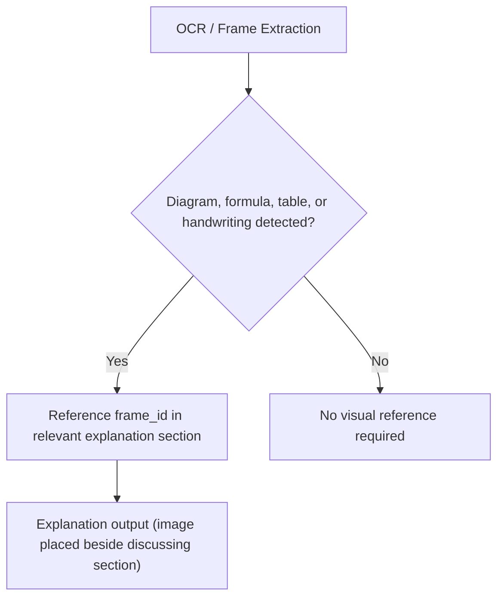

### 10.5 Design Rationale
Image placement is tied to explanation relevance rather than document position (e.g., "all images at the end") because separating visual material from its discussing text would break the anchoring guarantee that every claim be traceable to source material — a requirement that governs the entire Multimodal Integrity principle.

### 10.6 Advantages
- Preserves visual context exactly where it is pedagogically useful, rather than forcing the reader to cross-reference a disconnected image appendix.
- Directly supports the Quality Gate requirement that "every important figure should reference a lecture frame" (Chapter 11).

### 10.7 Conclusion
Image Integration ensures that the multimodal nature of a lecture — text, speech, and visuals — is preserved through to the final generated notes, rather than being reduced to text-only output during synthesis.

---

## 11. Quality Gates

### 11.1 Introduction
Quality Gates are automated validation checks applied to generated content before it is considered complete, ensuring that every subtopic explanation meets a fixed set of completeness criteria.

### 11.2 Design Objective
The objective of Quality Gates is to catch incomplete or inconsistent output automatically, and — critically — to correct it at the smallest possible granularity, avoiding the cost and risk of regenerating an entire document because a single subtopic failed a single check.

### 11.3 Detailed Explanation
Five checks are explicitly defined:

1. Every subtopic must have a complete explanation.
2. Every algorithm must include at least one worked example.
3. Every mathematical concept must include a derivation, if the lecture itself presented one.
4. Every important figure must reference a lecture frame.
5. Every generated section must be factually consistent with the transcript.

If any of these checks fails, the system regenerates **only the affected subtopic**, rather than regenerating the entire document. This is stated explicitly in the source documentation as a deliberate design choice.

### 11.4 Internal Workflow

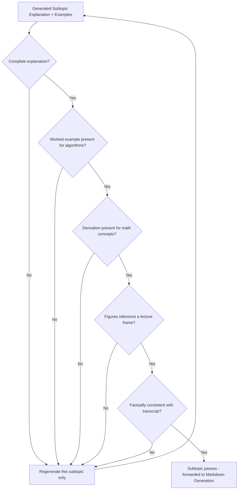

### 11.5 Design Rationale
Quality Gates operate at subtopic granularity because Detailed Explanation Generation (Chapter 8) itself operates at subtopic granularity — the atomicity of the generation stage is what makes atomic, targeted regeneration possible at the validation stage. If explanation generation instead produced one document per lecture, Quality Gates would have no choice but to regenerate the entire document on any single failure.

### 11.6 Advantages
- Keeps correction cost proportional to the size of the defect rather than the size of the document, directly supporting the cost-efficiency non-functional requirement from Chapter 1.
- Provides a concrete, checkable definition of "complete" for a subtopic explanation, rather than relying on subjective judgment.
- The factual-consistency check anchors generated content back to the transcript, reducing the risk of hallucinated claims persisting into the final output.

### 11.7 Conclusion
Quality Gates are the enforcement mechanism that converts the qualitative goals of Chapters 2 and 8 (pedagogical depth, completeness, factual grounding) into a concrete, automatable, and economically efficient validation step, ensuring defects are caught and corrected at the smallest unit of work possible.

---

## 12. Markdown Generation

### 12.1 Introduction
Markdown Generation is the final AI-facing stage of the Prompt Pipeline (Stage 9) and the first stage of the three-part export chain (Markdown → HTML → PDF).

### 12.2 Design Objective
The objective of this module is to convert fully validated, structured educational content into well-formatted Markdown, treating formatting as a task entirely independent of content generation.

### 12.3 Detailed Explanation
Instead of asking the LLM to generate content and formatting simultaneously, EduScribe AI treats formatting as an independent task performed after all content-generation and Quality Gate stages have completed. This separation allows the same structured content to be exported into Markdown, HTML, PDF, or other formats without requiring any change to the underlying explanation, example, or gap-analysis prompts. The final note structure that Markdown Generation assembles follows a fixed template:

```
# Lecture Title
## Topic
### Subtopic
  - Explanation
  - Illustration
  - Worked Example
  - Screenshot
  - Common Mistakes
  - Applications
  - Revision Summary
  - Key Takeaways
  - References
```

At the library level, Markdown-it-py is used as the standards-compliant Markdown rendering engine that later consumes this generated Markdown during the HTML Generation stage (Chapter 13).

### 12.4 Internal Workflow

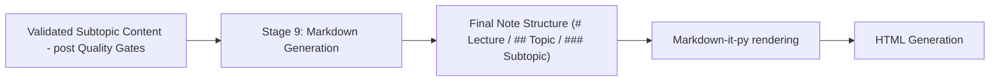

### 12.5 Design Rationale
Treating Markdown Generation as an independently executed final AI stage — rather than instructing the explanation prompt in Chapter 8 to directly output Markdown — means that changes to document formatting conventions (heading levels, section ordering) never require regenerating or reprompting the underlying educational content.

### 12.6 Advantages
- Establishes a single, fixed note structure applied consistently across every lecture, regardless of subject matter.
- Decouples formatting logic from content-generation logic, improving maintainability, as stated directly in the source documentation for this design choice.
- Produces a format (Markdown) that is itself the direct input to the subsequent HTML Generation stage, keeping the export chain linear and dependency-ordered.

### 12.7 Conclusion
Markdown Generation is the bridge between EduScribe AI's content-generation pipeline and its multi-format export pipeline. By fixing the final note structure and treating formatting as a distinct concern, it ensures that Explanation, Illustration, Worked Example, Screenshot, Common Mistakes, Applications, Revision Summary, Key Takeaways, and References are assembled consistently for every subtopic, in every lecture.

---

## 13. HTML Generation

### 13.1 Introduction
HTML Generation is the second stage of the export chain, transforming the Markdown output of Chapter 12 into styled HTML.

### 13.2 Design Objective
The objective of this module is to render structured Markdown notes into presentable HTML using reusable, templated layouts, rather than constructing HTML output manually for each lecture.

### 13.3 Detailed Explanation
HTML Generation relies on **Jinja2** for templating. Rather than manually constructing HTML for every generated document, Jinja2 templates define reusable layouts that the Markdown content is rendered into. This achieves a clean separation between presentation (the template) and logic/content (the generated Markdown), meaning that a visual redesign of the exported notes would only require modifying the Jinja2 templates, not the underlying content-generation pipeline.

### 13.4 Internal Workflow

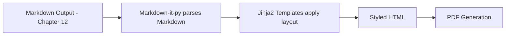

### 13.5 Design Rationale
Using a templating engine rather than direct string construction for HTML generation follows the same "separation of presentation and logic" principle explicitly stated in the source documentation for Jinja2's inclusion in the technology stack.

### 13.6 Advantages
- Produces clean, maintainable output by isolating layout definitions from generated content.
- Enables easy customization of the presentation layer without touching content-generation logic.
- Serves as the direct precursor input required by the PDF Generation stage (Chapter 14), which renders HTML and CSS into the final PDF.

### 13.7 Conclusion
HTML Generation converts the structurally fixed Markdown notes produced in Chapter 12 into a styled, presentable format, using Jinja2's templating capability to keep layout concerns fully separated from the educational content itself.

---

## 14. PDF Generation

### 14.1 Introduction
PDF Generation is the final stage of the export chain, converting the styled HTML output of Chapter 13 into a professional, distributable PDF document.

### 14.2 Design Objective
The objective of this module is to produce a professional-quality PDF directly from HTML and CSS, without manually drawing PDF pages, while supporting the visual and structural elements required by educational content — images, tables, and page numbering.

### 14.3 Detailed Explanation
PDF Generation uses **WeasyPrint**, which renders HTML and CSS directly into a PDF document. The source documentation specifically credits WeasyPrint with excellent typography support, CSS support, and the ability to render images, tables, page numbering, and a table of contents — all of which are directly relevant to the structure of an educational document containing worked examples, screenshots, and multi-level headings (Lecture → Topic → Subtopic).

### 14.4 Internal Workflow

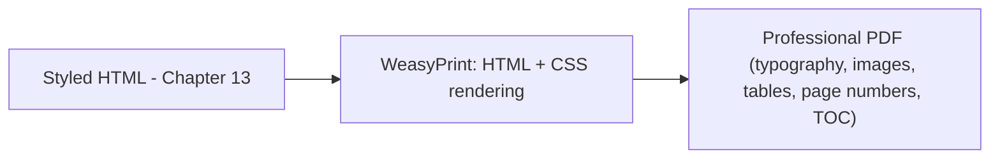

### 14.5 Design Rationale
Rendering directly from HTML/CSS rather than constructing the PDF programmatically (page by page) allows the same styling investment made for the HTML export (Chapter 13) to be directly reused for the PDF export, rather than requiring a second, independent layout implementation.

### 14.6 Advantages
- Produces a polished, professional final artifact suitable for distribution or offline study.
- Reuses the HTML/CSS styling layer already established for the HTML export target, avoiding duplicated layout work.
- Supports the structural elements (tables, page numbering, table of contents) that a multi-topic, multi-subtopic educational document requires.

### 14.7 Conclusion
PDF Generation is the terminal stage of EduScribe AI's End-to-End Pipeline, converting the fully validated, formatted, and styled educational content into the polished, final deliverable that the student ultimately receives.

---

## 15. LLM Provider Architecture

### 15.1 Introduction
The LLM Provider Architecture is the module responsible for abstracting all interaction with external Large Language Model vendors, ensuring that no part of the application communicates directly with a specific provider's SDK or API.

### 15.2 Design Objective
The objective of this architecture is to guarantee high availability, automatic failover, and vendor independence for the entire note-generation pipeline, since every stage of the Prompt Pipeline described in Chapter 3.2 depends on successful LLM invocation.

### 15.3 Detailed Explanation
Using only a single API provider introduces concrete, named risks: if a provider such as Gemini reaches its daily free quota, the entire notes-generation pipeline would stop functioning; temporary outages or regional restrictions could similarly interrupt the learning experience. EduScribe AI addresses this by never allowing the application to call a specific model directly. Instead, every request passes through a centralized **LLM Manager**, which selects the most appropriate provider for the task and automatically switches to an alternative provider whenever necessary.

This is implemented as a strict **provider abstraction layer**: the application only knows how to request an explanation or structured notes from the LLM Manager — it has no knowledge of which underlying provider (Gemini, OpenRouter, Groq, Together AI, Zhipu AI, Cerebras) actually generates the response. This abstraction means that adding a new provider requires only implementing a new provider class, and removing an existing provider requires no changes to the rest of the application.

The following providers are integrated:

| Provider | Notable Models | Role |
|---|---|---|
| Google AI Studio | Gemini 2.5 Flash, Gemini 2.5 Flash Lite | Primary provider |
| OpenRouter | DeepSeek V3, Qwen, Llama, Mistral, GLM | Secondary — unified access to many open-source models |
| Groq | Llama, Qwen, DeepSeek | Low-latency inference, especially useful for processing many chunks in parallel |
| Zhipu AI | GLM | Fallback — long reasoning and structured educational writing |
| Together AI | Llama, DeepSeek, Qwen, Mistral | Experimentation, aided by free starter credits for new users |
| Cerebras | (varies) | Very low response times where available |

Google AI Studio is designated the primary provider because Gemini performs exceptionally well for educational content — understanding long lecture transcripts while producing structured explanations — and because it provides a generous free tier during development, making it the default model throughout the project.

The centralized **LLM Provider Manager** is responsible for: selecting the best provider, managing API keys, retrying failed requests, handling rate limits, switching providers automatically, recording provider performance, logging token usage, and tracking response times. This keeps the rest of the application entirely independent of any specific LLM vendor.

The proposed folder structure for this layer is:

```
backend/
└── app/
    └── services/
        └── llm/
            ├── base_provider.py
            ├── google_provider.py
            ├── openrouter_provider.py
            ├── groq_provider.py
            ├── together_provider.py
            ├── zhipu_provider.py
            ├── cerebras_provider.py
            ├── provider_manager.py
            ├── model_selector.py
            ├── fallback_manager.py
            ├── key_manager.py
            ├── retry_manager.py
            └── response_parser.py
```

### 15.4 Internal Workflow

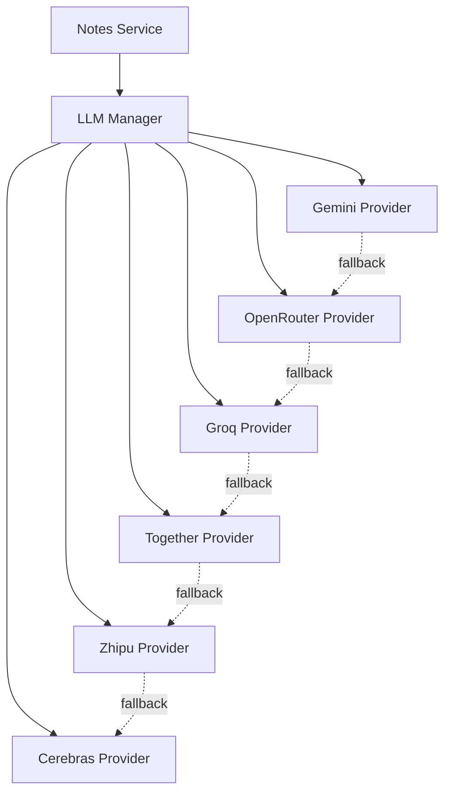

### 15.5 Design Rationale
The provider abstraction layer exists specifically to prevent the multi-stage, atomic-generation architecture described in Chapters 3.2, 8, and 9 from being fragile to a single vendor's availability. Because atomic, per-subtopic generation multiplies the number of LLM calls required per lecture relative to a single-pass summarization approach, the probability of encountering at least one transient provider failure during a full lecture's processing is non-trivial — making multi-provider resilience a structural necessity rather than a convenience.

### 15.6 Advantages
- High availability: the pipeline continues functioning even if one provider becomes unavailable.
- Flexibility: new models can be added with minimal code changes, isolated to a new provider class.
- Maintainability: business logic (Prompt Pipeline stages) remains entirely separate from provider-specific implementation details.
- Cost optimization: free providers can be prioritized before paid ones.
- Vendor independence: the system is never tied to a single AI provider.

### 15.7 Limitations
Every provider integrated into this architecture is used on a free tier, trial-credit, or otherwise quota-limited basis. This is explicitly acknowledged in the source documentation, which states that Google AI Studio has a daily free quota, Together AI provides free starter credits to new users, and Groq/Cerebras free access "varies over time." The provider architecture's resilience against outages does not eliminate this constraint — it only ensures that exhausting one provider's quota does not halt the entire pipeline, provided at least one other provider in the fallback chain still has available quota.

### 15.8 Conclusion
The LLM Provider Architecture is the layer that converts EduScribe AI from a system dependent on a single AI vendor into a system with structural resilience against provider-specific failure, quota exhaustion, and outages — a direct architectural response to the "Multi-Provider LLM Layer" feature principle established in Chapter 2.

---

## 16. LiteLLM

### 16.1 Introduction
LiteLLM is the communication layer used by EduScribe AI to normalize interaction with the multiple LLM providers described in Chapter 15.

### 16.2 Design Objective
The objective of integrating LiteLLM is to provide a single, unified interface for calling any of the supported LLM providers, eliminating the need to write separate, provider-specific request-formatting code for Gemini, OpenRouter, Groq, Together AI, Zhipu AI, and Cerebras individually.

### 16.3 Detailed Explanation
Without LiteLLM, the application would need to implement different request formats for each of the six integrated providers. LiteLLM removes this burden by normalizing communication: the application always calls the same function, and LiteLLM internally translates that call into the provider-specific API format required by whichever provider is currently selected. As a direct consequence, replacing one model with another typically requires changing only the model name in configuration, rather than rewriting any application code.

### 16.4 Internal Workflow

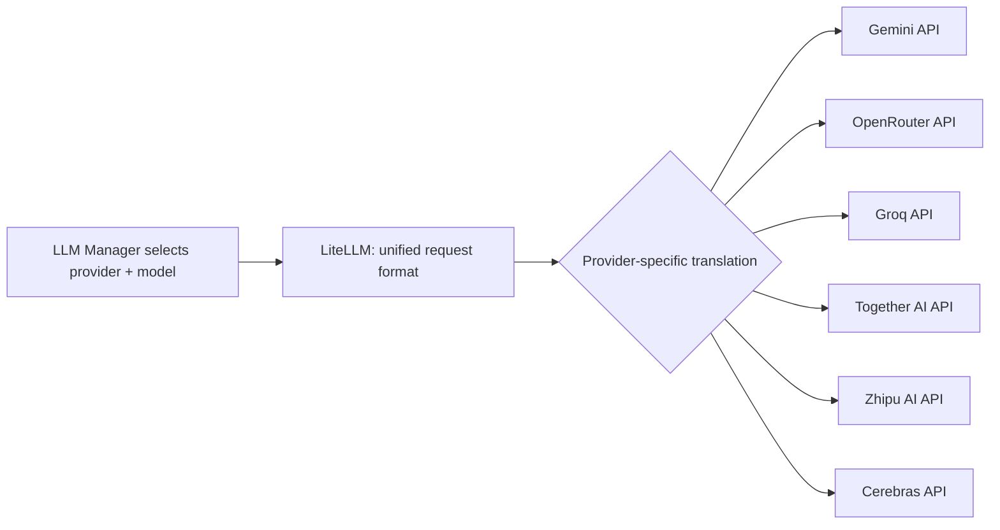

### 16.5 Design Rationale
LiteLLM sits directly beneath the LLM Manager in the architecture (see the Overall LLM Workflow in Chapter 15) precisely because provider abstraction at the business-logic level (the LLM Manager not knowing which provider is active) requires a corresponding abstraction at the wire-protocol level (a single function call that works regardless of which provider is active). Without LiteLLM, the LLM Manager itself would need to contain provider-specific branching logic, undermining the abstraction the provider architecture is designed to achieve.

### 16.6 Advantages
- Unified API across all six integrated providers.
- Easy provider and model switching, since switching becomes a configuration change rather than a code change.
- Reduced implementation complexity, since only one request/response format needs to be maintained by the application layer.
- Centralized token tracking and consistent error handling across otherwise heterogeneous provider APIs.

### 16.7 Conclusion
LiteLLM is the technical mechanism that makes the LLM Provider Architecture's abstraction promise achievable in practice. It converts six structurally different provider APIs into one consistent interface, which is what allows the LLM Manager, Model Router, and Fallback Manager described elsewhere in this document to operate without any provider-specific branching logic.

---

## 17. PydanticAI

### 17.1 Introduction
PydanticAI is the module responsible for enforcing structured, schema-compliant output from every LLM call made throughout the Prompt Pipeline.

### 17.2 Design Objective
The objective of PydanticAI is to guarantee that LLM responses conform to a predefined schema before they are allowed to propagate further into the application, since educational notes require predictable, structured output at every stage — from Lecture Analysis JSON through to the final Markdown assembly.

### 17.3 Detailed Explanation
While LiteLLM (Chapter 16) guarantees a unified communication format across providers, it does not guarantee that the content of a given response is structurally correct. PydanticAI closes this gap. Every prompt in the Prompt Pipeline is associated with a predefined schema — for example, the Topic Detection stage always expects output resembling:

```json
{
  "topic": "Binary Search",
  "subtopics": ["Definition", "Algorithm", "Complexity"]
}
```

If the model returns malformed JSON, omits required fields, or returns incorrect data types, PydanticAI detects the problem immediately, before the response reaches the rest of the application. This significantly improves reliability and reduces runtime failures caused by unexpected LLM output shapes. It also simplifies debugging, because validation errors clearly indicate which part of the response violated the expected schema, rather than surfacing as an opaque downstream failure.

### 17.4 Internal Workflow

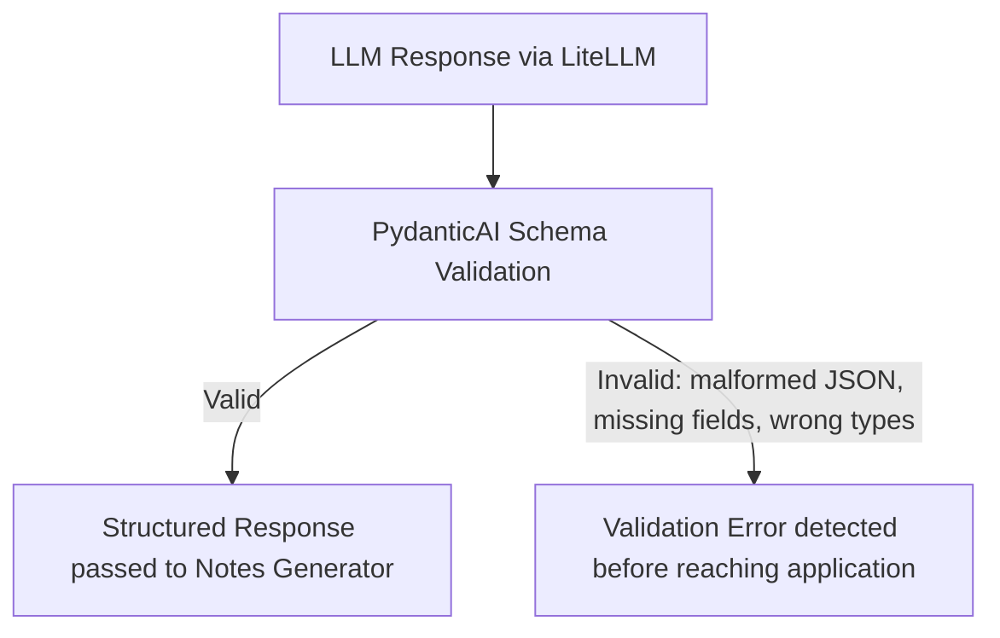

### 17.5 Design Rationale
PydanticAI is positioned immediately after LiteLLM and before the response reaches business logic, because it is the last line of defense against structurally invalid data entering the Notes Generator, Markdown Generation, or Quality Gate stages — all of which assume well-formed, schema-compliant input.

### 17.6 Advantages
- Reliable outputs: malformed responses are caught immediately rather than propagating into generated notes.
- Strong typing across every LLM-facing stage of the pipeline.
- Easier debugging, since validation errors pinpoint exactly which schema field was violated.
- Better maintainability, since every prompt's expected output shape is explicitly documented as a schema rather than implied by convention.

### 17.7 Conclusion
PydanticAI is the validation layer that converts LLM output from "probably structured" to "guaranteed structured," which is a precondition for every schema-dependent downstream stage described in this document — Topic Detection's JSON hierarchy, the Chunk Data Model, and the final Markdown assembly all depend on this guarantee holding at every stage of the pipeline.

---

## 18. Model Routing

### 18.1 Introduction
Model Routing (also referred to as the Model Selection Strategy in the source documentation) is the mechanism by which the LLM Manager assigns a specific model to a specific task, rather than using a single model uniformly across the entire pipeline.

### 18.2 Design Objective
The objective of Model Routing is to reduce API usage and cost by matching task complexity to model capability — not every task in the Prompt Pipeline requires the most powerful available model.

### 18.3 Detailed Explanation
EduScribe AI assigns models according to task complexity, following this routing table:

| Task | Recommended Model |
|---|---|
| Lecture Analysis | Gemini 2.5 Flash |
| Topic Detection | Gemini 2.5 Flash |
| Subtopic Detection | Gemini 2.5 Flash |
| Detailed Notes / Deep Explanations | Gemini 2.5 Flash (or DeepSeek V3) |
| Programming Explanations | DeepSeek V3 |
| Mathematical Explanations | Qwen3 |
| Markdown Generation | Gemini 2.5 Flash Lite |
| JSON Generation | Gemini 2.5 Flash |

This routing reflects a clear underlying logic: structural and organizational tasks (Lecture Analysis, Topic Detection, Subtopic Detection, JSON Generation) are routed to Gemini 2.5 Flash, since these tasks primarily require reliable structured output rather than deep domain reasoning. Formatting-only tasks (Markdown Generation) are routed to the lighter Gemini 2.5 Flash Lite, since no reasoning is required — only transformation of already-generated content into a fixed template. Domain-specific explanation tasks are routed to models with demonstrated strength in that domain: DeepSeek V3 for programming explanations, and Qwen3 for mathematical explanations.

### 18.4 Internal Workflow

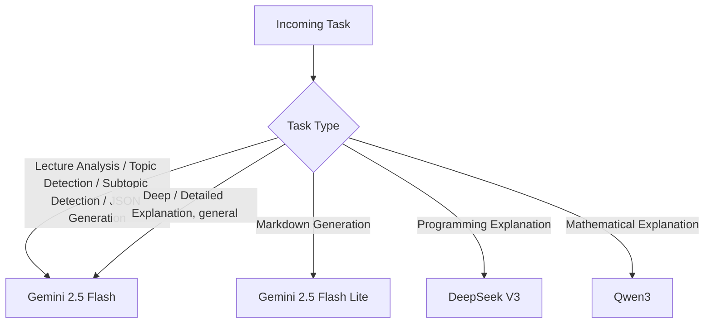

### 18.5 Design Rationale
Routing by task type — rather than by a fixed, single default model for every call — is a direct implementation of the "Token-Agnostic Quality" and "Cost-efficiency" requirements from Chapters 1 and 2 operating together: quality is preserved by directing domain-specific tasks to domain-appropriate models, while cost is controlled by directing simple, low-reasoning tasks (formatting) to the lightest available model.

### 18.6 Advantages
- Reduces overall API usage while maintaining output quality, as stated directly in the source documentation.
- Ensures simple formatting tasks never consume an expensive reasoning model's quota unnecessarily.
- Allows complex educational explanations to be routed to models demonstrated to perform well on that specific type of content (programming vs. mathematics vs. general explanation).

### 18.7 Conclusion
Model Routing is the mechanism that operationalizes cost-efficiency without sacrificing the quality of domain-specific explanations, ensuring that every LLM call in the Prompt Pipeline is served by a model whose capability is matched to — rather than exceeding — the complexity of the task it performs.

---

## 19. Retry Strategy

### 19.1 Introduction
The Retry Strategy defines how EduScribe AI handles transient failures from external LLM providers, using exponential backoff before escalating to provider fallback.

### 19.2 Design Objective
The objective of the Retry Strategy is to prevent temporary network errors or server overload from immediately terminating the processing pipeline, while avoiding unnecessary, rapid-fire repeated requests against a provider that is currently struggling.

### 19.3 Detailed Explanation
External API failures are treated as an expected, routine occurrence rather than an exceptional one. Whenever a request fails, the system waits a short interval before retrying, with the waiting period increasing after each subsequent failure — a technique known as exponential backoff:

| Attempt | Behavior |
|---|---|
| 1 | Immediate |
| 2 | Wait 2 seconds |
| 3 | Wait 4 seconds |
| 4 | Wait 8 seconds |
| 5 | Switch provider |

Retries are explicitly scoped to **transient** failures only — timeouts and rate limiting. **Permanent** errors, such as invalid API keys or malformed requests, are reported immediately rather than retried, since retrying a permanent error would only waste time and quota without any possibility of success. The **Tenacity** library is the technology-stack component responsible for implementing this automatic retry mechanism.

### 19.4 Internal Workflow

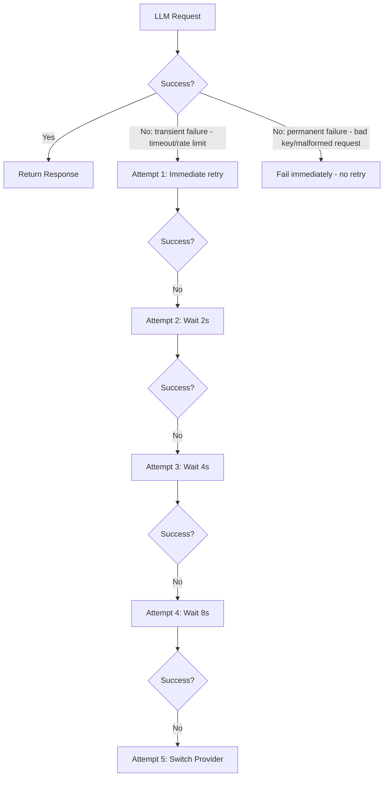

### 19.5 Design Rationale
Exponential backoff is used instead of fixed-interval retry because it reduces the total volume of requests sent to a provider that is already under load or rate-limiting the caller, while still giving the request multiple opportunities to succeed before the more disruptive step of switching providers entirely. The explicit distinction between transient and permanent failures prevents the retry mechanism from wasting attempts on errors that retrying can never resolve.

### 19.6 Advantages
- Prevents unnecessary API requests during provider-side instability, reducing wasted quota consumption.
- Increases the probability of successful execution without requiring an immediate provider switch for every minor, transient hiccup.
- Fails fast on permanent errors, avoiding wasted retry cycles on unrecoverable failures.

### 19.7 Conclusion
The Retry Strategy is the first line of defense against transient LLM provider instability, exhausting a bounded, exponentially-spaced set of retry attempts on the current provider before escalating to the Fallback Strategy (Chapter 20), which switches to an entirely different provider.

---

## 20. Fallback Strategy

### 20.1 Introduction
The Fallback Strategy defines the ordered sequence of alternative LLM providers EduScribe AI switches to when the currently selected provider becomes unavailable, whether due to quota exhaustion, timeout, rate limiting, server errors, or scheduled maintenance.

### 20.2 Design Objective
The objective of the Fallback Strategy is to guarantee that note generation continues uninterrupted even when an individual provider is completely unavailable, without requiring any manual intervention from the user.

### 20.3 Detailed Explanation
The fallback order follows a fixed priority sequence:

```
Gemini 2.5 Flash
  ↓
Gemini 2.5 Flash Lite
  ↓
DeepSeek V3
  ↓
Qwen3
  ↓
Llama 3.3
  ↓
Mistral
  ↓
GLM
```

Whenever the current provider fails due to any of the following conditions — API quota exceeded, timeout, rate limiting, server errors, or temporary maintenance — the request is automatically retried using the next available provider in this sequence. This transition is entirely transparent to the user: no manual model switching is ever required. The fallback sequence is executed only after the Retry Strategy's (Chapter 19) exponential backoff attempts on the current provider have been exhausted, meaning fallback is the escalation path for failures that retry alone could not resolve.

### 20.4 Internal Workflow

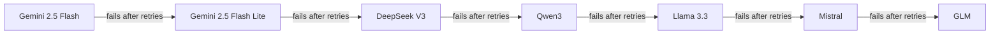

### 20.5 Design Rationale
The fallback sequence is ordered to prioritize the provider identified as strongest for educational content generation (Gemini) first, followed by progressively different but still capable open-source models accessed through OpenRouter and other integrated providers. This ordering ensures that the pipeline attempts the highest-quality option first and only degrades to alternative models when genuinely necessary, rather than load-balancing arbitrarily across all providers from the outset.

### 20.6 Advantages
- Higher availability: the pipeline continues functioning even if one, or several, providers are simultaneously unavailable.
- Better fault tolerance, since the fallback chain contains seven distinct provider/model options before the pipeline would be forced to halt entirely.
- Zero required user intervention: the source documentation explicitly states the user never needs to manually change models.

### 20.7 Conclusion
The Fallback Strategy is the mechanism that fulfills the "Automatic Fallback" feature principle described in Chapter 2 and the high-availability non-functional requirement described in Chapter 1, ensuring that a single provider's unavailability degrades the system's model quality at worst, rather than halting the note-generation pipeline entirely.

---

## 21. API Key Rotation

### 21.1 Introduction
API Key Rotation is a fine-grained resilience mechanism operating beneath the Fallback Strategy, addressing quota exhaustion at the level of an individual API key rather than an entire provider.

### 21.2 Design Objective
The objective of API Key Rotation is to maximize usage of each provider's free tier by cycling through multiple API keys per provider before concluding that the provider itself is unavailable and escalating to the Fallback Strategy.

### 21.3 Detailed Explanation
Each provider may have one or more associated API keys. Rather than always using the first key until it is entirely exhausted and then giving up on the provider, EduScribe AI rotates through the available keys intelligently. The documented example for Google illustrates this behavior:

```
Google
  Key 1 → Quota Full → Key 2 → Quota Full → Key 3 → Quota Full → Switch Provider
```

Only once every available key for a given provider has reached its quota limit does the system escalate to switching providers entirely, at which point the Fallback Strategy (Chapter 20) takes over.

### 21.4 Internal Workflow

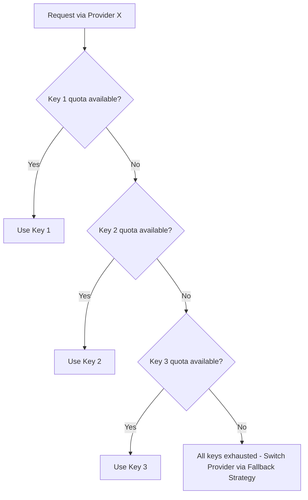

### 21.5 Design Rationale
API Key Rotation exists as a layer beneath provider-level fallback because switching providers is a more disruptive operation than switching keys within the same provider — a key switch preserves the currently selected model's quality characteristics, whereas a provider switch changes the underlying model entirely. Exhausting all available keys before escalating therefore maximizes the amount of work completed using the preferred, primary provider before quality potentially changes due to fallback.

### 21.6 Advantages
- Maximizes free-tier usage across every available key for a provider before that provider is considered exhausted.
- Delays the need to escalate to a lower-priority fallback provider, preserving output quality for as long as possible.
- Operates within each provider's usage policies by rotating rather than concentrating load on a single key.

### 21.7 Conclusion
API Key Rotation is the finest-grained layer of EduScribe AI's resilience architecture, sitting directly beneath the Fallback Strategy and ensuring that a provider is only abandoned after every one of its available keys has been fully utilized.

---

## 22. Backend Task Flow

### 22.1 Introduction
The Backend Task Flow describes how EduScribe AI processes long-running AI operations — transcription, OCR, note generation, and PDF rendering — without blocking the HTTP request/response cycle.

### 22.2 Design Objective
The objective of this module is to ensure that operations requiring several minutes to complete are executed asynchronously, in the background, rather than inside the lifetime of a single HTTP request.

### 22.3 Detailed Explanation
Running Whisper transcription, OCR, AI note generation, or PDF generation directly inside an HTTP request handler would block the server for the duration of these long-running operations. To avoid this, EduScribe AI uses **Celery** to execute these operations asynchronously, with **Redis** serving as the message broker between FastAPI and Celery. When a new job is submitted, Redis temporarily stores the task until an available Celery worker begins processing it. Beyond its role as a message broker, Redis is also used for rate limiting, temporary caching, session storage, and queue management.

### 22.4 Internal Workflow

```
User Uploads Video
  ↓
FastAPI
  ↓
Celery Queue
  ↓
Worker
  ↓
Processing
  ↓
Database Update
  ↓
User Notification
```

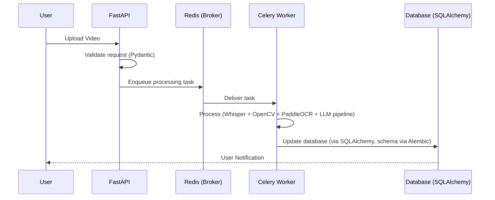

### 22.5 Design Rationale
Offloading long-running work to Celery workers, coordinated through Redis, is the direct architectural response to the "Scalability" non-functional requirement from Chapter 1: an AI application involving file uploads, long-running transcription/OCR/generation tasks, and communication with multiple external LLM APIs cannot remain responsive if any of these operations execute synchronously within the request lifecycle.

### 22.6 Advantages
- Background processing keeps the FastAPI request/response cycle fast and responsive regardless of how long the underlying AI processing takes.
- Retry support at the task-queue level adds an additional layer of fault tolerance beyond the LLM-specific Retry Strategy (Chapter 19).
- Parallel execution across multiple Celery workers allows multiple lectures, or multiple chunks within a lecture, to be processed concurrently.

### 22.7 Conclusion
The Backend Task Flow is the operational backbone that allows EduScribe AI's otherwise long-running, multi-stage AI pipeline (transcription through PDF export) to be exposed through a responsive, asynchronous API — ensuring the user-facing system remains usable even while extensive background processing is underway.

---

## 23. Technology Stack

### 23.1 Introduction
The Technology Stack chapter catalogs every library and framework selected for EduScribe AI, along with the specific architectural responsibility each one fulfills.

### 23.2 Design Objective
The objective of this chapter is to document why each library was selected — favoring mature, well-supported, and (during development) free or open-source tools — and to make explicit the specific responsibility boundary each library occupies within the overall architecture, in line with the system's stated principle of separation of concerns.

### 23.3 Detailed Explanation

**FastAPI** is the primary backend framework, responsible for user authentication, video upload, background task management, history APIs, notes generation APIs, file download APIs, and system administration APIs. It is selected for its automatic request validation via Pydantic models (reducing boilerplate and preventing common runtime errors), its asynchronous architecture (well suited to file uploads, long-running tasks, and external API communication), automatic API documentation, high performance, and strong integration with SQLAlchemy and Celery.

**SQLAlchemy** serves as the Object Relational Mapper, providing Python models that represent database tables instead of requiring raw SQL throughout the application. It handles database models, relationships, CRUD operations, query optimization, and database abstraction, and is selected for its maturity, its strong support for PostgreSQL, and the fact that it allows future migration to a different database without altering business logic.

**Alembic** manages database schema migrations, generating version-controlled migration files whenever a new table or column is added, providing version control for schema changes, easy rollback, team collaboration support, and production safety.

**Celery**, as described in Chapter 22, executes long-running AI operations (Whisper transcription, OCR, AI note generation, PDF generation) asynchronously, preventing these operations from blocking the HTTP request cycle. It provides background processing, retry support, parallel execution, and fault tolerance.

**Redis** acts as the message broker between FastAPI and Celery, temporarily storing submitted jobs until a worker begins processing them, and is additionally used for rate limiting, temporary caching, session storage, and queue management. It is selected for being extremely fast, lightweight, reliable, and easy to integrate.

**Pydantic** validates structured data throughout the project, ensuring that API requests, API responses, and LLM outputs all conform to predefined schemas — for example, validating a structure such as `{"topic": "...", "subtopics": []}` before it is processed further. It provides type safety, automatic validation, better error messages, and reduced bugs.

**PydanticAI**, detailed fully in Chapter 17, manages LLM interactions while guaranteeing structured outputs, handling prompt execution, output validation, retry handling, schema enforcement, and error detection.

**LiteLLM**, detailed fully in Chapter 16, provides the unified interface across multiple LLM providers, handling provider abstraction, model switching, API normalization, and token tracking.

**PaddleOCR** extracts textual information — including formulas, diagrams, tables, and handwritten annotations — from selected video frames, handling slide text extraction, formula recognition, timestamp association, and OCR confidence scoring. It is selected specifically for its strong performance on lecture slides compared with lighter-weight OCR libraries.

**MLX Whisper** converts lecture audio into text. It is selected because the project is developed on Apple Silicon, where MLX Whisper provides significantly better performance than the original Whisper implementation — faster inference and lower memory usage, optimized specifically for M-series chips.

**OpenCV** processes video frames before OCR, handling blur detection, duplicate detection, frame extraction, and image preprocessing, selected for its highly optimized computer vision algorithms.

**Structlog** provides structured, machine-readable logging in place of plain-text print statements, making logs easier to search, filter, and analyze.

**Tenacity**, detailed further in Chapter 19, automatically retries failed operations caused by network issues, rate limiting, or timeouts, providing improved reliability, reduced failures, and automatic exponential backoff.

**Jinja2**, detailed further in Chapter 13, generates HTML from structured notes using reusable templates rather than manually constructed HTML, providing clean code, easy customization, and separation of presentation and logic.

**Markdown-it-py** provides the standards-compliant Markdown rendering engine used to convert structured notes into Markdown before HTML generation, offering reliable rendering, easy formatting, and extensibility.

**WeasyPrint**, detailed further in Chapter 14, generates professional PDFs directly from HTML and CSS, supporting typography, images, tables, and page numbering/table of contents.

**Langfuse** monitors every LLM interaction, recording prompt versions, responses, latency, token usage, cost, and errors. As prompt engineering evolves, Langfuse provides the visibility developers need to determine which prompts produce the highest-quality educational notes, enabling systematic evaluation and continuous prompt-quality improvement.

The overall architecture, expressed as a single top-to-bottom stack, is:

```
Frontend (React)
        │
        ▼
FastAPI
        │
        ▼
Pydantic Validation
        │
        ▼
Celery + Redis
        │
        ▼
Whisper + OpenCV + PaddleOCR
        │
        ▼
PydanticAI
        │
        ▼
LiteLLM
        │
        ▼
Gemini / DeepSeek / Qwen / Llama
        │
        ▼
Structured Notes
        │
        ▼
Markdown-it-py
        │
        ▼
Jinja2 Templates
        │
        ▼
WeasyPrint
        │
        ▼
Professional PDF
```

```mermaid
flowchart TD
    A[Frontend - React] --> B[FastAPI]
    B --> C[Pydantic Validation]
    C --> D[Celery + Redis]
    D --> E[Whisper + OpenCV + PaddleOCR]
    E --> F[PydanticAI]
    F --> G[LiteLLM]
    G --> H[Gemini / DeepSeek / Qwen / Llama]
    H --> I[Structured Notes]
    I --> J[Markdown-it-py]
    J --> K[Jinja2 Templates]
    K --> L[WeasyPrint]
    L --> M[Professional PDF]
```

### 23.4 Internal Workflow
Each library in this chapter occupies exactly one layer of the top-to-bottom stack shown above. Data flows strictly downward: the frontend issues a request, FastAPI receives and validates it, Celery/Redis offload the heavy processing, Whisper/OpenCV/PaddleOCR perform ingestion, PydanticAI/LiteLLM manage the LLM interaction layer, and the export chain (Markdown-it-py → Jinja2 → WeasyPrint) produces the final artifact.

### 23.5 Design Rationale
Every library selection in this chapter is justified by the same underlying principle stated at the top of the source documentation's technology stack chapter: the system favors mature, well-supported, actively maintained, and well-documented open-source libraries over custom-built solutions for already-solved problems, with each library assigned a clearly defined, non-overlapping responsibility.

### 23.6 Advantages
- Every architectural layer (API, ORM, migrations, task queue, broker, validation, LLM abstraction, OCR, transcription, computer vision, logging, retry, templating, Markdown rendering, PDF rendering, observability) has an explicitly named, purpose-built library rather than a general-purpose or custom-built substitute.
- The stack's layering mirrors the End-to-End Pipeline (Chapter 3.1) directly, making it straightforward to map any pipeline stage to the specific library responsible for implementing it.

### 23.7 Limitations
MLX Whisper's selection is explicitly tied to the project's Apple Silicon development environment, which is a structural dependency inherited from Chapter 1's environmental assumption and carried through unchanged into the technology stack.

### 23.8 Conclusion
The Technology Stack chapter is the concrete library-level realization of every architectural principle described earlier in this document — from the provider abstraction described in Chapter 15, to the asynchronous processing described in Chapter 22, to the export chain described in Chapters 12 through 14 — with each library occupying precisely one layer of a strictly layered, top-to-bottom system architecture.

---

## 24. Important Notes

### 24.1 Introduction
The Important Notes chapter consolidates cross-cutting design commitments that apply across multiple modules described in this document, rather than being scoped to any single chapter.

### 24.2 Design Objective
The objective of this chapter is to make explicit a small number of system-wide design commitments that, if overlooked, could lead to a misreading of any individual chapter in isolation.

### 24.3 Detailed Explanation

**No arbitrary length limits.** Explanation length, as established in Chapter 8, is intentionally uncapped and scales with topic complexity. This is a deliberate design choice rather than an oversight, and it carries a direct cost implication given the free-tier and quota constraints on the LLM providers described in Chapter 15.

**Provider abstraction is mandatory.** As established in Chapter 15, the application must never call a vendor SDK directly. Every request flows through the LLM Manager → LiteLLM → Provider chain, which is what allows providers to be added or removed without touching business logic elsewhere in the system.

**Regeneration is scoped, not global.** As established in Chapter 11, failed Quality Gate checks trigger regeneration of the affected subtopic only, never the entire document. This keeps both token usage and cost proportional to the size of the actual defect.

**Chunk overlap is semantic, not fixed-token.** As established in Chapter 4, overlap size between adjacent chunks is determined by concept continuity, not by a fixed character or token count — distinguishing EduScribe AI's chunking strategy from traditional fixed-token overlap approaches.

**Retries and fallback are distinct mechanisms operating at different scopes.** As established in Chapters 19 and 20, retries (via exponential backoff) handle transient failures on the *same* provider, while fallback switches to the *next* provider only after retries on the current provider have been exhausted. Permanent errors — such as an invalid API key or a malformed request — bypass retries entirely and fail fast, since retrying a permanent error can never succeed.

**Chunk reusability is a stable, shared contract.** As established in Chapters 4 and 5, the same chunk data structure is intended to power Topic Detection, Subtopic Detection, Notes Generation, Flashcards, Quiz Generation, Mind Maps, and future RAG-based features. The chunk schema is therefore treated as a stable, shared contract across every feature that consumes it, rather than as an implementation detail private to any single module.

### 24.4 Internal Workflow
These notes do not describe a runtime workflow of their own; rather, each note functions as a cross-cutting constraint that governs the internal workflow of one or more chapters described earlier in this document — length constraints govern Chapter 8, provider abstraction governs Chapters 15–21, scoped regeneration governs Chapter 11, semantic overlap governs Chapter 4, and the retry/fallback distinction governs Chapters 19 and 20 jointly.

### 24.5 Design Rationale
Consolidating these notes into a single chapter, separate from the individual module chapters where each principle originates, ensures that a reader reviewing any single chapter in isolation does not lose sight of the system-wide commitments that chapter is expected to honor.

### 24.6 Advantages
- Provides a single point of reference for cross-cutting design commitments that would otherwise be scattered implicitly across multiple chapters.
- Reinforces the distinction between mechanisms that are easy to conflate — retries versus fallback, chunk overlap versus fixed-token overlap, scoped regeneration versus full-document regeneration.

### 24.7 Conclusion
The Important Notes chapter serves as a cross-cutting summary of the system's most consequential design commitments, ensuring that the architectural decisions established in Chapters 1 through 23 are read as a coherent, mutually consistent whole rather than as a set of independently negotiable module-level choices.

---

**End of Document**
