# EduScribe AI — Low-Level Design (LLD)

**Document Type:** Low-Level Design (LLD)
**Scope:** Engineering-level specification for the EduScribe AI system. All sections elaborate on existing design decisions, preserving the terminology, component boundaries, and architectural choices established in the source documentation. No new architecture, technology, workflow, or feature is introduced.

---

## Table of Contents

1. [Requirements](#1-requirements)
2. [Features](#2-features)
3. [Workflow](#3-workflow)
4. [Semantic Chunking](#4-semantic-chunking)
5. [Chunk Data Model](#5-chunk-data-model)
6. [Topic Detection](#6-topic-detection)
7. [Knowledge Gap Analysis](#7-knowledge-gap-analysis)
8. [Detailed Explanation Generation](#8-detailed-explanation-generation)
9. [Example Generation](#9-example-generation)
10. [Image Integration](#10-image-integration)
11. [Quality Gates](#11-quality-gates)
12. [Markdown Generation](#12-markdown-generation)
13. [HTML Generation](#13-html-generation)
14. [PDF Generation](#14-pdf-generation)
15. [LLM Provider Architecture](#15-llm-provider-architecture)
16. [LiteLLM](#16-litellm)
17. [PydanticAI](#17-pydanticai)
18. [Model Routing](#18-model-routing)
19. [Retry Strategy](#19-retry-strategy)
20. [Fallback Strategy](#20-fallback-strategy)
21. [API Key Rotation](#21-api-key-rotation)
22. [Backend Task Flow](#22-backend-task-flow)
23. [Technology Stack](#23-technology-stack)
24. [Important Notes](#24-important-notes)

---

## 1. Requirements

### 1.1 Purpose

This chapter defines the contractual boundary of EduScribe AI: what the system must do (functional requirements), how well it must do it (non-functional requirements), and the environmental assumptions under which it operates. In an LLD, requirements are not aspirational — they are fixed criteria against which every downstream module is evaluated. This separation of *what* from *how* allows the architecture to be justified against a traceable set of requirements rather than ad-hoc engineering decisions.

### 1.2 Functional Requirements

| # | Requirement | Fulfilled By |
|---|---|---|
| FR-1 | Convert a lecture video into structured, in-depth educational notes — not a summary | Atomic Generation (§8), Pedagogical Depth (§2) |
| FR-2 | Extract and synchronize four data streams per lecture: audio transcript, OCR text, timestamps, and video frames | Chunk Data Model (§5) |
| FR-3 | Detect lecture structure automatically — macro-topics and micro-subtopics — without manual tagging | Topic Detection (§6) |
| FR-4 | Generate standalone, pedagogically complete explanations per subtopic covering intuition, examples, applications, and pitfalls | Detailed Explanation Generation (§8), Example Generation (§9) |
| FR-5 | Export final notes to Markdown, HTML, and PDF | Export pipeline (§12–14) |
| FR-6 | Support multiple LLM providers with automatic failover so generation never halts due to a single provider's quota or outage | LLM Provider Architecture (§15), Fallback Strategy (§20) |
| FR-7 | Support future features (quizzes, flashcards, mind maps, RAG-based tutoring) without reprocessing the video | Chunk Data Model and Knowledge Tree as persistent, reusable structures (§4–6) |

### 1.3 Non-Functional Requirements

| Attribute | Requirement | Fulfilled By |
|---|---|---|
| **Reliability** | No single point of failure in the LLM layer; all requests route through a provider-agnostic LLM Manager | LLM Provider Architecture (§15) |
| **Scalability** | Long-running AI operations must not block the HTTP request/response cycle | Backend Task Flow (§22) |
| **Maintainability** | Provider logic, prompt logic, business logic, and presentation logic must remain cleanly separated | Separation of concerns throughout all chapters |
| **Cost-efficiency** | Free-tier APIs are prioritized; lightweight models handle cheap tasks; expensive models handle only complex tasks | Model Routing (§18) |
| **Auditability** | Every prompt, response, latency measurement, token count, and cost figure must be logged | Langfuse integration (§23) |

### 1.4 Environmental Assumption

The transcription component (MLX Whisper) is built and optimized for **Apple Silicon hardware**. Because transcript generation is the first step of the pipeline, every downstream module that depends on transcript availability inherits this platform dependency.

### 1.5 Requirement Traceability

Requirements are validated through the following chain:

```
Requirement → Module → Output Artifact → Validation (Quality Gates)
```

Functional requirements are validated by inspecting output content (e.g., does the note contain a worked example?). Non-functional requirements are validated by observing system behavior over time (e.g., did the pipeline continue when a provider's quota was exhausted?).

---

## 2. Features

### 2.1 Purpose

Where the Requirements chapter defines obligations, this chapter defines the design principles EduScribe AI implements to satisfy them. Each feature is a structural commitment that shapes multiple downstream modules simultaneously, traceable to a specific requirement from §1 and targeting a named failure mode of naive transcript-to-summary pipelines.

### 2.2 Feature Definitions

**Structural Discovery**
Before any content is generated, the system performs a full diagnostic pass over the lecture — the Lecture Analysis stage — producing structured metadata (subject, difficulty, prerequisites, teaching style, learning objectives) consumed by every later stage. The principle is *understand before you generate*.
*Counteracts:* context-blind generation.

**Atomic Generation**
Notes are generated on a per-subtopic basis. Each subtopic explanation is an independent unit of work, preventing the dilution inherent in global summarization where sub-concepts are compressed because the model is covering an entire lecture in one pass.
*Counteracts:* output dilution.

**Multimodal Integrity**
Every claim in generated notes is traceable to source material — transcript, OCR text, timestamp, or visual frame — enforced structurally by the Chunk Data Model (§5), which binds all four data types together so no stage processes one modality in isolation.
*Counteracts:* unverifiable or hallucinated claims.

**Pedagogical Depth**
Output reads as an *explanation*, not a *summary*. The Detailed Explanation Generation prompt (§8) instructs the model to explain the "why" behind concepts — including derivations, comparisons to alternatives, and step-by-step reasoning.
*Counteracts:* shallow restatement.

**Holistic Framework**
Every major topic follows a fixed educational template: (1) Intuition, (2) Practical Examples, (3) Real-World Applications, (4) Common Pitfalls / Misconceptions, (5) Synthesis Recap. This ensures consistent coverage regardless of subject matter.
*Counteracts:* inconsistent topic coverage.

**Token-Agnostic Quality**
No artificial ceiling is placed on explanation length; length is dictated exclusively by subtopic complexity. This principle necessitates multi-stage prompting, since a single-pass summarization prompt is inherently bounded.
*Counteracts:* premature truncation.

**Multi-Provider LLM Layer**
Automatic provider failover, API key rotation, and task-based model routing ensure that per-subtopic, multi-call generation does not create a single point of failure. Because atomic generation multiplies LLM calls per lecture, provider resilience is a structural requirement.
*Counteracts:* single-vendor fragility.

**Semantic Chunking**
The lecture is divided along conceptual boundaries rather than fixed token counts, with semantic overlap between adjacent chunks to preserve continuity. Without semantically coherent chunks, Topic Detection would operate on fragmented input.
*Counteracts:* concept fragmentation.

**Knowledge Tree**
All topic and subtopic mentions across a lecture — including concepts revisited multiple times — are deduplicated and merged into a single hierarchical structure, preventing duplicate note generation.
*Counteracts:* duplicate content generation.

**Quality Gates**
Automated completeness checks are applied to generated content. Failed checks trigger regeneration of only the affected subtopic, keeping correction both targeted and cost-efficient.
*Counteracts:* undetected omissions.

**Image Integration**
OCR-derived diagrams, formulas, and handwritten notes are embedded directly adjacent to the explanation section that discusses them, rather than listed separately or discarded.
*Counteracts:* loss of visual context.

**Multi-Format Export**
Final notes are converted through a defined chain: Markdown → HTML → PDF, using Jinja2 templating, Markdown-it-py rendering, and WeasyPrint respectively.
*Counteracts:* single-format lock-in.

**Observability**
Every prompt/response cycle is logged through Langfuse, capturing latency, token usage, and cost, keeping prompt quality and provider performance measurable over time.
*Counteracts:* invisible quality degradation.

### 2.3 Feature Dependency Chain

Features form a strict dependency chain that defines the processing order:

```
Semantic Chunking
  → Structural Discovery (Lecture Analysis)
    → Atomic Generation (per subtopic)
      → Knowledge Tree (deduplication)
        → Quality Gates (validation)
          → Multi-Format Export
```

Observability runs orthogonally throughout every LLM-touching stage. The Multi-Provider LLM Layer supports every stage that invokes an LLM.

---

## 3. Workflow

### 3.1 End-to-End Pipeline

The End-to-End Pipeline is the top-level orchestration sequence that transforms a raw lecture video into a fully exported set of educational notes. It is the single authoritative processing sequence for the entire system, enforcing a strict linear dependency order across audio processing, computer vision, natural language understanding, and document rendering.

#### Pipeline Stages

```
Video
  ↓
Transcript (Whisper) + OCR (PaddleOCR) + Frame Extraction (OpenCV)   [parallel]
  ↓
Semantic Chunking
  ↓
Topic Detection — Macro-Topics
  ↓
Subtopic Detection — Micro-Subtopics
  ↓
Knowledge Tree (deduplicated, hierarchical)
  ↓
Detailed Explanation Generation (per subtopic)
  ↓
Examples and Visual References
  ↓
Markdown Generation
  ↓
HTML Generation
  ↓
PDF Generation
```

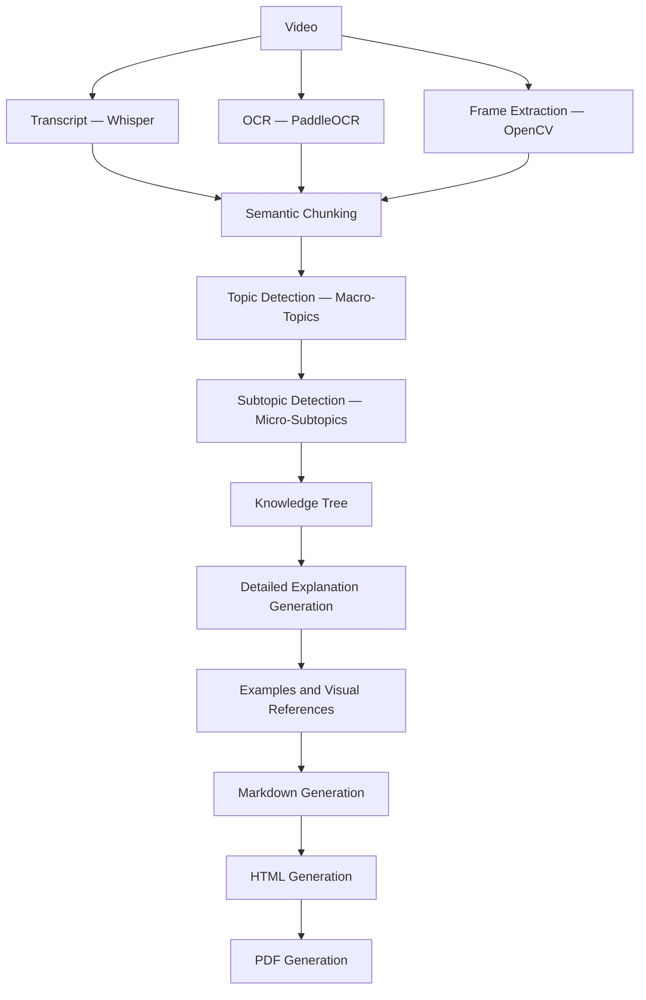

#### Design Rationale

The pipeline is deliberately linear because each stage's output is a structural precondition for the next:

- **Topic Detection** cannot run correctly on unchunked transcript, since chunk boundaries encode conceptual completeness.
- **Explanation Generation** cannot begin before the Knowledge Tree exists, since generating an explanation for a topic that will later be merged with another occurrence would produce duplicate, conflicting content.

Parallelism is applied where safe — transcript extraction, OCR, and frame extraction run simultaneously — and removed where it is not (Semantic Chunking waits for all three streams).

> **Debugging note:** Because the pipeline is strictly linear, a defect in the output can always be traced to exactly one pipeline stage.

---

### 3.2 Prompt Pipeline

The Prompt Pipeline is the LLM-facing counterpart to the End-to-End Pipeline. While the End-to-End Pipeline describes the movement of data through the system, the Prompt Pipeline describes the sequence of distinct, single-responsibility LLM calls that transform structured input into structured educational output.

A single "summarize this lecture" instruction produces shallow, incomplete output — it mentions an algorithm and its complexity while omitting prerequisites, worked examples, common mistakes, and practical applications. The Prompt Pipeline avoids this by assigning each concern to its own dedicated stage.

#### Stage Definitions

**Stage 1 — Lecture Analysis**
Identifies the lecture's subject, difficulty, prerequisites, teaching style, and primary learning objectives. Outputs structured JSON metadata consumed by every later stage. Does not produce explanatory content.

**Stage 2 — Topic Detection**
Identifies the macro-topics of the lecture, each associated with start and end timestamps. Does not attempt to explain any topic.

**Stage 3 — Subtopic Detection**
Decomposes each macro-topic into its internal structure (e.g., "Binary Search" → Definition, Prerequisites, Algorithm, Dry Run, Complexity, Applications).

**Stage 4 — Knowledge Gap Analysis**
Identifies information a beginner would require but which the lecture only briefly mentions or entirely assumes. Output is consumed internally by Stage 5 and is not surfaced to the user. See §7 for full detail.

**Stage 5 — Detailed Explanation Generation**
Core content-producing stage. Processes exactly one subtopic per invocation, instructing the model to *teach* the concept with definition, intuition, motivation, step-by-step reasoning, visual explanation, mathematical derivation (where applicable), worked examples, code examples (for programming lectures), real-world applications, common mistakes, best practices, interview perspective, and key takeaways. No upper bound on explanation length. See §8 for full detail.

**Stage 6 — Example Generation**
Produces simple, intermediate, real-world, numerical, programming, and visual examples tied to lecture frames. See §9 for full detail.

> **Note on stage numbering:** The source documentation defines Stages 1–6 explicitly, then continues at Stage 9. "Common Mistakes" and "Revision Notes" appear in the pipeline diagram as intermediate steps between Stage 6 and Stage 9 but are not numbered in the source. This gap is preserved as-is.

**Stage 9 — Markdown Generation**
The final AI-facing stage. Converts all validated, structured educational content into well-formatted Markdown. Deliberately separated from content generation so formatting logic can evolve independently. See §12 for full detail.

#### Pipeline Sequence

```
Video
  ↓
Transcript + OCR + Frames
  ↓
Stage 1: Lecture Analysis        → subject, difficulty, prerequisites, teaching style
  ↓
Stage 2: Topic Detection         → macro-topics + timestamps
  ↓
Stage 3: Subtopic Detection      → micro-subtopics per topic
  ↓
Stage 4: Knowledge Gap Analysis  → implicit / missing prerequisite information
  ↓
Stage 5: Detailed Explanation Generation  → per subtopic, no length ceiling
  ↓
Stage 6: Example Generation      → simple / intermediate / real-world / numerical / code / visual
  ↓
[Common Mistakes + Revision Notes]
  ↓
Stage 9: Markdown Generation
  ↓
HTML Generation
  ↓
PDF Generation
```

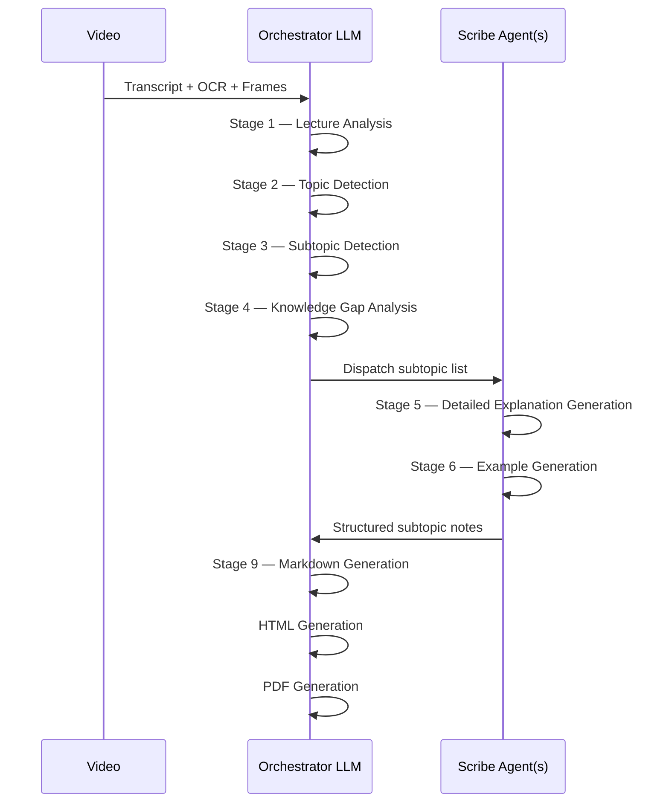

#### Design Rationale

Each stage is restricted to a single responsibility so that no LLM call is simultaneously asked to understand, structure, and explain a lecture — mirroring the Atomic Generation principle (§2). Improving one stage (e.g., refining the Knowledge Gap Analysis prompt) never requires modifying any other stage's prompt. Each stage outputs independently structured JSON where applicable, simplifying validation via PydanticAI (§17) and isolating debugging to the exact stage where a failure occurs.

---

## 4. Semantic Chunking

### 4.1 Purpose

Semantic Chunking divides the merged transcript and OCR content into coherent, self-contained units before any topic detection or explanation generation occurs. It sits immediately after data ingestion in the pipeline and is a precondition for every subsequent AI-facing stage.

Token-based chunking divides a transcript at fixed intervals regardless of concept boundaries, producing two failure modes: a single explanation (e.g., Binary Search) is split across chunks, or one chunk contains the tail of one concept and the beginning of an unrelated one. Semantic Chunking replaces fixed-size slicing with **boundary detection** — chunk edges are placed where lecture content actually transitions between concepts.

### 4.2 Boundary Detection Signals

Boundary decisions combine multiple indicators rather than treating any single signal as authoritative:

- Changes in lecture topic or subject matter
- Significant pauses in speech
- Slide transitions
- Changes in OCR-extracted text content
- Appearance of new headings on slides
- Explicit instructor transition phrases ("Now let's discuss…", "Next…", "Moving on to…")
- Major shifts in vocabulary

### 4.3 Structural Rules

**Semantic Overlap**
Adjacent chunks share overlap determined by concept continuity, not a fixed token count. For example, if Chunk A ends with "Definition" and "Algorithm," Chunk B may begin with "Algorithm," "Example," and "Complexity," ensuring that no section is lost at a boundary. This distinguishes EduScribe AI's strategy from traditional fixed-token overlap.

**Chunk Linking**
If the lecturer returns to an earlier concept later in the lecture, the new chunk is linked to the earlier chunk covering the same concept rather than duplicating the content. This mechanism feeds directly into the Knowledge Tree's deduplication (§6).

**Chunk Relationship Graph**
Chunks are stored as a connected linked list:

```
Chunk 1 → Chunk 2 → Chunk 3 → Chunk 4
```

Each chunk references its previous and next neighbor. When a chunk begins with "As discussed previously…", the system retrieves the prior chunk to restore missing context rather than treating the chunk as isolated.

### 4.4 Processing Workflow

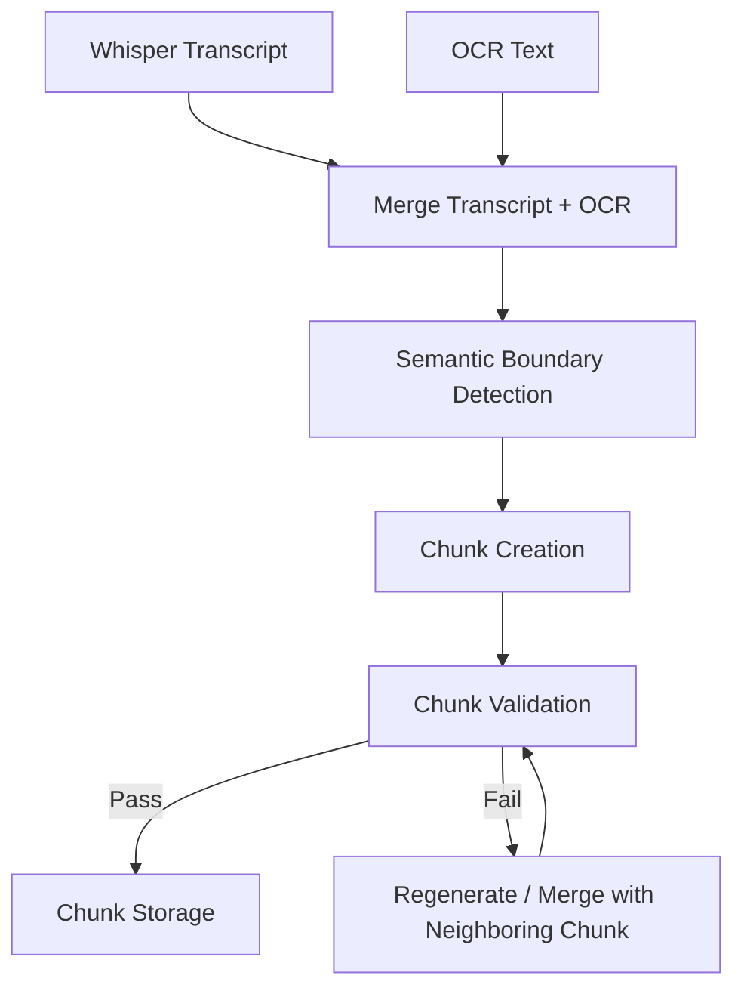

### 4.5 Chunk Validation Checks

A chunk must pass all of the following checks before it is forwarded to the LLM pipeline:

| Check | Description |
|---|---|
| Transcript availability | Chunk contains valid transcript text |
| OCR consistency | OCR text is consistent with transcript content |
| Timestamp correctness | Start/end timestamps are valid and sequential |
| Minimum information density | Chunk contains sufficient content to be meaningful |
| Semantic completeness | Chunk is not cut mid-concept |
| Duplicate detection | Chunk is not a near-duplicate of an existing chunk |

Chunks that fail validation are either regenerated or merged with a neighboring chunk — they are never silently discarded.

### 4.6 Design Rationale

Semantic Chunking is positioned as early as possible in the pipeline because every downstream AI stage depends on conceptually complete input. If chunk boundaries were arbitrary, Topic Detection would be forced to reconstruct concept boundaries that Chunking should have already established, duplicating expensive work at a later pipeline stage.

> **Limitation:** Boundary detection relies on heuristic signals rather than deterministic rules. Lectures with poor audio quality or visually noisy slides produce weaker boundary signals, which is why Chunk Validation is a mandatory gate before storage.

### 4.7 Reusability

The chunk structure produced here is the atomic unit consumed by every downstream feature: Topic Detection, Subtopic Detection, Notes Generation, and planned future features (flashcards, quiz generation, mind maps, RAG). The chunk schema is therefore a stable, shared contract across the entire system.

---

## 5. Chunk Data Model

### 5.1 Purpose

The Chunk Data Model defines the structured representation of a single semantic chunk after it passes validation. It operationalizes the Multimodal Integrity feature (§2) by binding transcript text, OCR text, timestamps, and frame references into one addressable unit.

The schema is intentionally over-specified relative to what any single downstream consumer strictly requires, because the same chunk object is reused across Topic Detection, Subtopic Detection, Notes Generation, Flashcards, Quiz Generation, Mind Maps, and RAG. Under-specifying now would force schema migrations as each feature is added.

### 5.2 Schema

```json
{
  "chunk_id": 15,
  "lecture_id": 2,
  "start_time": "00:12:20",
  "end_time": "00:18:45",
  "topic_hint": "Binary Search",
  "transcript": "...",
  "ocr_text": ["Binary Search", "O(log n)", "Sorted Array"],
  "frame_ids": ["frame_24.jpg", "frame_25.jpg"],
  "previous_chunk": 14,
  "next_chunk": 16,
  "confidence": 0.97
}
```

### 5.3 Metadata Categories

| Category | Fields |
|---|---|
| **Temporal** | `start_time`, `end_time`, lecture duration, estimated reading time |
| **Visual** | `frame_ids`, OCR confidence, number of associated images |
| **Content** | `topic_hint`, keywords, difficulty estimate, chunk summary |
| **Relationship** | `previous_chunk`, `next_chunk`, parent topic, child subtopics |

**Minimum required fields:** `chunk_id`, `start_time`, `end_time`, `transcript`, `ocr_text`, `frame_ids`.

**Extended fields** that add relationship-awareness: `lecture_id`, `topic_hint`, `previous_chunk`, `next_chunk`, `confidence`.

### 5.4 Database Hierarchy

Chunks are stored in a hierarchy that supports both top-down and bottom-up traversal:

```
Lectures
  └── Chunks
        └── Topics
              └── Subtopics
                    └── Generated Notes
```

- **Top-down:** Retrieve all notes belonging to a lecture.
- **Bottom-up:** Identify which chunk supports a given piece of generated text.

### 5.5 Key Design Decisions

- **`confidence` field:** Allows downstream consumers to make informed decisions about how much to trust a chunk's content, rather than treating all chunks as equally reliable.
- **`previous_chunk` / `next_chunk`:** Enable context recovery without a full-lecture re-scan. A chunk beginning with "As discussed previously…" can automatically retrieve its predecessor.
- **`topic_hint`:** Provides a lightweight semantic tag that accelerates Topic Detection without replacing it.

---

## 6. Topic Detection

### 6.1 Purpose

Topic Detection transforms a flat sequence of validated chunks into a hierarchical macro/micro topic structure — the authoritative table of contents for the generated document. Every subsequent content-generation stage (Knowledge Gap Analysis, Detailed Explanation Generation, Example Generation) operates against the topic/subtopic units this stage produces, not against raw chunk text.

### 6.2 Two-Tier Detection Strategy

**Tier 1 — Macro-Topic Identification**
The Orchestrator identifies the main pillars of the lecture (e.g., "Binary Search" within a lecture on searching algorithms). Each macro-topic receives start and end timestamps.

**Tier 2 — Micro-Subtopic Decomposition**
Each macro-topic is independently decomposed into its specific internal concepts (e.g., for "Binary Search": Definition, Prerequisites, Algorithm, Dry Run, Complexity, Applications).

The two-tier split exists because the two tasks are fundamentally different: macro-topic identification requires understanding the overall shape of the lecture (and depends on Stage 1 output), while micro-subtopic identification requires deep, topic-specific decomposition. Separating them allows each to be validated independently. A Tier 1 error (missing an entire macro-topic) is a structurally different failure from a Tier 2 error (missing a subtopic within a correctly identified macro-topic).

### 6.3 Output Format

Both tiers output strict JSON, which is machine-verifiable via PydanticAI (§17).

**Tier 1 — macro-topics with timestamps:**
```json
{
  "topics": [
    { "title": "Binary Search", "start": "00:05:20", "end": "00:18:30" }
  ]
}
```

**Tier 2 — micro-subtopics per topic:**
```json
{
  "topic": "Binary Search",
  "subtopics": ["Definition", "Prerequisites", "Algorithm", "Dry Run", "Complexity", "Applications"]
}
```

### 6.4 Knowledge Tree Construction

After all chunks are processed, repeated topic mentions are merged: if "Binary Search" appears across multiple chunks (e.g., introduced early and revisited during Q&A), all associated information is collected beneath a single topic node in the Knowledge Tree rather than generating duplicate notes for each occurrence.

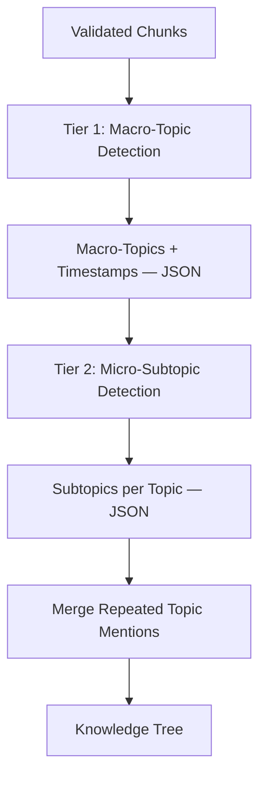

### 6.5 Advantages

- Strict JSON output enables automated schema validation, preventing malformed topic hierarchies from propagating downstream.
- Timestamps at the macro-topic level allow explanation stages to reference the corresponding video segment.
- Merging repeated mentions here prevents duplicate note generation, directly feeding the Knowledge Tree's deduplication behavior.

---

## 7. Knowledge Gap Analysis

### 7.1 Purpose

Knowledge Gap Analysis (Stage 4 of the Prompt Pipeline) identifies information necessary for a beginner's understanding of a topic that is missing, implicit, or only briefly mentioned in the lecture itself. Without this stage, generated notes would faithfully reproduce the same conceptual blind spots present in the live lecture — undefined terms, unstated prerequisites, and expert-assumed reasoning steps. Knowledge Gap Analysis addresses this by explicitly surfacing these gaps before any explanatory content is drafted.

### 7.2 What Gets Identified

For each subtopic, this stage identifies:

- **Assumed definitions** — concepts used by the instructor but never explicitly defined
- **Missing prerequisites** — foundational concepts a beginner would need before the current topic makes sense
- **Implicit reasoning** — logical steps skipped because they were obvious to an expert
- **Missing context** — additional background required for full understanding
- **Potential misconceptions** — misunderstandings students might form from the way the material was presented

### 7.3 How the Output Is Used

This stage's output is **not surfaced to the end user** as a standalone artifact. It is consumed internally, guiding Stage 5 (Detailed Explanation Generation) so that the resulting explanation proactively fills identified gaps. A student encountering the notes never sees the gap analysis — they simply receive a complete explanation.

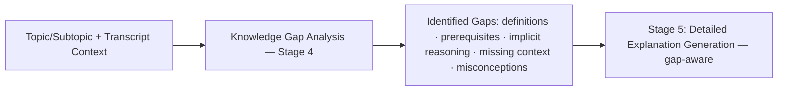

### 7.4 Design Rationale

Positioning Knowledge Gap Analysis as its own dedicated stage — rather than folding gap-detection instructions into the explanation prompt — follows the single-responsibility principle governing the entire Prompt Pipeline. Asking one prompt to simultaneously detect gaps and produce polished explanations risks prioritizing fluent prose over rigorous completeness checking. Separating the tasks ensures gap detection receives dedicated reasoning attention before any explanatory text is drafted.

> **Connection to Quality Gates:** The gap analysis output can also inform Quality Gates (§11) — a subtopic whose known gaps remain unaddressed in the final explanation represents an incomplete output.

---

## 8. Detailed Explanation Generation

### 8.1 Purpose

Detailed Explanation Generation (Stage 5) is the core content-producing module of EduScribe AI. It is where the system's central design philosophy — *explanation, not summary* — is directly enacted. Every subtopic is treated as an isolated, standalone lesson, generating depth that is structurally impossible to achieve within a single-pass, whole-lecture summarization prompt.

### 8.2 Expanded Pedagogical Prompt

Each subtopic is generated using an Expanded Pedagogical Prompt. Rather than stating a fact or formula directly, the model is instructed to explain derivations, variables, and the reasoning behind conditions and constants. The following components are required for every subtopic, in order:

| # | Component | Description |
|---|---|---|
| 1 | Definition | Simple-language definition of the concept |
| 2 | Motivation | Why the concept exists; what problem it solves |
| 3 | Prerequisites | What the reader must already know |
| 4 | Step-by-step explanation | Full conceptual walkthrough |
| 5 | Worked example | A concrete example with actual values |
| 6 | Visual explanation | References to associated lecture frames |
| 7 | Common mistakes | Typical errors and misconceptions |
| 8 | Edge cases | Boundary conditions and special scenarios |
| 9 | Complexity analysis | Time/space complexity where applicable |
| 10 | Real-world applications | Practical uses of the concept |
| 11 | Interview/exam perspective | How the concept appears in assessments |
| 12 | Key takeaways | Concise summary of critical points |

**Illustrative contrast — summary vs. explanation:**

A *summary* might read: "Binary Search repeatedly divides the search space in half."

An *explanation* — as this stage produces — would:
1. Explain why linear search becomes inefficient at scale
2. Introduce the requirement that the array must be sorted
3. Describe how the midpoint is chosen
4. Walk through every comparison step with actual values
5. Analyze time complexity (O(log n)) and prove why
6. Discuss common implementation mistakes (e.g., integer overflow in midpoint calculation)
7. Conclude with practical applications (searching databases, dictionaries, etc.)

Relevant OCR text and lecture screenshots are embedded wherever they reinforce a specific part of the explanation, directly implementing Image Integration (§10).

### 8.3 No Length Ceiling

**No upper limit is placed on explanation length.** If a concept genuinely requires several pages to be properly explained, the model is expected to produce that length rather than truncate for brevity. This is the direct implementation of the Token-Agnostic Quality feature (§2).

> **Cost implication:** Because explanation length is uncapped, this stage is the primary driver of LLM token consumption in the entire pipeline. This interacts directly with the free-tier and quota constraints of the LLM providers described in §15.

### 8.4 Processing Workflow

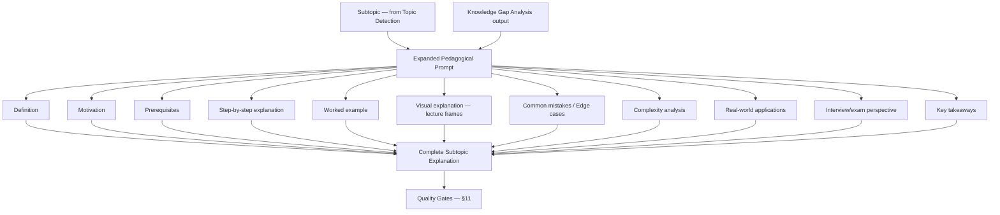

**Input:** Single subtopic + associated chunk data (transcript, OCR, frame references) + Knowledge Gap Analysis output for that subtopic.
**Output:** Fully composed subtopic explanation, forwarded to Example Generation (§9) and then Quality Gates (§11).

### 8.5 Atomic Regeneration Benefit

Generating explanations one subtopic at a time means that if Quality Gates later reject a specific explanation, only that subtopic needs to be regenerated — not the entire lecture's notes. This keeps correction cost proportional to the size of the defect.

---

## 9. Example Generation

### 9.1 Purpose

Example Generation (Stage 6) is a dedicated stage that produces concrete examples for each concept, deliberately separated from the explanation prompt in Stage 5. The underlying pedagogical principle is that students learn concepts more effectively through examples than through explanation text alone. Separating example generation into its own stage allows future improvements to example quality without requiring any change to the explanation prompt, and vice versa.

### 9.2 Example Categories

For each concept, six categories of examples are generated:

| Category | Description |
|---|---|
| Simple examples | Introductory, beginner-accessible illustrations |
| Intermediate examples | More complex applications of the concept |
| Real-world applications | How the concept appears in practice |
| Numerical examples | Concrete numerical walkthroughs (where applicable) |
| Programming examples | Code-level demonstrations (for programming lectures) |
| Visual examples | Examples tied to extracted lecture frames |

### 9.3 Processing Workflow

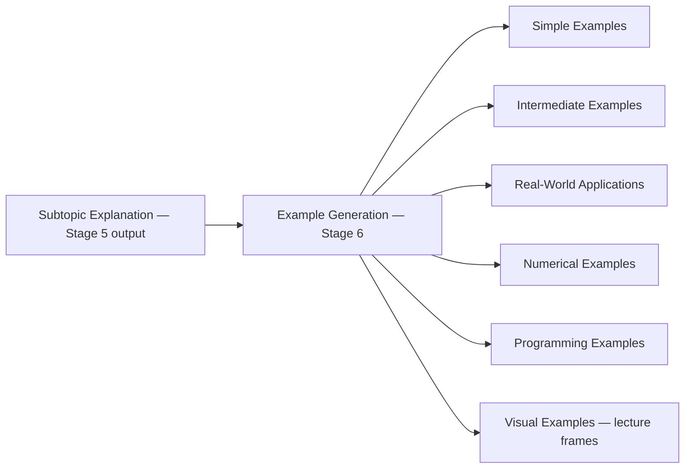

### 9.4 Connection to Quality Gates

The Quality Gate requirement that every algorithm must include at least one worked example (§11) is directly fulfilled by this stage. Because example production is this stage's explicit responsibility, the Quality Gate can target a precise, independently verifiable artifact rather than inspecting the body of a combined prompt output.

---

## 10. Image Integration

### 10.1 Purpose

Image Integration governs how OCR-derived and frame-derived visual material — diagrams, formulas, tables, and handwritten notes — is incorporated into the generated notes. The goal is to ensure that no visual material captured during ingestion is discarded or relegated to a disconnected appendix.

### 10.2 Placement Rule

Images are positioned **beside the explanation section that discusses them**, not grouped at the end of the document. This is a strict rule. It directly reflects the Multimodal Integrity feature (§2): every claim in the generated text must be anchored to its visual source wherever one exists. Separating visual material from the text that discusses it would break this anchoring guarantee.

### 10.3 Workflow

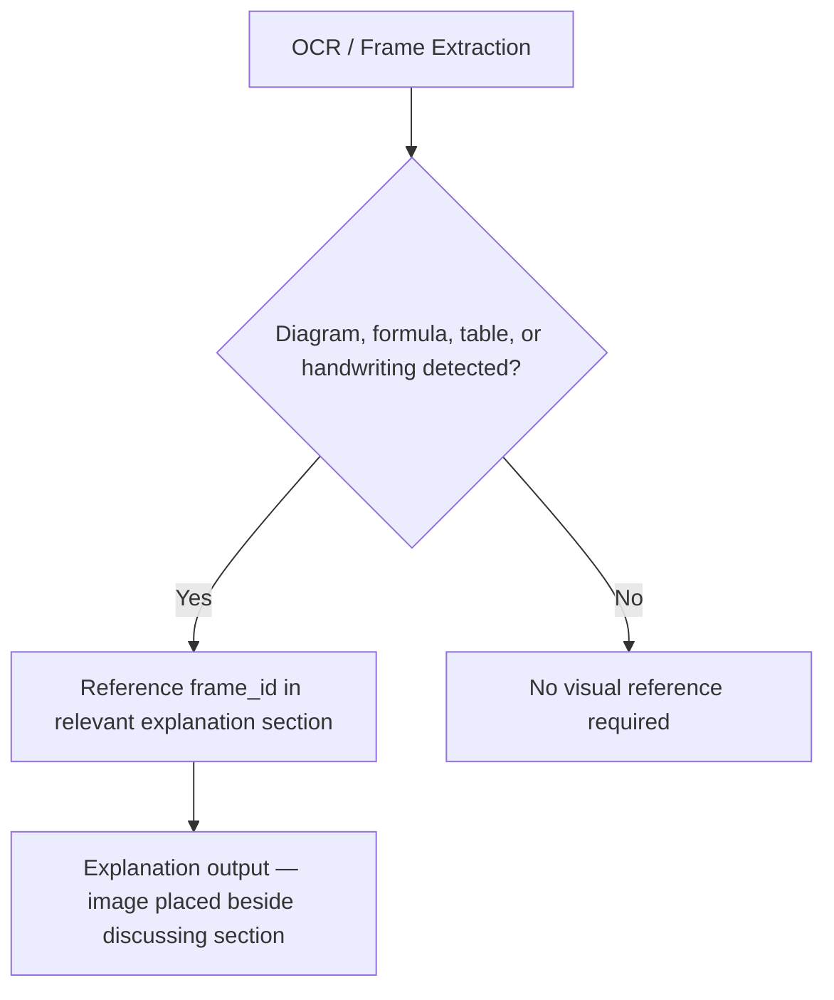

### 10.4 Connection to Quality Gates

The Quality Gate requirement that every important figure must reference a lecture frame (§11) is enforced through this module. If a figure was detected during ingestion but is absent from the explanation output, the Quality Gate will flag the subtopic for regeneration.

---

## 11. Quality Gates

### 11.1 Purpose

Quality Gates are automated validation checks applied to generated content before it is considered complete. They ensure every subtopic explanation meets a fixed set of completeness criteria, and they correct failures at the smallest possible granularity — avoiding the cost and risk of regenerating an entire document because a single subtopic failed a single check.

### 11.2 Five Completeness Checks

| # | Check | Triggers Regeneration If… |
|---|---|---|
| 1 | Complete explanation | The subtopic explanation is missing or incomplete |
| 2 | Worked example | An algorithmic subtopic lacks at least one worked example |
| 3 | Mathematical derivation | A mathematical subtopic omits a derivation the lecture itself presented |
| 4 | Visual reference | An important figure is not anchored to a lecture frame |
| 5 | Factual consistency | Any generated section contradicts the source transcript |

### 11.3 Regeneration Scope

**Only the affected subtopic is regenerated — never the entire document.** This is an explicit design choice. Because Detailed Explanation Generation (§8) operates at subtopic granularity, targeted regeneration is always possible at the validation stage. Correction cost is kept proportional to the size of the defect, directly satisfying the cost-efficiency non-functional requirement (§1.3).

### 11.4 Workflow

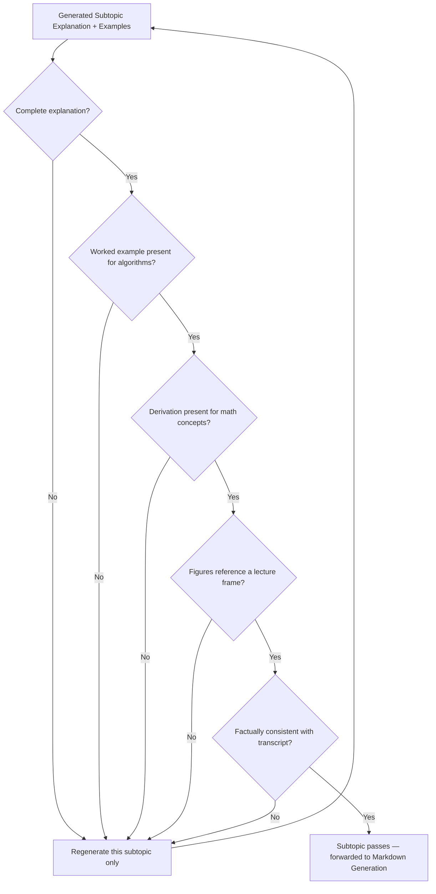

### 11.5 Factual Consistency Check

The factual consistency check anchors generated content back to the transcript, reducing the risk of hallucinated claims persisting into the final output. This check provides a concrete, automatable definition of "factually grounded" rather than relying on subjective review.

---

## 12. Markdown Generation

### 12.1 Purpose

Markdown Generation (Stage 9 of the Prompt Pipeline) is the final AI-facing stage and the first stage of the three-part export chain (Markdown → HTML → PDF). It converts fully validated, structured educational content into well-formatted Markdown, treating formatting as a concern entirely independent of content generation. This separation means the same structured content can later be exported to additional formats without modifying any explanation, example, or gap-analysis prompt.

### 12.2 Fixed Note Structure

Markdown Generation assembles every subtopic using a fixed template applied consistently across all lectures:

```
# Lecture Title
## Topic
### Subtopic
  - Explanation
  - Illustration
  - Worked Example
  - Screenshot
  - Common Mistakes
  - Applications
  - Revision Summary
  - Key Takeaways
  - References
```

Changes to document formatting conventions (heading levels, section ordering) require modifying only this stage's prompt — no underlying educational content needs to be regenerated.

### 12.3 Workflow

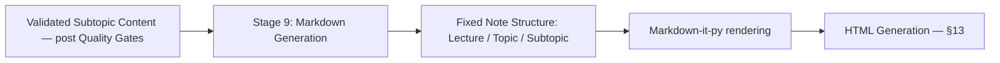

**Library:** `Markdown-it-py` is the standards-compliant Markdown rendering engine that consumes this output during the HTML Generation stage.

---

## 13. HTML Generation

### 13.1 Purpose

HTML Generation is the second stage of the export chain, transforming Markdown output from §12 into styled HTML using reusable, templated layouts rather than constructing HTML manually per lecture.

### 13.2 Jinja2 Templating

HTML Generation uses **Jinja2** for templating. Jinja2 templates define reusable layouts into which Markdown content is rendered, achieving a clean separation between presentation (the template) and content (the generated Markdown). A visual redesign of exported notes requires only modifying the Jinja2 templates — the content-generation pipeline is unaffected.

### 13.3 Workflow

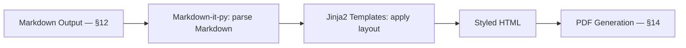

### 13.4 Role in Export Chain

The HTML output serves two purposes: it is a standalone deliverable (HTML export format) and the required input for WeasyPrint in the PDF Generation stage (§14).

---

## 14. PDF Generation

### 14.1 Purpose

PDF Generation is the final stage of the export chain, converting the styled HTML output from §13 into a professional, distributable PDF document.

### 14.2 WeasyPrint

PDF Generation uses **WeasyPrint**, which renders HTML and CSS directly into a PDF. WeasyPrint was selected for its excellent typography support, full CSS support, native rendering of images and tables, page numbering, and table of contents generation — all directly relevant to educational documents containing worked examples, screenshots, and multi-level headings (Lecture → Topic → Subtopic).

### 14.3 Design Rationale

Rendering from HTML/CSS rather than constructing PDF pages programmatically allows the styling investment from §13 to be reused for PDF export, avoiding the maintenance burden of two independent layout implementations for the same visual design.

### 14.4 Workflow

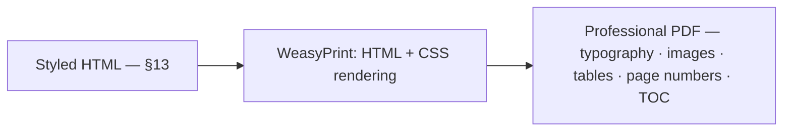

---

## 15. LLM Provider Architecture

### 15.1 Purpose

The LLM Provider Architecture ensures that no part of the application communicates directly with a specific LLM vendor's SDK or API. Instead, every request passes through a centralized **LLM Manager**, which selects the most appropriate provider for the task and automatically switches when necessary.

This architecture addresses a concrete operational risk: if a single provider (e.g., Gemini) reaches its daily free quota, the entire notes-generation pipeline halts. Because atomic, per-subtopic generation multiplies LLM calls per lecture, the probability of encountering at least one transient provider failure during full lecture processing is non-trivial — making multi-provider resilience a structural necessity, not a convenience.

### 15.2 Provider Abstraction Layer

The application only knows how to request a result from the LLM Manager — it has no knowledge of which underlying provider (Gemini, OpenRouter, Groq, Together AI, Zhipu AI, Cerebras) actually generates the response. As a consequence, adding a new provider requires only implementing a new provider class, and removing an existing provider requires no changes to the rest of the application.

### 15.3 Integrated Providers

| Provider | Notable Models | Role |
|---|---|---|
| Google AI Studio | Gemini 2.5 Flash, Gemini 2.5 Flash Lite | **Primary provider** |
| OpenRouter | DeepSeek V3, Qwen, Llama, Mistral, GLM | Secondary — unified access to many open-source models |
| Groq | Llama, Qwen, DeepSeek | Low-latency inference; useful for processing many chunks in parallel |
| Zhipu AI | GLM | Fallback — long reasoning and structured educational writing |
| Together AI | Llama, DeepSeek, Qwen, Mistral | Experimentation; free starter credits for new users |
| Cerebras | (varies) | Very low response times where available |

**Why Google AI Studio is primary:** Gemini performs exceptionally well for educational content — understanding long lecture transcripts while producing structured explanations — and provides a generous free tier during development.

> **Important limitation:** Every provider in this architecture is used on a free tier, trial-credit, or quota-limited basis. The architecture's resilience against outages does not eliminate quota constraints — it only ensures that exhausting one provider's quota does not halt the entire pipeline, *provided at least one other provider in the fallback chain still has available quota*.

### 15.4 LLM Manager Responsibilities

The LLM Manager handles:

- Selecting the best provider for the current task
- Managing and rotating API keys (§21)
- Retrying failed requests (§19)
- Handling rate limits
- Switching providers automatically (§20)
- Recording provider performance
- Logging token usage and response times

### 15.5 Folder Structure

```
backend/
└── app/
    └── services/
        └── llm/
            ├── base_provider.py
            ├── google_provider.py
            ├── openrouter_provider.py
            ├── groq_provider.py
            ├── together_provider.py
            ├── zhipu_provider.py
            ├── cerebras_provider.py
            ├── provider_manager.py
            ├── model_selector.py
            ├── fallback_manager.py
            ├── key_manager.py
            ├── retry_manager.py
            └── response_parser.py
```

### 15.6 Provider Routing Workflow

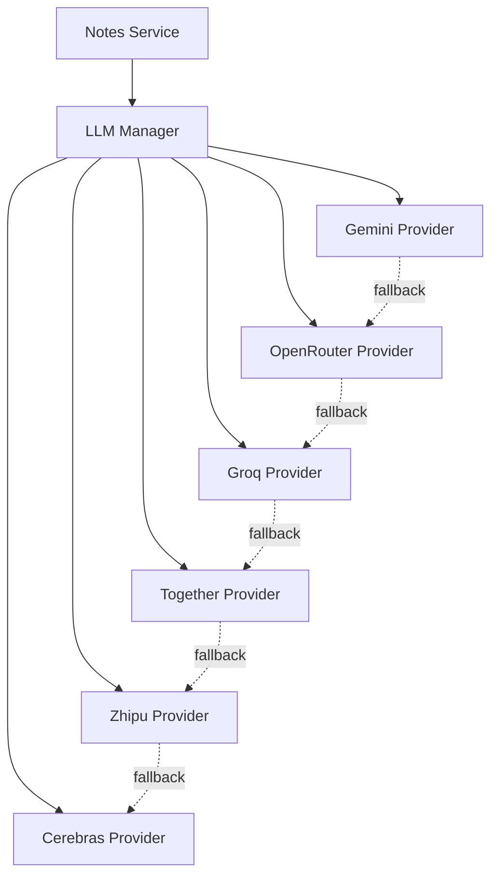

---

## 16. LiteLLM

### 16.1 Purpose

LiteLLM is the communication layer that normalizes interaction with all LLM providers described in §15. Without it, the application would require separate, provider-specific request-formatting code for each of the six integrated providers. LiteLLM removes this burden by providing a single unified interface — the application always calls the same function, and LiteLLM internally translates that call into the provider-specific API format. In practice, replacing one model with another typically requires changing only the model name in configuration, not rewriting application code.

### 16.2 Position in Architecture

LiteLLM sits directly beneath the LLM Manager because provider abstraction at the business-logic level requires a corresponding abstraction at the wire-protocol level. Without LiteLLM, the LLM Manager itself would need provider-specific branching logic, undermining the abstraction the provider architecture is designed to achieve.

### 16.3 Workflow

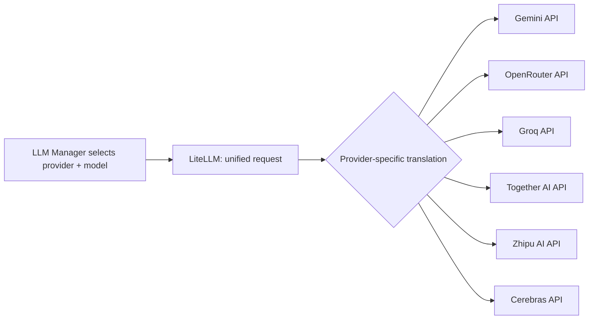

### 16.4 Key Benefits

| Benefit | Description |
|---|---|
| Unified API | One interface regardless of provider |
| Easy model switching | Configuration change, not code change |
| Reduced complexity | One request/response format to maintain |
| Centralized token tracking | Consistent across all providers |
| Consistent error handling | Normalized across otherwise heterogeneous APIs |

---

## 17. PydanticAI

### 17.1 Purpose

PydanticAI enforces structured, schema-compliant output from every LLM call throughout the Prompt Pipeline. While LiteLLM (§16) guarantees a unified communication format across providers, it does not guarantee that the *content* of a response is structurally correct. PydanticAI closes this gap: every prompt in the Prompt Pipeline is associated with a predefined schema, and if the model returns malformed JSON, omits required fields, or returns incorrect data types, PydanticAI detects the problem immediately — before the response reaches business logic.

### 17.2 Example Schema Validation

Topic Detection always expects output in this form:

```json
{
  "topic": "Binary Search",
  "subtopics": ["Definition", "Algorithm", "Complexity"]
}
```

If the model omits `"subtopics"`, returns it as a string rather than an array, or produces unparseable JSON, PydanticAI raises a validation error that clearly identifies which schema field was violated — rather than surfacing as an opaque downstream failure in the Notes Generator or Markdown Generation stage.

### 17.3 Position in Architecture

PydanticAI is positioned immediately after LiteLLM and before any response reaches business logic. It is the last line of defense against structurally invalid data entering stages that assume well-formed, schema-compliant input.

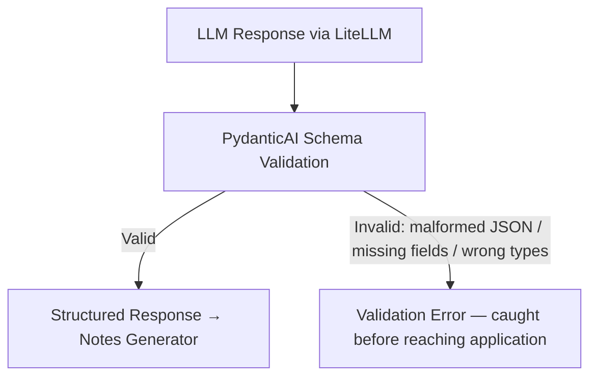

### 17.4 Key Benefits

| Benefit | Description |
|---|---|
| Reliable outputs | Malformed responses caught immediately, not propagated |
| Strong typing | Every LLM-facing stage has an explicitly typed contract |
| Easier debugging | Validation errors pinpoint the exact field that failed |
| Better maintainability | Every prompt's expected output shape is documented as a schema |

---

## 18. Model Routing

### 18.1 Purpose

Model Routing (also called the Model Selection Strategy) assigns a specific model to each task rather than using a single model uniformly across the entire pipeline. The objective is to match task complexity to model capability — not every task requires the most powerful or most expensive model available.

### 18.2 Routing Table

| Task | Recommended Model | Rationale |
|---|---|---|
| Lecture Analysis | Gemini 2.5 Flash | Structural/organizational task; reliable structured output |
| Topic Detection | Gemini 2.5 Flash | Structural/organizational task |
| Subtopic Detection | Gemini 2.5 Flash | Structural/organizational task |
| JSON Generation | Gemini 2.5 Flash | Structured output; no deep reasoning required |
| Detailed Notes / Deep Explanations | Gemini 2.5 Flash (or DeepSeek V3) | Complex content; broad educational strength |
| Programming Explanations | DeepSeek V3 | Demonstrated domain strength in code |
| Mathematical Explanations | Qwen3 | Demonstrated strength in math/proofs |
| Markdown Generation | Gemini 2.5 Flash Lite | Formatting only; no reasoning required |

**Routing logic:**
- Structural/organizational tasks → Gemini 2.5 Flash
- Formatting-only tasks → Gemini 2.5 Flash Lite (lightest available model)
- Domain-specific explanation tasks → domain-appropriate models (DeepSeek V3 for code, Qwen3 for math)

This directly implements both Token-Agnostic Quality (quality preserved by routing to domain-appropriate models) and the Cost-efficiency non-functional requirement (costs controlled by routing cheap tasks to lightweight models).

### 18.3 Model Quality Reference

The tables below provide the evidence base for routing decisions, rating each integrated model against each educational task category. All models listed are available on free tiers through the integrated providers (§15). This reference informs the `model_selector.py` component.

#### 18.3.1 Structured Note Generation

*Best for: lecture notes, chapter notes, summaries.*

| Model | Quality | Free Tier |
|---|---|---|
| DeepSeek V3 | ⭐⭐⭐⭐⭐ | ✅ |
| Qwen3 235B A22B | ⭐⭐⭐⭐⭐ | ✅ |
| Gemini 2.5 Flash | ⭐⭐⭐⭐⭐ | ✅ |
| Llama 3.3 70B | ⭐⭐⭐⭐☆ | ✅ |
| Mistral Small 3.2 | ⭐⭐⭐⭐☆ | ✅ |

**Top picks:** DeepSeek V3 · Qwen3 235B · Gemini 2.5 Flash

#### 18.3.2 Mathematics (Step-by-Step)

| Model | Proof Quality | Reasoning | Free Tier |
|---|---|---|---|
| Qwen3 235B | ⭐⭐⭐⭐⭐ | ⭐⭐⭐⭐⭐ | ✅ |
| DeepSeek R1 | ⭐⭐⭐⭐⭐ | ⭐⭐⭐⭐⭐ | ✅ |
| Gemini 2.5 Flash | ⭐⭐⭐⭐☆ | ⭐⭐⭐⭐⭐ | ✅ |
| Llama 3.3 70B | ⭐⭐⭐⭐☆ | ⭐⭐⭐⭐☆ | ✅ |

**Top picks:** DeepSeek R1 · Qwen3 235B

#### 18.3.3 Formula Derivation and Proof

*Applicable to: Calculus, Linear Algebra, Statistics, Physics derivations, Algorithm proofs.*

| Model | Quality |
|---|---|
| DeepSeek R1 | ⭐⭐⭐⭐⭐ |
| Qwen3 235B | ⭐⭐⭐⭐⭐ |
| Gemini 2.5 Flash | ⭐⭐⭐⭐☆ |
| Llama 3.3 | ⭐⭐⭐⭐☆ |

#### 18.3.4 Code Generation

| Model | Quality |
|---|---|
| DeepSeek V3 | ⭐⭐⭐⭐⭐ |
| Qwen3 Coder | ⭐⭐⭐⭐⭐ |
| Gemini 2.5 Flash | ⭐⭐⭐⭐⭐ |
| Llama 3.3 | ⭐⭐⭐⭐☆ |
| Codestral | ⭐⭐⭐⭐☆ |

**Top picks:** DeepSeek V3 · Qwen3 Coder · Gemini 2.5 Flash

#### 18.3.5 Code Explanation

| Model | Quality |
|---|---|
| Gemini 2.5 Flash | ⭐⭐⭐⭐⭐ |
| DeepSeek V3 | ⭐⭐⭐⭐⭐ |
| Qwen3 | ⭐⭐⭐⭐⭐ |
| Llama 3.3 | ⭐⭐⭐⭐☆ |

#### 18.3.6 Example Generation (Real-World)

*Applicable to: OOP, Machine Learning, Networks, Databases, Operating Systems.*

| Model | Quality |
|---|---|
| Gemini 2.5 Flash | ⭐⭐⭐⭐⭐ |
| DeepSeek V3 | ⭐⭐⭐⭐⭐ |
| Qwen3 | ⭐⭐⭐⭐⭐ |
| Mistral | ⭐⭐⭐⭐☆ |

#### 18.3.7 Quiz Generation

*Output types: MCQ, True/False, Fill-in-the-blank, HOTS questions, University-style exams.*

| Model | Quality |
|---|---|
| Gemini 2.5 Flash | ⭐⭐⭐⭐⭐ |
| DeepSeek V3 | ⭐⭐⭐⭐⭐ |
| Qwen3 | ⭐⭐⭐⭐⭐ |
| Llama 3.3 | ⭐⭐⭐⭐☆ |

#### 18.3.8 Flashcard Generation

| Model | Quality |
|---|---|
| Gemini 2.5 Flash | ⭐⭐⭐⭐⭐ |
| DeepSeek V3 | ⭐⭐⭐⭐⭐ |
| Qwen3 | ⭐⭐⭐⭐⭐ |

#### 18.3.9 Mind Map Generation

*Output formats: Mermaid, Markdown trees, nested bullet structures.*

| Model | Quality |
|---|---|
| Gemini 2.5 Flash | ⭐⭐⭐⭐⭐ |
| DeepSeek V3 | ⭐⭐⭐⭐⭐ |
| Qwen3 | ⭐⭐⭐⭐⭐ |

#### 18.3.10 Markdown and HTML Notes

| Task | Primary | Secondary |
|---|---|---|
| Markdown Notes | DeepSeek V3 | Gemini 2.5 Flash |
| HTML Notes | Gemini 2.5 Flash | DeepSeek V3 |

#### 18.3.11 LaTeX Generation

| Model | Quality |
|---|---|
| Qwen3 | ⭐⭐⭐⭐⭐ |
| DeepSeek R1 | ⭐⭐⭐⭐⭐ |
| Gemini 2.5 Flash | ⭐⭐⭐⭐☆ |

#### 18.3.12 Educational Content, Long Context, and OCR Correction

| Task | Primary | Secondary |
|---|---|---|
| Educational Content (General) | Gemini 2.5 Flash | Qwen3 |
| Long Context Understanding | Gemini 2.5 Flash | Qwen3 235B |
| OCR Correction | Gemini 2.5 Flash | Qwen3 |

#### 18.3.13 Tables, Diagrams, RAG, Summarization, and Reasoning

| Task | Primary | Secondary |
|---|---|---|
| Table Generation | Gemini 2.5 Flash | DeepSeek V3 |
| Educational Diagram (Text-Based) | Gemini 2.5 Flash | DeepSeek V3 |
| RAG Answering | Gemini 2.5 Flash | DeepSeek V3 |
| Summarization | Gemini 2.5 Flash | DeepSeek V3 |
| Reasoning | DeepSeek R1 | Qwen3 235B |

### 18.4 Cross-Task Routing Summary

The table below consolidates all categories into the reference used by `model_selector.py`:

| Task Category | Primary Model | Secondary Model |
|---|---|---|
| Structured Note Generation | DeepSeek V3 / Qwen3 235B | Gemini 2.5 Flash |
| Mathematics (Step-by-Step) | DeepSeek R1 | Qwen3 235B |
| Formula Derivation / Proof | DeepSeek R1 | Qwen3 235B |
| Code Generation | DeepSeek V3 / Qwen3 Coder | Gemini 2.5 Flash |
| Code Explanation | Gemini 2.5 Flash | DeepSeek V3 |
| Example Generation | Gemini 2.5 Flash | DeepSeek V3 |
| Quiz Generation | Gemini 2.5 Flash | DeepSeek V3 |
| Flashcard Generation | Gemini 2.5 Flash | DeepSeek V3 |
| Mind Map Generation | Gemini 2.5 Flash | DeepSeek V3 |
| Markdown Notes | DeepSeek V3 | Gemini 2.5 Flash |
| HTML Notes | Gemini 2.5 Flash | DeepSeek V3 |
| LaTeX Generation | Qwen3 | DeepSeek R1 |
| Educational Content (General) | Gemini 2.5 Flash | Qwen3 |
| Long Context Understanding | Gemini 2.5 Flash | Qwen3 235B |
| OCR Correction | Gemini 2.5 Flash | Qwen3 |
| Table Generation | Gemini 2.5 Flash | DeepSeek V3 |
| Educational Diagram (Text) | Gemini 2.5 Flash | DeepSeek V3 |
| RAG Answering | Gemini 2.5 Flash | DeepSeek V3 |
| Summarization | Gemini 2.5 Flash | DeepSeek V3 |
| Reasoning | DeepSeek R1 | Qwen3 235B |

---

## 18.5 Embedding Model Reference

The RAG pipeline (§18.3.13) requires a complementary routing decision for the retrieval layer: which embedding model converts chunks, notes, and queries into vector representations.

### 18.5.1 General Purpose (Best Overall)

| Embedding Model | Dimensions | Max Input | Multilingual | Rating |
|---|---|---|---|---|
| Qwen3-Embedding-8B | 4,096 | 32,768 tokens | ✅ | ⭐⭐⭐⭐⭐ |
| Qwen3-Embedding-4B | 2,560 | 32,768 tokens | ✅ | ⭐⭐⭐⭐⭐ |
| BGE-M3 | 1,024 | 8,192 tokens | ✅ | ⭐⭐⭐⭐⭐ |
| NV-Embed-v2 | 4,096 | 32,768 tokens | ✅ | ⭐⭐⭐⭐⭐ |
| e5-mistral-7b-instruct | 4,096 | 8,192 tokens | ✅ | ⭐⭐⭐⭐☆ |

**Top picks:** Qwen3-Embedding-8B › BGE-M3 › NV-Embed-v2

### 18.5.2 Retrieval by Task Type

| Task | Recommended Model |
|---|---|
| Educational notes / lecture retrieval | Qwen3-Embedding-8B |
| Books and PDFs | BGE-M3 |
| Code retrieval | CodeRankEmbed / Qwen3-Embedding-8B |
| Mathematics and formula retrieval | Qwen3-Embedding-8B / BGE-M3 |
| Scientific papers | Qwen3-Embedding-8B / BGE-M3 |
| Long document retrieval | BGE-M3 / Qwen3-Embedding-8B |
| Multilingual search | BGE-M3 / Qwen3-Embedding-8B / Jina Embeddings v3 |
| Hybrid retrieval (production RAG) | BGE-M3 (supports dense + sparse + multi-vector) |

### 18.5.3 Retrieval by Deployment Scale

| Scale | Chunk Count | Recommended Models |
|---|---|---|
| 🟢 Small (dev / prototype) | ≤ 100k chunks | BAAI/bge-small-en-v1.5 · gte-small |
| 🟡 Medium (production) | 100k – 5M chunks | BGE-M3 ⭐ · Qwen3-Embedding-4B · Jina Embeddings v3 |
| 🔴 Large (enterprise) | 5M+ chunks | Qwen3-Embedding-8B ⭐ · BGE-M3 ⭐ · NV-Embed-v2 |

### 18.5.4 CPU-Friendly / Lightweight Models

| Model | Dimensions | RAM Usage | Rating |
|---|---|---|---|
| BAAI/bge-small-en-v1.5 | 384 | ~130 MB | ⭐⭐⭐⭐☆ |
| BAAI/bge-base-en-v1.5 | 768 | ~450 MB | ⭐⭐⭐⭐☆ |
| all-MiniLM-L6-v2 | 384 | ~0.1 GB | ⭐⭐⭐☆☆ |
| gte-small | 384 | ~0.2 GB | ⭐⭐⭐⭐☆ |

### 18.5.5 Hybrid Retrieval

BGE-M3 is the recommended choice for production RAG because it uniquely supports all three retrieval strategies in a single model:

| Model | Dense | Sparse | Multi-vector | Rating |
|---|---|---|---|---|
| BGE-M3 | ✅ | ✅ | ✅ | ⭐⭐⭐⭐⭐ |
| SPLADE | ❌ | ✅ | ❌ | ⭐⭐⭐⭐☆ |
| ColBERT v2 | ❌ | ❌ | ✅ | ⭐⭐⭐⭐☆ |

---

## 18.6 Model Profiles

Model Profiles provide engineering-level specifications for each primary model: context windows, memory requirements, token budgets, throughput, and RAG configuration. These profiles inform the runtime configuration of `model_selector.py` and `provider_manager.py`.

> **Common note for all models:** Generation-tier models (DeepSeek V3, DeepSeek R1, Gemini 2.5 Flash, Qwen3 variants, Llama 3.3 70B, Mistral Small 3.2) cannot perform OCR, speech recognition, or video understanding independently — these require the upstream ingestion pipeline (Whisper, PaddleOCR, OpenCV). Embedding models (BGE-M3, Qwen3-Embedding series, NV-Embed-v2, Jina Embeddings v3, e5-mistral-7b, bge-base/small) are retrieval-only and require a separate generative LLM for responses.

### 18.6.1 DeepSeek V3

| Property | Value |
|---|---|
| Provider | DeepSeek AI |
| Architecture | Mixture of Experts (MoE) |
| Total Parameters | 671B |
| Active Parameters | 37B (8 of 256 experts activated per token) |
| Context Window | 128,000 tokens |
| Release | December 2024 |
| License | Open Weights |
| Vision | ❌ |
| Streaming / Function Calling / JSON Mode / Tool Calling | ✅ all |
| Quantization | FP16, INT8, INT4, GGUF |

**Token Budget (128K context example):**

| Component | Tokens |
|---|---|
| System Prompt | 1,500 |
| Developer Prompt | 3,000 |
| User Prompt | 1,800 |
| Retrieved Context | 70,000 |
| Conversation History | 25,000 |
| Tool Results | 5,000 |
| Reserved | 3,500 |
| **Output** | **18,000** |

**Token Calculation Example:**
```
Transcript: 50,000 tokens | Chunk Size: 800 | Overlap: 100 | Effective Chunk: 700
Chunks = 50,000 / 700 ≈ 71 chunks
Retriever selects 18 chunks → 18 × 800 = 14,400 tokens

Prompt: System 1,500 + Developer 2,500 + User 1,500 + Retrieved 14,400 + History 12,000 = 31,900
Remaining for output: 128,000 − 31,900 = 96,100 tokens
```

**Memory Requirements:**

| Precision | Memory |
|---|---|
| FP16 | ~1.3 TB (full model) |
| INT8 | ~650 GB |
| INT4 | ~330 GB |

**Throughput:** ~80–150 tokens/sec, TTFT 300–800 ms

**RAG Configuration:**

| Parameter | Value |
|---|---|
| Chunk Size | 800 tokens |
| Overlap | 100 tokens |
| Top-K | 15 |
| Embedding Model | BGE-M3 |
| Re-ranker | BGE Reranker |

**Engineering Notes:**

| Parameter | Value |
|---|---|
| Preferred Chunk Size | 800 tokens |
| Max Chunks in Context | 20 |
| Ideal Context Window Usage | 20K–40K tokens |
| Recommended Output Budget | 4K–8K tokens |
| Best Temperature | 0.2–0.5 |
| Best Top-P | 0.9 |

**Evaluation Scores (out of 10):**

| Category | Score |
|---|---|
| Coding | 9.8 |
| Mathematics | 9.7 |
| Long Context | 9.6 |
| Educational Notes | 9.8 |
| JSON Output | 9.5 |
| RAG | 9.6 |
| Markdown | 9.9 |
| Cost Efficiency | 9.7 |

**Best EduScribe AI tasks:** Lecture Notes · Programming · Educational Content · Markdown · Long Documents

**Recommended deployment:** Cloud API via OpenRouter / Together AI / Fireworks AI; BGE-M3 for embeddings; Qdrant for vector store; LiteLLM framework; Langfuse for monitoring.

---

### 18.6.2 DeepSeek R1

| Property | Value |
|---|---|
| Provider | DeepSeek AI |
| Architecture | Mixture of Experts (MoE) |
| Total Parameters | 671B |
| Active Parameters | 37B (8 of 256 experts activated per token) |
| Context Window | 128,000 tokens |
| Release | January 2025 |
| License | Open Weights |
| Reasoning Mode | Native Chain-of-Thought |
| Vision | ❌ |
| Streaming / Function Calling / JSON Mode / Tool Calling | ✅ all |

**Token Budget (128K context example):**

| Component | Tokens |
|---|---|
| System Prompt | 1,500 |
| Developer Prompt | 2,500 |
| User Prompt | 2,000 |
| Retrieved Chunks | 65,000 |
| Conversation History | 28,000 |
| Tool Results | 4,000 |
| Reserved | 3,000 |
| **Output** | **22,000** |

**Token Calculation Example:**
```
Transcript: 72,000 tokens | Chunk: 900 | Overlap: 150 | Effective: 750
Chunks = 72,000 / 750 = 96 chunks
Top-K 20 chunks → 20 × 900 = 18,000 tokens

Prompt: 1,500 + 2,500 + 1,800 + 18,000 + 12,000 + 3,000 = 38,800
Remaining: 128,000 − 38,800 = 89,200 tokens
```

**Memory Requirements:** FP16 ~1.3 TB | INT8 ~650 GB | INT4 ~330 GB

**Throughput:** ~60–120 tokens/sec, TTFT 500–900 ms (higher latency due to native reasoning overhead)

**RAG Configuration:**

| Parameter | Value |
|---|---|
| Chunk Size | 900 tokens |
| Overlap | 150 tokens |
| Embedding Model | BGE-M3 |
| Re-ranker | BGE Reranker v2 |
| Top-K | 15–20 |
| Retriever | Hybrid Search |

**Production Configuration:** Temperature 0.2 · Top-P 0.9 · Max Output 8,000 tokens · Streaming enabled

**Evaluation Scores (out of 10):**

| Category | Score |
|---|---|
| Mathematics | 10.0 |
| Reasoning | 10.0 |
| Coding | 9.8 |
| Long Context | 9.6 |
| Educational Notes | 9.4 |
| RAG | 9.7 |
| JSON Output | 9.6 |
| Markdown | 9.8 |
| Tool Calling | 9.5 |

**Best EduScribe AI tasks:** Step-by-Step Mathematics · Formula Derivation · Proof Generation · Algorithm Explanation · Programming Tutorials · Competitive Programming

**Recommended deployment:** Cloud API (OpenRouter · Together AI · Fireworks AI); requires 8× NVIDIA H100 for self-hosting; vLLM for inference; Langfuse for monitoring.

---

### 18.6.3 Gemini 2.5 Flash

| Property | Value |
|---|---|
| Provider | Google DeepMind |
| Architecture | Dense Transformer (proprietary) |
| Context Window | 1,048,576 tokens (1M) |
| Release | 2025 |
| License | Proprietary |
| Self-Hosting | ❌ |
| Vision / Audio / Video | ✅ all |
| Streaming / Function Calling / JSON Mode / Tool Calling | ✅ all |

**Token Budget (1M context example):**

| Component | Tokens |
|---|---|
| System Prompt | 2,000 |
| Developer Prompt | 3,000 |
| User Prompt | 2,500 |
| Retrieved Chunks | 250,000 |
| Conversation History | 50,000 |
| OCR Results | 100,000 |
| Video Metadata | 20,000 |
| Tool Results | 10,000 |
| Reserved | 10,000 |
| **Output** | **50,000** |
| Remaining | ~550K tokens |

**Token Calculation Example:**
```
Transcript: 350,000 | OCR: 60,000 | Slides Metadata: 15,000
User: 2,000 | System: 2,000 | Developer: 3,000 | History: 15,000
Total Prompt: 447,000
Remaining: 1,048,576 − 447,000 = 601,576 tokens
```

**Memory:** Google-managed (cannot be self-hosted)

**Throughput:** TTFT 200–500 ms · Excellent long-context performance

**Multimodal Capabilities:**

| Capability | Rating |
|---|---|
| Text Understanding | ⭐⭐⭐⭐⭐ |
| Image Analysis / OCR | ⭐⭐⭐⭐⭐ |
| PDF Understanding | ⭐⭐⭐⭐⭐ |
| Video Understanding | ⭐⭐⭐⭐⭐ |
| Audio Understanding | ⭐⭐⭐⭐⭐ |
| Charts / Tables | ⭐⭐⭐⭐⭐ |

**RAG Configuration:**

| Parameter | Value |
|---|---|
| Chunk Size | 1,000 tokens |
| Overlap | 150 tokens |
| Embedding Model | BGE-M3 |
| Re-ranker | BGE Reranker |
| Top-K | 25 |
| Retriever | Hybrid Search |

**Production Configuration:** Temperature 0.3 · Top-P 0.9 · Top-K 40 · Streaming enabled · Thinking: adaptive

**Evaluation Scores (out of 10):**

| Category | Score |
|---|---|
| Long Context | 10.0 |
| OCR | 10.0 |
| PDF Understanding | 10.0 |
| Video Analysis | 10.0 |
| Educational Notes | 9.9 |
| RAG | 9.8 |
| Tool Calling | 10.0 |
| Coding | 9.3 |
| Mathematics | 9.4 |

**Limitations:** Cannot be self-hosted · Provider-controlled rate limits · Latency increases at very large contexts · Model behavior may change as Google updates managed versions

**Best EduScribe AI tasks:** Transcript Cleanup · OCR Correction · Video-to-Notes · PDF Analysis · Flashcards · Quiz Generation · Mind Map Generation · RAG Question Answering

**Recommended deployment:** Google AI Studio or Vertex AI; LiteLLM framework; BGE-M3 for embeddings; Qdrant; Langfuse; Redis for caching.

---

### 18.6.4 Qwen3 235B A22B

| Property | Value |
|---|---|
| Provider | Alibaba Cloud (Qwen Team) |
| Architecture | Mixture of Experts (MoE) |
| Total Parameters | 235B |
| Active Parameters | 22B |
| Experts | 128 (dynamic routing) |
| Context Window | 262,144 tokens (256K) |
| Release | 2025 |
| License | Apache 2.0 |
| Multilingual | ✅ 100+ languages |
| Vision | ❌ (text-only variant) |
| Streaming / Function Calling / JSON Mode / Tool Calling | ✅ all |
| Quantization | FP16, BF16, INT8, INT4, GGUF |

**Memory:** FP16 ~470 GB | INT8 ~240 GB | INT4 ~120 GB | Active compute: 22B parameters

**Throughput:** ~100–180 tokens/sec, TTFT 300–700 ms

**RAG Configuration:** Chunk 1,000 tokens · Overlap 150 · Embedding: Qwen3-Embedding-8B · Re-ranker: Qwen3 Reranker · Top-K 20–25

**Production Configuration:** Temperature 0.2 · Top-P 0.9 · Streaming / JSON / Function Calling enabled

**Evaluation Scores (out of 10):**

| Category | Score |
|---|---|
| Coding | 9.9 |
| Mathematics | 9.9 |
| Reasoning | 9.8 |
| Long Context | 9.9 |
| Educational Notes | 9.8 |
| Translation | 9.8 |
| JSON Output | 9.9 |
| Tool Calling | 9.8 |
| RAG | 9.8 |
| Cost Efficiency | 9.6 |

**Best EduScribe AI tasks:** Topic Detection · Semantic Chunking · Long Lecture Notes · Formula Explanation · Programming Notes · Mathematical Derivation · Structured JSON Generation

**Recommended deployment:** Cloud API (Alibaba DashScope · OpenRouter · Together AI · Groq); vLLM for self-hosting; Qwen3-Embedding-8B or BGE-M3; Qdrant; Langfuse.

---

### 18.6.5 Qwen3 Coder

| Property | Value |
|---|---|
| Provider | Alibaba Cloud (Qwen Team) |
| Architecture | Mixture of Experts (MoE) |
| Total Parameters | 480B |
| Active Parameters | 35B |
| Context Window | 256,000 tokens |
| Release | 2025 |
| License | Apache 2.0 |
| Primary Domain | Software Engineering (100+ programming languages) |
| Vision | ❌ |
| Streaming / Function Calling / JSON Mode / Tool Calling | ✅ all |

**Memory:** FP16 ~960 GB | INT8 ~480 GB | INT4 ~240 GB

**Throughput:** ~100–180 tokens/sec, TTFT 300–700 ms

**Programming Language Support (selection):**

| Language | Rating |
|---|---|
| Python / Java / C++ / C | ⭐⭐⭐⭐⭐ |
| JavaScript / TypeScript | ⭐⭐⭐⭐⭐ |
| Go / Rust / Kotlin | ⭐⭐⭐⭐⭐ |
| SQL / Bash | ⭐⭐⭐⭐⭐ |
| Swift | ⭐⭐⭐⭐☆ |

**Production Configuration:** Temperature 0.1 · Top-P 0.95 · Streaming / JSON / Function Calling enabled

**Evaluation Scores (out of 10):** Code Generation 10.0 · Code Review 10.0 · Debugging 9.9 · Refactoring 9.9 · API Design 9.8 · Documentation 9.8

**Best EduScribe AI tasks:** FastAPI Backend · Next.js · React Components · PostgreSQL Queries · Redis Integration · Unit Test Generation · Bug Detection · Code Refactoring · System Design

**Recommended deployment:** Cloud API (Alibaba DashScope · OpenRouter · Together AI); vLLM; Qwen3-Embedding-8B; Qdrant; Tree-sitter for code indexing.

---

### 18.6.6 Llama 3.3 70B Instruct

| Property | Value |
|---|---|
| Provider | Meta AI |
| Architecture | Dense Decoder Transformer |
| Total Parameters | 70B (all active) |
| Context Window | 128,000 tokens |
| Release | December 2024 |
| License | Llama Community License |
| Self-Hosting | ✅ |
| Vision | ❌ |
| Streaming / Function Calling / JSON Mode / Tool Calling | ✅ all |
| Quantization | FP16, BF16, INT8, INT4, GGUF |

**Memory:** FP16 ~140 GB | INT8 ~70 GB | INT4 ~35 GB | GGUF Q4 ~40 GB

**Throughput:** ~70–140 tokens/sec, TTFT 300–700 ms

**RAG Configuration:** Chunk 800 tokens · Overlap 100 · BGE-M3 · Top-K 15 · BGE Reranker

**Production Configuration:** Temperature 0.2 · Top-P 0.9 · Streaming / JSON / Function Calling enabled

**Evaluation Scores (out of 10):** Coding 9.7 · RAG 9.7 · Long Context 9.5 · Documentation 9.8 · Reasoning 9.3 · Mathematics 9.2 · Cost Efficiency 9.7

**Best EduScribe AI tasks:** Lecture Notes · Topic Extraction · Markdown Notes · HTML Notes · RAG Chatbot · Code Examples · Documentation

**Recommended deployment:** Cloud API (Groq · OpenRouter · Together AI · Fireworks AI) or self-hosted with vLLM.

---

### 18.6.7 Mistral Small 3.2

| Property | Value |
|---|---|
| Provider | Mistral AI |
| Architecture | Dense Transformer |
| Total Parameters | ~24B |
| Context Window | 128,000 tokens |
| Release | 2025 |
| License | Apache 2.0 |
| Self-Hosting | ✅ |
| Vision | ❌ (text variant) |
| Streaming / Function Calling / JSON Mode / Tool Calling | ✅ all |

**Memory:** FP16 ~48 GB | INT8 ~24 GB | INT4 ~12 GB | GGUF Q4 ~14 GB

**Throughput:** ~120–220 tokens/sec, TTFT 200–500 ms (fastest in the generation tier)

**RAG Configuration:** Chunk 800 tokens · Overlap 100 · BGE-M3 or Qwen3-Embedding-4B · Top-K 15

**Production Configuration:** Temperature 0.3 · Top-P 0.9 · Max Output 6,000 tokens

**Evaluation Scores (out of 10):** Speed 9.9 · Cost Efficiency 9.8 · RAG 9.6 · Summarization 9.7 · Lecture Notes 9.3 · Coding 9.2

**Best EduScribe AI tasks:** Fast Note Generation · Summary Notes · RAG Chatbot · Markdown Notes · Educational Chat · FAQ Generation · Documentation

**Recommended deployment:** Cloud API (Mistral API · OpenRouter · Together AI) or self-hosted with vLLM.

---

### 18.6.8 BGE-M3 (Embedding Model)

| Property | Value |
|---|---|
| Provider | BAAI |
| Architecture | Transformer Encoder |
| Parameters | ~568M |
| Embedding Dimension | 1,024 |
| Max Input | 8,192 tokens |
| License | MIT |
| Self-Hosting | ✅ |
| Multilingual | ✅ 100+ languages |
| Retrieval Types | Dense + Sparse + Multi-vector (unique capability) |

**Storage at scale (Float32, 1,024-dim ≈ 4 KB/vector):**

| Chunks | Storage |
|---|---|
| 100,000 | ~400 MB |
| 1,000,000 | ~4 GB |
| 10,000,000 | ~40 GB |

**Embedding latency:** ~20–60 ms per chunk

**Recommended chunk config:** 800 tokens · 100 overlap · Top-K 15 · BGE Reranker · Cosine similarity

**HNSW production config:** M 32 · efConstruction 200 · efSearch 128 · Batch size 64

**Evaluation Scores (out of 10):** Semantic Retrieval 10.0 · Hybrid Search 10.0 · Educational Content 9.9 · Long Documents 9.8 · Production Readiness 10.0

**Best EduScribe AI tasks:** Lecture Transcript Embedding · OCR Embedding · PDF Embedding · Flashcard Search · Quiz Context Retrieval · Hybrid Search

**Recommended deployment:** SentenceTransformers framework · ONNX Runtime · Qdrant or Milvus · BGE Reranker v2 for re-ranking.

---

### 18.6.9 Qwen3-Embedding-8B (Embedding Model)

| Property | Value |
|---|---|
| Provider | Alibaba Cloud |
| Parameters | 8B |
| Embedding Dimension | 4,096 |
| Max Input | 32,768 tokens |
| License | Apache 2.0 |
| Self-Hosting | ✅ |
| Multilingual | ✅ 100+ languages |
| Retrieval Type | Dense |

**Storage at scale (Float32, 4,096-dim ≈ 16 KB/vector):**

| Chunks | Storage |
|---|---|
| 100,000 | ~1.6 GB |
| 1,000,000 | ~16 GB |
| 10,000,000 | ~160 GB |

**Embedding latency:** ~30–80 ms per chunk

**Recommended chunk config:** 1,000 tokens · 150 overlap · Top-K 20 · Qwen3 Reranker · Cosine similarity

**Evaluation Scores (out of 10):** Semantic Retrieval 10.0 · Long Context 10.0 · Educational Content 10.0 · Multilingual 10.0 · RAG 10.0

**Comparison with BGE-M3:**

| Feature | Qwen3-Embedding-8B | BGE-M3 |
|---|---|---|
| Parameters | 8B | ~568M |
| Dimensions | 4,096 | 1,024 |
| Max Input | 32K tokens | 8K tokens |
| Hybrid Retrieval | ❌ (dense only) | ✅ |
| Storage per vector (FP32) | ~16 KB | ~4 KB |
| Long Document Retrieval | ⭐⭐⭐⭐⭐ | ⭐⭐⭐⭐☆ |
| Storage Cost | High | Medium |

**Recommended deployment:** SentenceTransformers · vLLM · Qdrant · Qwen3 Reranker.

---

### 18.6.10 Qwen3-Embedding-4B (Embedding Model)

| Property | Value |
|---|---|
| Provider | Alibaba Cloud |
| Parameters | 4B |
| Embedding Dimension | 2,560 |
| Max Input | 32,768 tokens |
| License | Apache 2.0 |
| Self-Hosting | ✅ |
| Retrieval Type | Dense |

**Storage at scale (Float32, 2,560-dim ≈ 10 KB/vector):** 100K → ~1 GB | 1M → ~10 GB | 10M → ~100 GB

**Embedding latency:** ~20–60 ms per chunk

**Comparison with Qwen3-Embedding-8B:**

| Feature | 4B | 8B |
|---|---|---|
| Dimensions | 2,560 | 4,096 |
| Vector size (FP32) | ~10 KB | ~16 KB |
| Storage cost | Medium | High |
| Speed | Faster | Slightly slower |
| Best for | Medium-scale production | Enterprise-scale production |

---

### 18.6.11 NV-Embed-v2 (Embedding Model)

| Property | Value |
|---|---|
| Provider | NVIDIA |
| Parameters | 7B |
| Embedding Dimension | 4,096 |
| Max Input | 32,768 tokens |
| License | NVIDIA Open Model License |
| Self-Hosting | ✅ |
| Retrieval Type | Dense |

**Storage at scale:** Same as Qwen3-Embedding-8B (~16 KB/vector FP32).

**Evaluation Scores (out of 10):** Enterprise Search 10.0 · Semantic Retrieval 10.0 · Long Documents 10.0 · Research Papers 10.0 · Production Readiness 10.0

**Best for:** Enterprise knowledge bases, large-scale RAG, research paper retrieval. Equivalent retrieval quality to Qwen3-Embedding-8B; slightly stronger for enterprise and research use cases.

---

### 18.6.12 Jina Embeddings v3 (Embedding Model)

| Property | Value |
|---|---|
| Provider | Jina AI |
| Parameters | ~600M |
| Embedding Dimension | 1,024 |
| Max Input | 8,192 tokens |
| License | Apache 2.0 |
| Self-Hosting | ✅ |
| Multilingual | ✅ 90+ languages |
| Retrieval Type | Dense |

**Storage:** ~4 KB/vector (FP32). **Embedding latency:** ~15–40 ms per chunk.

**Comparison with BGE-M3:**

| Feature | Jina v3 | BGE-M3 |
|---|---|---|
| Multilingual | ⭐⭐⭐⭐⭐ | ⭐⭐⭐⭐⭐ |
| Cross-Language Search | ⭐⭐⭐⭐⭐ | ⭐⭐⭐⭐☆ |
| Hybrid Retrieval | ❌ | ✅ |
| Speed | ⭐⭐⭐⭐⭐ | ⭐⭐⭐⭐☆ |
| Best for | Multilingual / cross-lingual search | Production hybrid RAG |

---

### 18.6.13 e5-Mistral-7B-Instruct (Embedding Model)

| Property | Value |
|---|---|
| Provider | Microsoft Research + Mistral AI |
| Parameters | 7B |
| Embedding Dimension | 4,096 |
| Max Input | 8,192 tokens |
| License | Apache 2.0 |
| Self-Hosting | ✅ |
| Retrieval Type | Dense; supports instruction-based retrieval |

**Storage:** ~16 KB/vector (FP32). **Embedding latency:** ~30–70 ms per chunk.

**Key differentiator:** Supports instruction-based retrieval — queries can include task-specific instructions for improved retrieval precision. Strong for research papers, long PDFs, and books.

**Limitation vs. Qwen3-Embedding-8B:** 8K vs. 32K max input; no native hybrid retrieval support.

---

### 18.6.14 BAAI/bge-base-en-v1.5 (Lightweight Embedding)

| Property | Value |
|---|---|
| Provider | BAAI |
| Parameters | 109M |
| Embedding Dimension | 768 |
| Max Input | 512 tokens |
| License | MIT |
| Self-Hosting | ✅ |
| Multilingual | ❌ (English only) |
| Memory | FP32 ~450 MB |

**Embedding latency:** ~5–15 ms per chunk. **Storage:** ~3 KB/vector (FP32).

**Best for:** Small RAG systems, CPU deployment, English-only fast semantic search, prototype development.
**Limitation:** 512-token max input makes it unsuitable for long-document retrieval.

---

### 18.6.15 BAAI/bge-small-en-v1.5 (Smallest / Edge Embedding)

| Property | Value |
|---|---|
| Provider | BAAI |
| Parameters | 33M |
| Embedding Dimension | 384 |
| Max Input | 512 tokens |
| License | MIT |
| Self-Hosting | ✅ |
| Multilingual | ❌ (English only) |
| Memory | FP32 ~130 MB |

**Embedding latency:** ~2–8 ms per chunk. **Storage:** ~1.5 KB/vector (FP32).

**Best for:** Edge devices, local development, CPU-only deployments, prototype RAG, demo applications.

**Comparison with bge-base-en-v1.5:**

| Feature | bge-small | bge-base |
|---|---|---|
| Parameters | 33M | 109M |
| Dimensions | 384 | 768 |
| Speed | ⭐⭐⭐⭐⭐ | ⭐⭐⭐⭐☆ |
| Retrieval Accuracy | ⭐⭐⭐⭐☆ | ⭐⭐⭐⭐⭐ |
| Best for | Edge / CPU / demo | General production |

---

## 19. Retry Strategy

### 19.1 Purpose

The Retry Strategy handles transient failures from external LLM providers using exponential backoff, giving the current provider multiple opportunities to succeed before escalating to a provider switch. It is the *first* line of defense against provider failures; the Fallback Strategy (§20) is the escalation path when retries are exhausted.

### 19.2 Exponential Backoff Schedule

| Attempt | Behavior |
|---|---|
| 1 | Immediate retry |
| 2 | Wait 2 seconds |
| 3 | Wait 4 seconds |
| 4 | Wait 8 seconds |
| 5 | Switch provider (escalate to §20) |

Exponential backoff reduces the volume of requests sent to a provider that is already under load or rate-limiting the caller, while still giving each request multiple opportunities to succeed before escalation.

### 19.3 Transient vs. Permanent Failures

| Failure Type | Handling | Reason |
|---|---|---|
| **Transient** — timeouts, rate limiting | Apply backoff, retry up to 4 times | May succeed after waiting |
| **Permanent** — invalid API key, malformed request | Fail immediately, no retry | Retrying can never succeed; would only waste quota |

This distinction prevents the retry mechanism from consuming attempts on errors that are definitionally unrecoverable.

**Library:** `Tenacity` implements automatic retry with exponential backoff.

### 19.4 Workflow

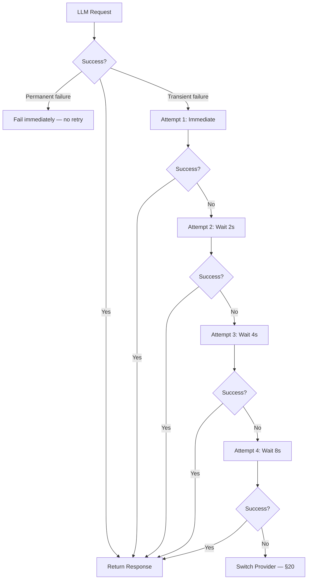

---

## 20. Fallback Strategy

### 20.1 Purpose

The Fallback Strategy defines the ordered sequence of alternative LLM providers EduScribe AI switches to when the currently active provider cannot be recovered by the Retry Strategy (§19). Fallback executes automatically and is entirely transparent to the user — no manual model switching is ever required.

**Trigger conditions:** API quota exceeded · timeout (post-retry) · rate limiting (post-retry) · server errors · scheduled maintenance.

### 20.2 Fallback Order

```
Gemini 2.5 Flash
  ↓ (fails after all retries)
Gemini 2.5 Flash Lite
  ↓
DeepSeek V3
  ↓
Qwen3
  ↓
Llama 3.3
  ↓
Mistral
  ↓
GLM
```


### 20.3 Ordering Rationale

The sequence prioritizes the provider identified as strongest for educational content generation (Gemini) first, followed by progressively different but still capable open-source models. This ensures the pipeline attempts the highest-quality option first and degrades to alternative models only when genuinely necessary. The fallback chain contains seven distinct model options, meaning all seven would need to fail simultaneously before generation halts entirely.

### 20.4 Relationship with Retry Strategy

These are distinct mechanisms operating at different scopes:

| Mechanism | Scope | Trigger |
|---|---|---|
| **Retry** (§19) | Same provider, different attempts | Transient failure (timeout, rate limit) |
| **Fallback** (§20) | Different provider | All retries on current provider exhausted |

Fallback is the escalation path, not the first response to any provider failure.

---

## 21. API Key Rotation

### 21.1 Purpose

API Key Rotation is a fine-grained resilience mechanism operating *beneath* the Fallback Strategy. It addresses quota exhaustion at the level of an individual API key rather than an entire provider, maximizing utilization of each provider's free tier before concluding that the provider itself is unavailable. Switching providers (§20) changes the underlying model, which may affect output quality. Switching keys within the same provider preserves the currently selected model's characteristics — exhausting all available keys before escalating therefore maximizes the amount of work completed using the preferred provider.

### 21.2 Key Rotation Behavior

For each provider, the system cycles through all associated API keys before escalating to the Fallback Strategy:

```
Provider → Key 1 → Quota Full
         → Key 2 → Quota Full
         → Key 3 → Quota Full
         → All keys exhausted → Switch Provider (§20)
```

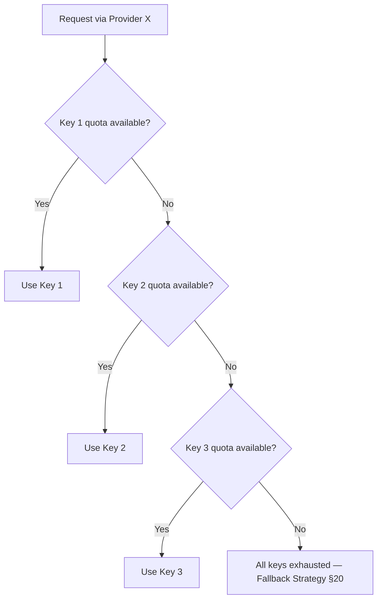

### 21.3 Three-Layer Resilience Architecture

The complete resilience architecture operates as three nested layers:

```
1. API Key Rotation (§21)  — try all keys on current provider
      ↓ all keys exhausted
2. Retry Strategy (§19)    — retry with exponential backoff on current provider
      ↓ all retries exhausted
3. Fallback Strategy (§20) — switch to next provider in sequence
```

> **Note:** In practice, Key Rotation and Retry Strategy operate in tandem. A failed request triggers retries first; if the failure is quota-related and retries don't resolve it, key rotation switches to the next available key; if all keys are exhausted, Fallback switches providers.

---

## 22. Backend Task Flow

### 22.1 Purpose

The Backend Task Flow describes how EduScribe AI processes long-running AI operations — transcription, OCR, note generation, and PDF rendering — without blocking the HTTP request/response cycle. Running any of these operations directly inside an HTTP request handler would block the server for the duration, which can be several minutes for a full lecture. EduScribe AI avoids this using **Celery** for asynchronous task execution, with **Redis** as the message broker between FastAPI and Celery.

### 22.2 Component Roles

| Component | Role |
|---|---|
| **FastAPI** | Receives and validates requests; immediately enqueues the processing task |
| **Redis** | Acts as message broker, temporarily storing submitted tasks until a worker picks them up; also used for rate limiting, caching, session storage, and queue management |
| **Celery** | Executes long-running AI operations (Whisper transcription, OCR, AI note generation, PDF rendering) asynchronously; supports retry, parallel execution, and fault tolerance |
| **SQLAlchemy** | ORM layer for persisting results and status updates to the database |
| **Alembic** | Manages database schema migrations; ensures version-controlled, rollback-safe schema changes |

### 22.3 Workflow

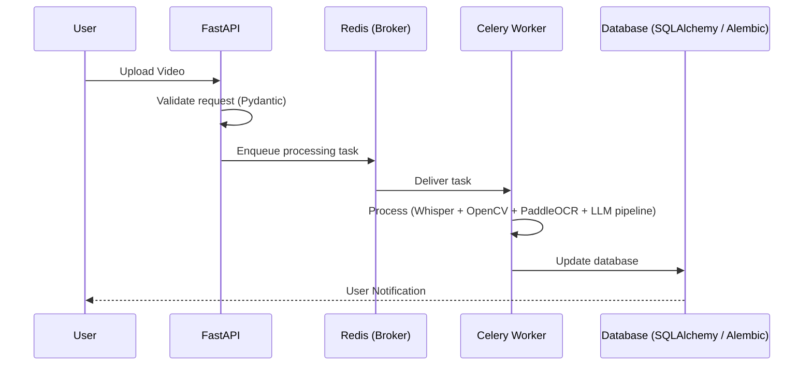

### 22.4 Key Advantages

- **Responsiveness:** The FastAPI request/response cycle remains fast regardless of how long background AI processing takes.
- **Parallelism:** Multiple Celery workers allow multiple lectures — or multiple chunks within a lecture — to be processed concurrently.
- **Fault tolerance:** Celery's built-in retry support adds an additional layer of fault tolerance beyond the LLM-specific Retry Strategy (§19).

---

## 23. Technology Stack

### 23.1 Overview

Every library in EduScribe AI's technology stack occupies exactly one layer of a strictly layered architecture. The guiding principle is to favor mature, well-supported, actively maintained open-source libraries over custom-built solutions for already-solved problems, with each library assigned a clearly defined, non-overlapping responsibility.

### 23.2 Stack Architecture

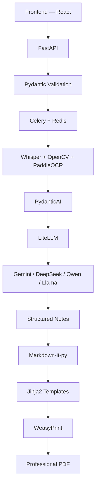

### 23.3 Component Reference

| Library | Layer | Responsibility | Rationale |
|---|---|---|---|
| **FastAPI** | API | User auth, video upload, background task management, history APIs, notes generation APIs, file download APIs, admin APIs | Automatic Pydantic validation, async architecture, auto-documentation, high performance, strong SQLAlchemy + Celery integration |
| **SQLAlchemy** | ORM | Python models for DB tables; CRUD, relationships, query optimization, DB abstraction | Mature, excellent PostgreSQL support, DB-agnostic — allows future migration without altering business logic |
| **Alembic** | Migrations | Version-controlled schema migrations; rollback support; team collaboration; production safety | Paired with SQLAlchemy; prevents manual schema drift |
| **Celery** | Task Queue | Asynchronous execution of Whisper, OCR, AI generation, PDF rendering | Background processing, retry support, parallel execution, fault tolerance |
| **Redis** | Broker / Cache | Message broker between FastAPI and Celery; rate limiting; caching; session storage; queue management | Extremely fast, lightweight, reliable, easy to integrate |
| **Pydantic** | Validation | Validates API requests, API responses, and LLM outputs against predefined schemas | Type safety, automatic validation, better error messages |
| **PydanticAI** | LLM Validation | Manages LLM interactions; guarantees structured outputs; handles retry, schema enforcement, error detection | See §17 |
| **LiteLLM** | LLM Abstraction | Unified interface across all LLM providers; provider abstraction, model switching, API normalization, token tracking | See §16 |
| **PaddleOCR** | Vision | Extracts text from video frames: slide text, formulas, diagrams, tables, handwritten annotations; OCR confidence scoring | Best performance on lecture slides vs. lighter-weight OCR libraries |
| **MLX Whisper** | Transcription | Converts lecture audio to text; optimized for Apple Silicon | Significantly faster inference and lower memory than standard Whisper on M-series chips |
| **OpenCV** | Video Processing | Frame extraction, blur detection, duplicate detection, image preprocessing | Highly optimized computer vision algorithms |
| **Structlog** | Logging | Structured, machine-readable logging in place of plain-text output | Logs are searchable, filterable, and analyzable |
| **Tenacity** | Reliability | Automatic retry with exponential backoff for network issues, rate limiting, timeouts | See §19 |
| **Jinja2** | Templating | HTML generation from structured notes using reusable templates | Clean separation of presentation and logic; see §13 |
| **Markdown-it-py** | Rendering | Standards-compliant Markdown rendering engine | Reliable, extensible; intermediate step in the export chain |
| **WeasyPrint** | PDF Export | Renders HTML + CSS directly into professional PDF | Excellent typography, CSS support, images, tables, page numbering, TOC; see §14 |
| **Langfuse** | Observability | Monitors every LLM interaction: prompt versions, responses, latency, token usage, cost, errors | Enables systematic prompt-quality evaluation and continuous improvement |

> **Platform dependency:** MLX Whisper is explicitly tied to Apple Silicon hardware — a structural dependency inherited from the environmental assumption in §1.4.

---

## 24. Important Notes

### 24.1 Purpose

This chapter consolidates cross-cutting design commitments that apply across multiple modules, ensuring they remain visible regardless of which chapter a reader enters from. Each note functions as a system-wide constraint governing one or more upstream chapters.

### 24.2 System-Wide Design Commitments

---

**1. No arbitrary explanation length limits**

Explanation length is intentionally uncapped and scales with topic complexity (§8). This is a deliberate design choice with a direct cost implication given the free-tier and quota constraints on LLM providers (§15). Depth is never sacrificed for brevity.

---

**2. Provider abstraction is mandatory**

The application must never call a vendor SDK directly. Every LLM request flows through:

```
Business Logic → LLM Manager → LiteLLM → Provider
```

This is what allows providers to be added or removed without modifying business logic anywhere else in the system (§15, §16).

---

**3. Regeneration is scoped — never global**

Failed Quality Gate checks (§11) trigger regeneration of the affected subtopic only, never the entire document. Because Detailed Explanation Generation (§8) operates at subtopic granularity, targeted regeneration is always possible, and correction cost remains proportional to the size of the defect.

---

**4. Chunk overlap is semantic — not fixed-token**

Overlap between adjacent chunks is determined by concept continuity, not a fixed character or token count (§4). This distinguishes EduScribe AI from traditional fixed-token overlap strategies and is what makes chunk boundaries pedagogically meaningful rather than arbitrary.

---

**5. Retry, Key Rotation, and Fallback are distinct mechanisms**

| Mechanism | Scope | Trigger |
|---|---|---|
| **Retry** (§19) | Same provider, multiple attempts | Transient failure (timeout, rate limit) |
| **API Key Rotation** (§21) | Same provider, different API key | Quota exhaustion on current key |
| **Fallback** (§20) | Different provider | All retries on all keys exhausted |

Permanent errors (invalid API key, malformed request) bypass retries entirely and fail immediately — retrying a permanent error can never succeed.

---

**6. The chunk schema is a stable, shared contract**

The same chunk data structure (§5) underpins every AI feature: Topic Detection, Subtopic Detection, Notes Generation, Flashcards, Quiz Generation, Mind Maps, and future RAG-based features. It must be treated as a stable, shared contract across all consuming modules — not as an implementation detail private to any single stage.

---

### 24.3 Traceability Summary

| Commitment | Primary Chapter | Also Governs |
|---|---|---|
| No length ceiling | §8 | §15 (cost implications) |
| Mandatory provider abstraction | §15 | §16, §17, §18 |
| Scoped regeneration | §11 | §8 (atomic generation enables it) |
| Semantic chunk overlap | §4 | §5 (schema) |
| Retry / Key Rotation / Fallback distinction | §19, §20 | §21 (key rotation) |
| Chunk as shared contract | §5 | §4, §6, §7, §8, §9 |

---

*End of Document*