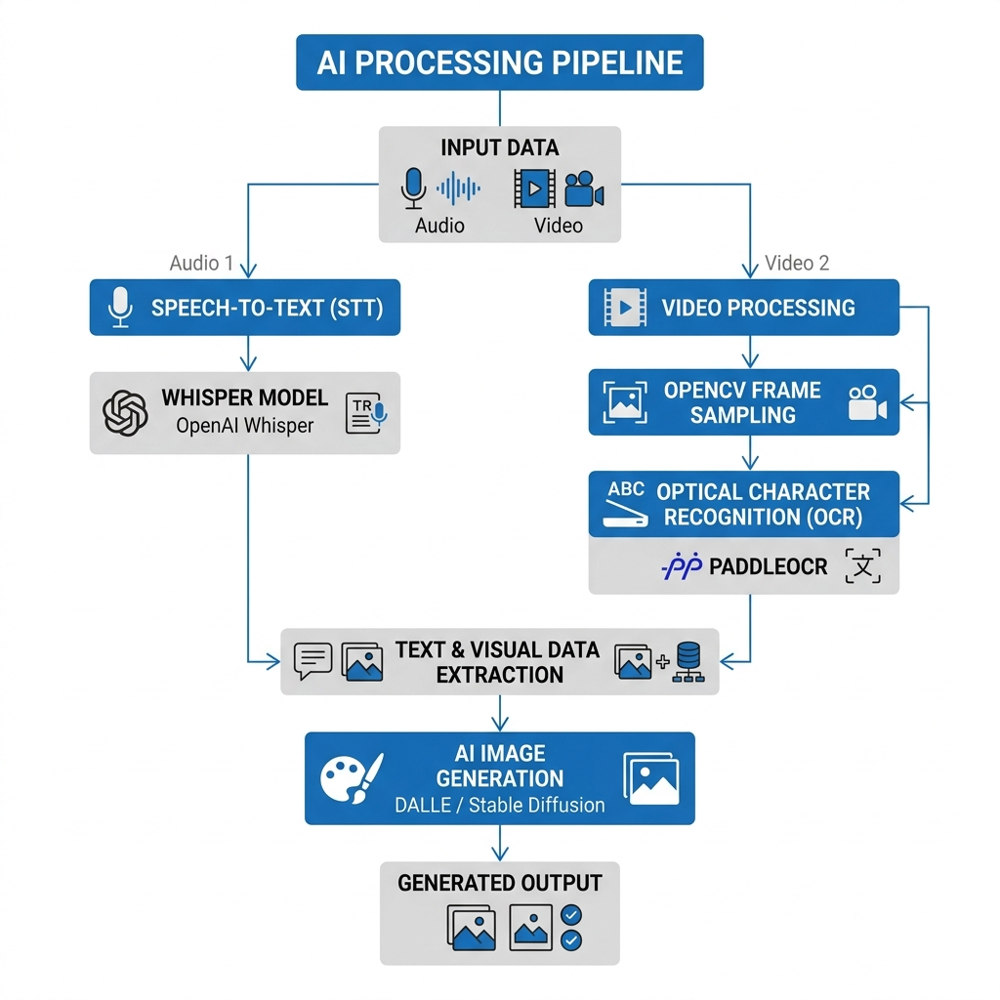
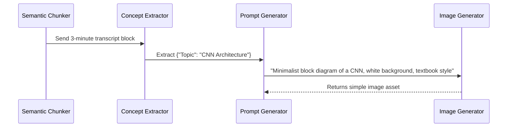

# AI Pipeline

EduScribe AI utilizes a combination of pre-trained deep learning models and generative AI techniques to process multimedia content.

## 🧠 Core AI Models

*Figure 3. AI Models and Pipeline Flow.*

### 1. Speech-to-Text: OpenAI Whisper
- **Engine**: PyTorch (Local Execution)
- **Purpose**: Converts 16kHz audio streams into text with start/end timestamps.
- **Optimization**: The model is loaded lazily into system memory only when required, freeing up resources when idle.

### 2. Optical Character Recognition: PaddleOCR
- **Engine**: PaddlePaddle
- **Purpose**: Detects and recognizes text bounding boxes on extracted video frames.
- **Advantage**: Exceptionally lightweight and highly accurate on non-standard backgrounds (e.g., presentation slides, whiteboards) compared to traditional engines like Tesseract.

### 3. Computer Vision: OpenCV & ImageHash
- **Purpose**: Pre-processing raw video data before it hits the heavy OCR models.
- **Algorithms**:
  - **Laplacian Variance**: Calculates the 2nd derivative of an image to measure edge sharpness, instantly detecting and discarding blurry frames.
  - **Perceptual Hashing (pHash)**: Generates a 64-bit structural fingerprint of a frame to detect visual duplicates, reducing noise by over 99%.

---

## 🎨 Upcoming Feature: AI Generated Simple Images

To enhance the generated educational notes, the AI pipeline is being expanded to include a generative visual component.

### Concept to Image Workflow

### Design Constraints
The Image Generator is strictly configured to produce **educational, simple visuals**. It deliberately avoids generating realistic artwork or highly complex decorative images. The goal is to replicate clear, minimalist textbook diagrams that aid student comprehension (e.g., UML diagrams, network topologies, algorithmic flowcharts).
