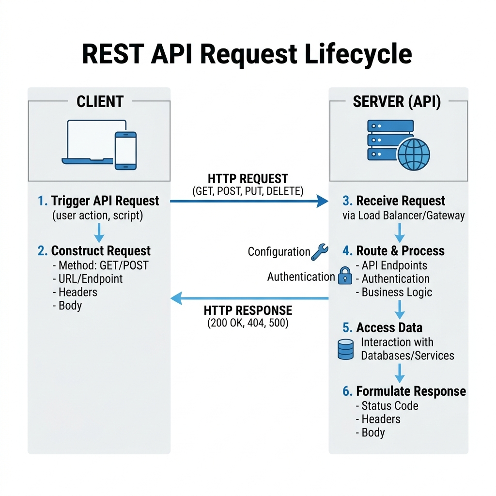

# API Reference

The EduScribe AI backend exposes a RESTful API powered by FastAPI. All endpoints except `/auth/google/login` and `/auth/google/callback` require a valid JWT Bearer token.

**Base URL (development):** `http://localhost:5001`

**Authentication:** `Authorization: Bearer <jwt_token>`

---

## Authentication


*Figure 5. REST API Request Lifecycle.*

| Method | Endpoint | Auth | Description |
|---|---|---|---|
| GET | `/auth/google/login` | None | Redirect to Google OAuth consent screen |
| GET | `/auth/google/callback` | None | Exchange OAuth code → issue JWT, redirect to frontend |
| GET | `/auth/me` | Bearer | Return current user profile |

**`GET /auth/me` Response:**
```json
{
  "id": "uuid",
  "email": "user@example.com",
  "name": "Jane Doe",
  "picture": "https://lh3.googleusercontent.com/...",
  "join_date": "2026-01-15T10:00:00"
}
```

---

## Videos

| Method | Endpoint | Auth | Description |
|---|---|---|---|
| POST | `/videos/upload` | Bearer | Upload file (multipart/form-data) |
| POST | `/videos/youtube` | Bearer | Ingest YouTube URL |
| GET | `/videos/` | Bearer | All videos for authenticated user |
| GET | `/videos/{id}` | Bearer | Video detail + live progress |
| GET | `/videos/{id}/details` | Bearer | Full metadata (+ transcript info) |
| GET | `/videos/analytics` | Bearer | Count, total duration, total word count |
| GET | `/videos/storage` | Bearer | Storage used (SQL SUM aggregate, <5ms) |
| PATCH | `/videos/{id}/retention` | Bearer | Update retention days (7/14/30) |
| DELETE | `/videos/{id}` | Bearer | Cascade delete all video artifacts + DB records |

### `POST /videos/upload`

**Request:** `multipart/form-data`
- `file`: Video/audio file (MP4, MKV, MOV, AVI, MP3, WAV, M4A, max 1 GB)
- `retention_days`: Integer (7, 14, or 30) — optional, default 7

**Response:** `202 Accepted`
```json
{
  "id": "uuid",
  "title": "lecture.mp4",
  "status": "UPLOADING",
  "progress_percent": 0,
  "created_at": "2026-08-02T10:00:00"
}
```

**Errors:**
- `400` — No filename or unsupported format
- `413` — File exceeds size limit

### `POST /videos/youtube`

**Request:** JSON
```json
{
  "url": "https://www.youtube.com/watch?v=...",
  "retention_days": 14
}
```

**Response:** Same as upload (202 Accepted with video record)

### `GET /videos/{id}`

**Response:** Video with live progress fields
```json
{
  "id": "uuid",
  "title": "...",
  "status": "PROCESSING",
  "progress_percent": 60,
  "current_step": "Running OCR on keyframes...",
  "estimated_time_remaining_seconds": 45
}
```

### `GET /videos/storage`

**Response:** Storage usage via SQL aggregate (O(1))
```json
{
  "used_bytes": 1073741824,
  "used_gb": 1.0,
  "video_count": 12
}
```

---

## Frames

| Method | Endpoint | Auth | Description |
|---|---|---|---|
| GET | `/frames/video/{video_id}` | Bearer | All frames with OCR + scores |
| GET | `/frames/video/{video_id}/selected` | Bearer | Only `is_selected=True` frames |
| POST | `/frames/video/{video_id}/extract` | Bearer | Manually re-run vision pipeline |

### `GET /frames/video/{video_id}` Response

```json
[
  {
    "id": "uuid",
    "frame_path": "storage/frames/{video_id}/scene_0001_12345.jpg",
    "timestamp_ms": 12345,
    "scene_number": 1,
    "blur_score": 142.7,
    "is_selected": true,
    "visual_importance_score": 0.83,
    "ocr_text": "Gradient Descent: θ = θ - α∇J(θ)",
    "transcript_similarity": 87.3
  }
]
```

**Frame URL construction (frontend):**
```javascript
const frameUrl = `http://localhost:5001/${frame.frame_path}`;
// → http://localhost:5001/storage/frames/{video_id}/scene_0001.jpg
```

---

## Notes

| Method | Endpoint | Auth | Description |
|---|---|---|---|
| GET | `/notes/{video_id}` | Bearer | Smart Notes content as JSON |
| GET | `/notes/{video_id}/download` | Bearer | Download as `.md` file |
| DELETE | `/notes/{video_id}` | DELETE | Delete notes file |

### `GET /notes/{video_id}` Response

```json
{
  "video_id": "uuid",
  "title": "Lecture Title",
  "content": "# Lecture Title\n\n**[00:00]** Welcome...\n\n### 📸 Visual Reference...",
  "word_count": 4200,
  "created_at": "2026-08-02T10:05:00"
}
```

---

## Error Responses

All endpoints return standard error responses:

```json
{
  "detail": "Error description"
}
```

| Status | Meaning |
|---|---|
| 400 | Bad request (invalid input) |
| 401 | Missing or invalid JWT token |
| 403 | Access denied (video belongs to another user) |
| 404 | Resource not found |
| 413 | File too large |
| 500 | Server/pipeline error |

---

## FastAPI Auto-Documentation

Interactive API docs are available at runtime:
- **Swagger UI:** `http://localhost:5001/docs`
- **ReDoc:** `http://localhost:5001/redoc`
- **OpenAPI JSON:** `http://localhost:5001/openapi.json`
