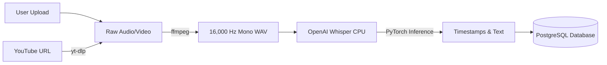

# Audio Transcription Pipeline

EduScribe AI relies on highly accurate audio transcription to make video content searchable and readable. The audio pipeline handles everything from secure downloading to state-of-the-art speech-to-text processing.

## Pipeline Architecture



## 1. Audio Acquisition
The pipeline supports two primary intake methods:
- **Direct File Uploads**: Users can upload raw `.mp4`, `.mp3`, or `.wav` files directly to the server.
- **YouTube Ingestion**: Leveraging `yt-dlp`, the backend can dynamically fetch and download audio streams directly from YouTube. `yt-dlp` is configured with advanced bot-bypass techniques (including user-agent spoofing and OAuth cookie passing) to ensure reliable downloads without triggering rate limits.

## 2. Audio Normalization (FFmpeg)
AI models are highly sensitive to audio sample rates and channels. Before passing data to the transcription model, the system uses system-level `ffmpeg` to:
1. Strip the video track (saving memory).
2. Convert the audio to **Mono** (single channel).
3. Downsample the audio to exactly **16,000 Hz**.
This format is the mathematical requirement for OpenAI's Whisper model to function optimally.

## 3. Speech-to-Text (OpenAI Whisper)
The system uses the **Whisper** architecture (running locally via PyTorch, completely independent of cloud APIs) to transcribe the normalized audio file.

- **Model Selection**: EduScribe typically runs on the `base` or `small` Whisper models, which provide an exceptional balance between rapid inference speed (often 10x faster than real-time) and transcription accuracy.
- **Timestamp Generation**: Whisper natively generates start and end timestamps for every sentence, allowing the frontend to create a clickable, interactive transcript explorer.
- **VRAM Optimization**: The model is loaded into memory only when an active transcription job is running, preventing idle memory leaks.

## 4. Storage & Formatting
The final transcript is structured into a standardized JSON schema containing:
```json
{
  "text": "The full concatenated transcript string...",
  "segments": [
    {
      "start": 0.0,
      "end": 4.5,
      "text": " Welcome to this lecture."
    }
  ],
  "language": "en"
}
```
This JSON file is persisted securely to the `/storage/transcripts/` directory, and its metadata (word count, language) is saved to the PostgreSQL database.
