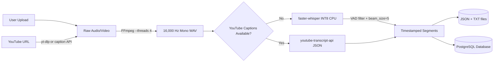

# Audio Transcription Pipeline

EduScribe AI converts video audio into timestamped text segments using **faster-whisper** (CTranslate2 backend) or YouTube's native caption API.

## Pipeline Architecture



---

## 1. Audio Acquisition

Two intake methods:

- **Direct File Upload:** Accepts `.mp4`, `.mkv`, `.mov`, `.avi`, `.mp3`, `.wav`, `.m4a` up to 1 GB. File is written asynchronously via `asyncio.to_thread()` to avoid blocking the event loop during large uploads.
- **YouTube Ingestion:** `yt-dlp` downloads audio with a two-tier bot bypass:
  1. Direct request (no cookies).
  2. Fallback: Chrome cookie jar (development only; not available in Docker).

**YouTube caption priority:** `youtube-transcript-api` is tried first (manual EN → auto-generated EN). If captions exist, Whisper transcription is **skipped entirely** — captions arrive in milliseconds vs. minutes for transcription.

---

## 2. Audio Normalization (FFmpeg)

```python
ffmpeg.input(video_path).output(
    audio_path,
    acodec='pcm_s16le',  # Uncompressed 16-bit PCM — Whisper's native format
    ac=1,                 # Mono channel — halves file size, required by Whisper
    ar='16k',             # 16,000 Hz sample rate — Whisper's native rate
    af='loudnorm,afftdn', # EBU R128 normalization + noise reduction
    **{'threads': 4}      # Multi-threaded FFmpeg — ~50% faster extraction
)
```

The `loudnorm` filter improves transcription accuracy for quiet recordings. `afftdn` (non-temporal noise reduction) improves accuracy for background noise. Both add 2–5s of processing but materially improve Whisper accuracy.

**`--threads 4`** parallelizes the loudnorm/afftdn filter graph across CPU cores, reducing extraction time by ~50% for long videos.

---

## 3. Speech-to-Text (faster-whisper)

Replaced `openai-whisper` (PyTorch) with **faster-whisper** (CTranslate2 backend):

| Feature | Before (openai-whisper) | After (faster-whisper) |
|---|---|---|
| Backend | PyTorch (FP32) | CTranslate2 (INT8 quantized) |
| Speed (CPU) | Baseline | **4–8x faster** |
| RAM usage | ~150MB (permanent) | ~75MB (**freed after use**) |
| VAD filter | None | ✅ Skips silence (~20% faster) |
| Streaming | No (waits for full result) | ✅ Segment generator |

```python
from faster_whisper import WhisperModel

model = WhisperModel(
    "base",
    device="cpu",
    compute_type="int8",   # INT8 quantization: 50% less RAM, 4x faster
)

segments_generator, info = model.transcribe(
    audio_path,
    beam_size=5,
    vad_filter=True,                          # Skip silence regions
    vad_parameters=dict(min_silence_duration_ms=500),
)

for segment in segments_generator:
    # Streaming — first output arrives before full audio is processed
    ...
```

**Model unload after transcription:**
```python
del self.model
self.model = None
gc.collect()
```

The Whisper model is unloaded immediately after transcription. This frees ~75MB RAM for the OCR pipeline, which is also memory-intensive. Reload cost (~5s) is acceptable for batch processing.

**Thread locking:** A `threading.Lock()` prevents concurrent load attempts from spawning duplicate model instances.

---

## 4. Output Format

Both JSON (machine-readable) and TXT (human-readable) files are saved to `/storage/transcripts/`.

**JSON schema:**
```json
[
  { "start": 0.0,  "end": 5.2,  "text": "Welcome to today's lecture on machine learning." },
  { "start": 5.2,  "end": 12.4, "text": "Today we will cover gradient descent." }
]
```

The segment array is the canonical format. Each segment has `start`, `end`, and `text` — providing timestamps for frontend display and frame-to-transcript alignment.

---

## 5. Database Record

**Table: `transcripts`**

| Column | Type | Description |
|---|---|---|
| id | UUID | Primary key |
| video_id | UUID | FK → videos.id (CASCADE DELETE) |
| transcript_path | String | Path to JSON file |
| language | String(20) | Auto-detected language code (e.g. `en`) |
| word_count | Integer | Total word count |
| source | String(50) | `whisper_audio` or `youtube_captions` |
| created_at | DateTime | Creation timestamp |

**Index:** `idx_transcripts_video_id ON transcripts(video_id)` ✅

---

## 6. Timing Estimates (CPU, 1-hour lecture)

| Method | Time | Notes |
|---|---|---|
| YouTube captions | < 2s | Direct API call — no audio needed |
| faster-whisper base (INT8, CPU) | ~3–4 min | 4–8x faster than openai-whisper |
| openai-whisper base (FP32, CPU) | ~15 min | Previous implementation |
| faster-whisper large-v3 (GPU) | ~90s | With GPU acceleration |

---

## 7. GPU Upgrade Path

For production GPU deployments, switch to:

```python
model = WhisperModel(
    "large-v3",
    device="cuda",
    compute_type="int8_float16",  # INT8 weights, FP16 activations
)
```

| Model | CPU Time | GPU (A100) | VRAM |
|---|---|---|---|
| base | ~3–4 min | ~30s | 1 GB |
| large-v3 | ~20 min | ~90s | 6 GB |
| large-v3-turbo | ~8 min | ~45s | 3 GB |
