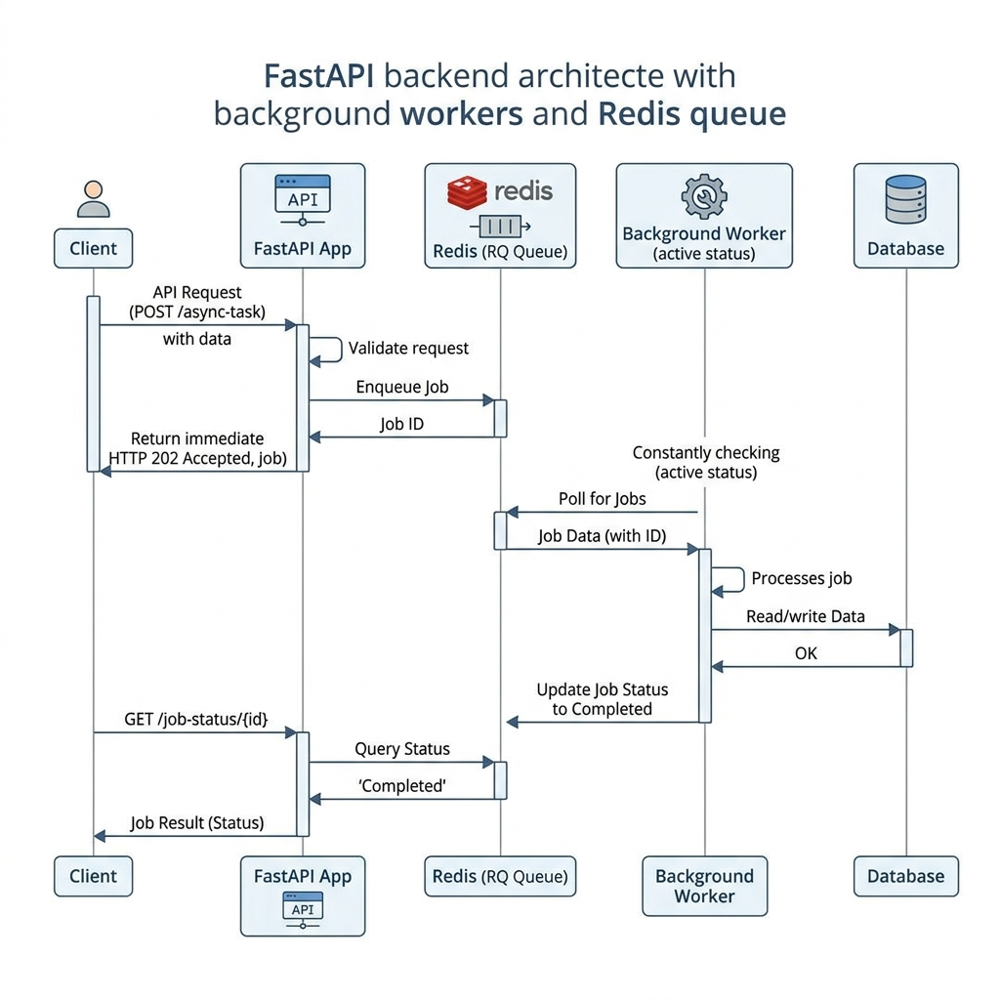
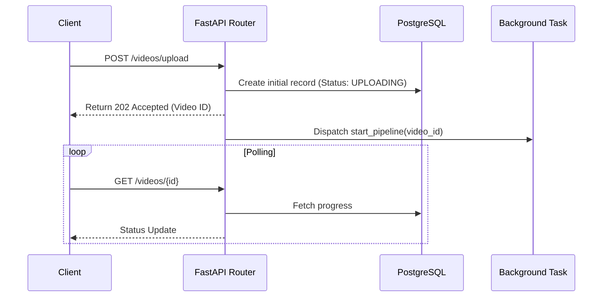

# Backend Architecture

The EduScribe AI backend is designed for high concurrency and asynchronous task execution, ensuring that long-running AI models do not block incoming API requests from the frontend.

## Core Technologies
- **FastAPI**: Provides the REST API interface.
- **Uvicorn**: The ASGI web server.
- **BackgroundTasks**: A FastAPI utility used to immediately return a 200/202 response while processing AI jobs in the background.

## Backend Workflow

*Figure 8. FastAPI, Redis, and Background Worker Sequence Diagram.*

## Structure
- `/api/routers/`: Contains the REST endpoints (Auth, Videos, Frames).
- `/services/`: Contains the heavy business logic and API wrappers (YouTube fetching, Whisper, OpenCV).
- `/models/`: SQLAlchemy database schemas.
- `/schemas/`: Pydantic models for request/response validation.

## (Upcoming) Image Generation Service
A new service will be added to the backend (`/services/image_gen.py`). It will be triggered at the end of the transcription phase to generate educational images and save them to `/storage/images/`.
