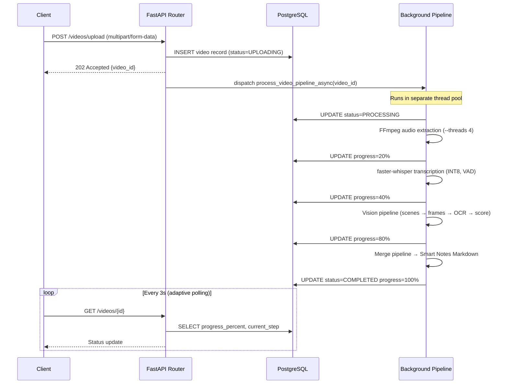

# Backend Architecture

The EduScribe AI backend is designed for high concurrency and asynchronous task execution, ensuring that long-running AI models do not block incoming API requests.

## Core Technologies

| Library | Version | Role |
|---|---|---|
| FastAPI | 0.110 | REST API framework |
| uvicorn + uvloop | latest | ASGI server with C-based event loop (~2x throughput) |
| SQLAlchemy | 2.0 (async) | ORM with AsyncPG driver |
| Alembic | latest | Database migrations |
| APScheduler | 3.10+ | Nightly cleanup cron |
| faster-whisper | 1.0+ | Speech-to-text (INT8 CTranslate2) |
| PaddleOCR | latest | Frame text extraction |
| PySceneDetect | latest | Scene boundary detection |
| imagehash | latest | Perceptual duplicate detection |
| RapidFuzz | latest | Transcript fuzzy matching |
| ffmpeg-python | latest | Audio extraction wrapper |
| cachetools | 5.5+ | LRU cache for OCR results |
| python-jose / PyJWT | latest | JWT generation and validation |

---

## Backend Workflow



---

## Directory Structure

```
backend/
├── api/
│   └── routers/
│       ├── auth.py          # Google OAuth2 + JWT
│       ├── video.py         # Upload, YouTube, status, delete, storage
│       ├── frames.py        # Frame fetch + manual trigger
│       └── notes.py         # Notes fetch + download
├── core/
│   ├── config.py            # Settings (env vars via pydantic-settings)
│   ├── database.py          # AsyncPG engine (pool_size=10, overflow=20)
│   └── security.py          # JWT create + validate
├── models/
│   ├── user.py              # User ORM model
│   ├── video.py             # Video + file_size_bytes
│   ├── transcript.py        # Transcript ORM model
│   └── frame.py             # VideoFrame + FrameScore + OCRResult
├── schemas/
│   ├── video.py             # VideoCreate, VideoResponse Pydantic models
│   └── frame.py             # FrameResponse Pydantic models
├── services/
│   ├── audio.py             # FFmpeg extraction (--threads 4)
│   ├── whisper_service.py   # faster-whisper, INT8, VAD, model unload
│   ├── youtube_service.py   # yt-dlp + youtube-transcript-api
│   ├── storage_service.py   # File save/delete helpers
│   ├── merge_service.py     # Smart Notes Markdown generator
│   └── vision/
│       ├── pipeline.py          # 9-stage orchestrator
│       ├── extraction/
│       │   ├── scene_detector.py    # PySceneDetect, adaptive downscale
│       │   └── frame_extractor.py   # Best-of-2, web-relative paths
│       ├── filtering/
│       │   ├── duplicate_detector.py # dHash, deque(maxlen=50)
│       │   └── blur_detector.py      # Laplacian, adaptive threshold
│       ├── ocr/
│       │   ├── paddleocr_service.py  # Lazy-load, locked, edge pre-filter
│       │   └── cache.py              # LRUCache(maxsize=500)
│       └── scoring/
│           ├── ranking_service.py    # per-scene top_n groupby
│           ├── importance_scorer.py  # Composite score calculator
│           └── feature_extractor.py # Feature vector builder
├── migrations/
│   └── versions/
│       └── 63c689249d08_add_db_indexes_and_file_size_bytes.py
├── main.py                  # App startup, APScheduler nightly cron
└── requirements.txt
```

---

## Key Design Decisions

### Non-blocking File Upload
```python
# File write is offloaded to a thread — does not block the event loop
file_path = await asyncio.to_thread(
    storage_service.save_upload_file, file, video_id, ext
)
file_size_bytes = os.path.getsize(file_path)
```

### Progress Updates — Session Isolation
Each `update_progress()` call opens a **fresh DB session** instead of reusing the pipeline session. This ensures progress writes are committed immediately and are not rolled back if the pipeline fails:

```python
async def update_progress(video_id, percent, step, eta=None):
    async with AsyncSessionLocal() as db:  # Fresh session per update
        await db.execute(update(Video).where(...).values(...))
        await db.commit()
```

### Storage Query — SQL Aggregate
```python
# O(1) SQL aggregate instead of O(N) disk stat calls
result = await db.execute(
    select(func.coalesce(func.sum(Video.file_size_bytes), 0))
    .where(Video.user_id == str(current_user.id))
)
used_bytes = result.scalar()
```

Response time: ~500ms (200 disk stats) → **<5ms** (1 SQL).

### Nightly Cleanup (APScheduler)
```python
from apscheduler.schedulers.asyncio import AsyncIOScheduler
from apscheduler.triggers.cron import CronTrigger

scheduler = AsyncIOScheduler()
scheduler.add_job(
    cleanup_expired_videos,
    trigger=CronTrigger(hour=2, minute=0),
    misfire_grace_time=3600,  # Fire up to 1h late if server was down
)
```

Cleanup cascade per video: transcript file → frames directory → temp/upload files → DB record (via SQLAlchemy `cascade="all, delete-orphan"`).

---

## API Endpoints Reference

### Authentication
| Endpoint | Method | Auth | Description |
|---|---|---|---|
| `/auth/google/login` | GET | None | Redirect to Google OAuth consent |
| `/auth/google/callback` | GET | None | Exchange code → issue JWT |
| `/auth/me` | GET | Bearer | Current user profile |

### Videos
| Endpoint | Method | Auth | Description |
|---|---|---|---|
| `POST /videos/upload` | POST | Bearer | Upload file (async write) |
| `POST /videos/youtube` | POST | Bearer | YouTube URL ingestion |
| `GET /videos/` | GET | Bearer | All videos for user |
| `GET /videos/{id}` | GET | Bearer | Video detail + progress |
| `GET /videos/analytics` | GET | Bearer | Count, duration, word count |
| `GET /videos/storage` | GET | Bearer | Storage used (SQL aggregate) |
| `PATCH /videos/{id}/retention` | PATCH | Bearer | Update retention days |
| `DELETE /videos/{id}` | DELETE | Bearer | Cascade delete all artifacts |

### Frames
| Endpoint | Method | Auth | Description |
|---|---|---|---|
| `GET /frames/video/{video_id}` | GET | Bearer | All frames with OCR + scores |
| `POST /frames/video/{video_id}/extract` | POST | Bearer | Manually re-run vision pipeline |

### Notes
| Endpoint | Method | Auth | Description |
|---|---|---|---|
| `GET /notes/{video_id}` | GET | Bearer | Smart Notes JSON content |
| `GET /notes/{video_id}/download` | GET | Bearer | Download as `.md` file |
| `DELETE /notes/{video_id}` | DELETE | Bearer | Delete notes file |
