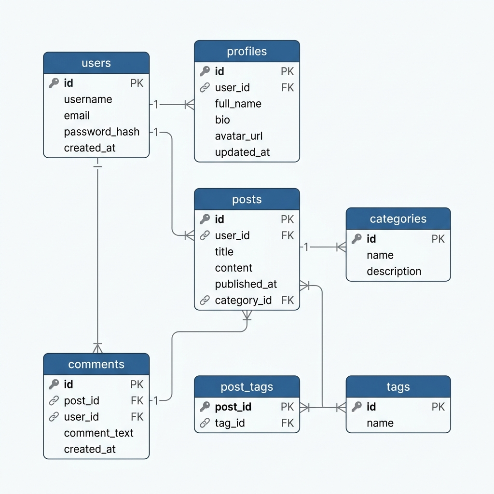
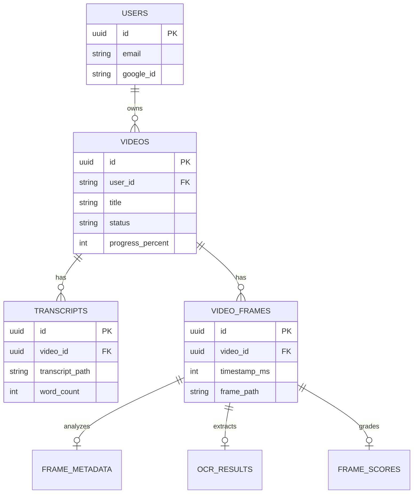
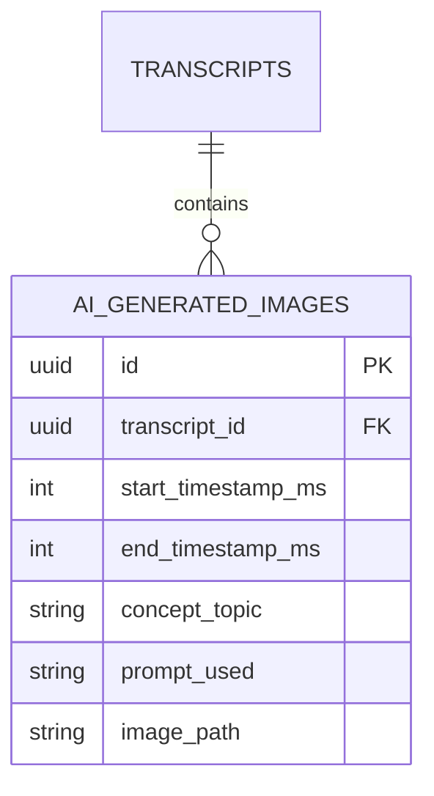

# Database Schema

EduScribe AI uses **PostgreSQL** to securely store relational data across users, videos, and generated AI metadata.

## Entity Relationship Diagram

*Figure 4. PostgreSQL Database Schema.*

## Upcoming Schema Changes
To support the **AI Generated Simple Images** feature, a new table will be introduced to track the mapping between transcript concepts and their generated illustrations:

