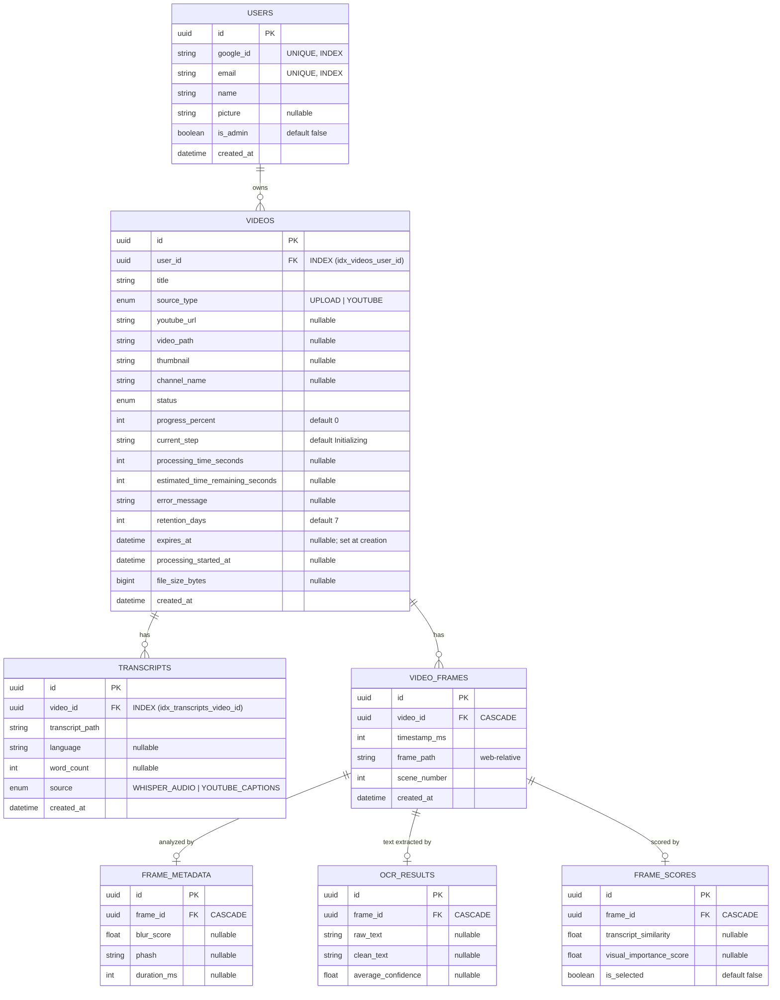

# Database Schema

EduScribe AI uses **PostgreSQL 15** for all relational data. The ORM is SQLAlchemy 2 (async, asyncpg driver).

---

## Entity Relationship Diagram



---

## Tables In Detail

### `users`

| Column | Type | Constraints | Notes |
|---|---|---|---|
| `id` | UUID | PK | Auto-generated |
| `google_id` | String | UNIQUE, NOT NULL, INDEX | Google sub claim |
| `email` | String | UNIQUE, NOT NULL, INDEX | |
| `name` | String | NOT NULL | |
| `picture` | String | NULLABLE | Profile photo URL |
| `is_admin` | Boolean | NOT NULL, default `false` | Admin RBAC flag |
| `created_at` | DateTime(tz) | default now() | |

---

### `videos`

| Column | Type | Constraints | Notes |
|---|---|---|---|
| `id` | UUID | PK | |
| `user_id` | UUID | FK→users.id (CASCADE), NOT NULL, **INDEX** | `idx_videos_user_id` |
| `title` | String(500) | NOT NULL | |
| `source_type` | Enum | NOT NULL | `UPLOAD` or `YOUTUBE` |
| `youtube_url` | String | NULLABLE | |
| `video_path` | String | NULLABLE | Deleted after pipeline |
| `thumbnail` | String | NULLABLE | |
| `channel_name` | String | NULLABLE | |
| `status` | Enum | default `UPLOADING` | See VideoStatus enum |
| `progress_percent` | Integer | default `0` | 0–100 |
| `current_step` | String(100) | default `"Initializing"` | Human-readable stage |
| `processing_time_seconds` | Integer | NULLABLE | |
| `estimated_time_remaining_seconds` | Integer | NULLABLE | |
| `error_message` | String | NULLABLE | Capped at 2,000 chars |
| `retention_days` | Integer | default `7` | 1–30 |
| `expires_at` | DateTime(tz) | NULLABLE | Set at video creation |
| `processing_started_at` | DateTime(tz) | NULLABLE | Set when orchestrator begins |
| `file_size_bytes` | BigInteger | NULLABLE | Captured at upload time |
| `created_at` | DateTime(tz) | default now() | |

**VideoStatus enum values:**
```
UPLOADING → EXTRACTING_AUDIO → TRANSCRIBING → EXTRACTING_FRAMES →
RUNNING_OCR → CHUNKING → DETECTING_TOPICS → GENERATING_NOTES →
EXPORTING → COMPLETED
FAILED (can occur from any step)
```

---

### `transcripts`

| Column | Type | Constraints | Notes |
|---|---|---|---|
| `id` | UUID | PK | |
| `video_id` | UUID | FK→videos.id (CASCADE), **INDEX** | `idx_transcripts_video_id` |
| `transcript_path` | String | NOT NULL | Path to JSON file in `storage/transcripts/` |
| `language` | String(20) | NULLABLE | Auto-detected (e.g. `"en"`) |
| `word_count` | Integer | NULLABLE | |
| `source` | String(50) | NULLABLE | `"whisper_audio"` or `"youtube_captions"` |
| `created_at` | DateTime(tz) | default now() | |

---

### `video_frames`

| Column | Type | Notes |
|---|---|---|
| `id` | UUID | PK |
| `video_id` | UUID | FK→videos.id (CASCADE) |
| `timestamp_ms` | Integer | Frame position in milliseconds |
| `frame_path` | String | **Web-relative**: `storage/frames/{video_id}/scene_0001_12345.jpg` |
| `scene_number` | Integer | PySceneDetect scene index (0-based) |
| `created_at` | DateTime(tz) | |

---

### `frame_metadata`

| Column | Type | Notes |
|---|---|---|
| `id` | UUID | PK |
| `frame_id` | UUID | FK→video_frames.id (CASCADE) |
| `blur_score` | Float | Laplacian variance |
| `phash` | String | dHash hex string |
| `duration_ms` | Integer | Scene duration in ms |

---

### `ocr_results`

| Column | Type | Notes |
|---|---|---|
| `id` | UUID | PK |
| `frame_id` | UUID | FK→video_frames.id (CASCADE) |
| `raw_text` | String | Concatenated raw PaddleOCR output |
| `clean_text` | String | Post-processed clean text |
| `average_confidence` | Float | Mean confidence across detected text boxes |

---

### `frame_scores`

| Column | Type | Notes |
|---|---|---|
| `id` | UUID | PK |
| `frame_id` | UUID | FK→video_frames.id (CASCADE) |
| `transcript_similarity` | Float | RapidFuzz `token_set_ratio` score (0–100) |
| `visual_importance_score` | Float | Composite ranking score |
| `is_selected` | Boolean | `true` = best frame for its scene |

---

## Database Indexes

```sql
-- Applied in migration 63c689249d08
CREATE INDEX idx_videos_user_id ON videos(user_id);
CREATE INDEX idx_transcripts_video_id ON transcripts(video_id);
```

These indexes are critical for:
- Dashboard queries: `SELECT ... FROM videos WHERE user_id = ?`
- Storage aggregate: `SUM(file_size_bytes) WHERE user_id = ?`
- Workspace load: transcript lookup by video

---

## Cascade Delete Rules

Deleting a `Video` record cascades through:

```
Video
 └── Transcript            (cascade delete)
 └── VideoFrame            (cascade delete)
      ├── FrameMetadata    (cascade delete)
      ├── OCRResult        (cascade delete)
      └── FrameScore       (cascade delete)
```

Physical files (video, transcript, frames, notes, embeddings) are deleted **before** the DB cascade fires, in the `DELETE /videos/{id}` endpoint handler.

---

## Connection Pool

```python
create_async_engine(
    SQLALCHEMY_DATABASE_URL,
    pool_size=10,       # Persistent connections
    max_overflow=20,    # Burst capacity
    pool_recycle=1800,  # Recycle every 30 min (prevents Neon serverless idle timeout)
    echo=False,
)
```

---

## Applied Migrations

| Migration ID | Description |
|---|---|
| `8a92f814b3d2` | Initial schema: users, videos, transcripts, video_frames, frame_metadata, ocr_results, frame_scores |
| `63c689249d08` | Added `idx_videos_user_id`, `idx_transcripts_video_id`; added `file_size_bytes` column to videos |

```bash
# Apply all pending migrations
alembic upgrade head

# Check current revision
alembic current

# Create a new migration
alembic revision --autogenerate -m "description"
```
