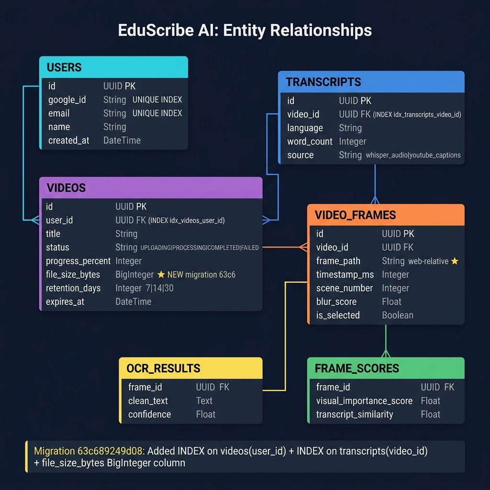
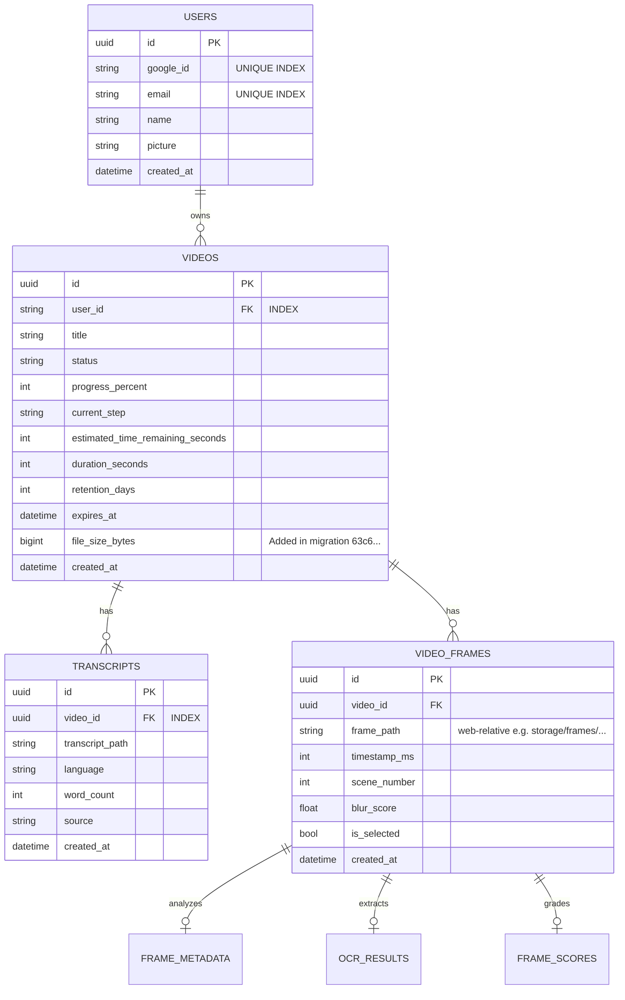

# Database Schema

EduScribe AI uses **PostgreSQL** to store relational data across users, videos, frames, transcripts, and generated notes.

## Entity Relationship Diagram


*Figure 4. PostgreSQL Database Schema.*



---

## Tables In Detail

### `users`

| Column | Type | Constraints |
|---|---|---|
| id | UUID | PK, default uuid4 |
| google_id | String | UNIQUE, NOT NULL, INDEX |
| email | String | UNIQUE, NOT NULL, INDEX |
| name | String | NOT NULL |
| picture | String | NULLABLE |
| created_at | DateTime | default=utcnow |

---

### `videos`

| Column | Type | Constraints | Notes |
|---|---|---|---|
| id | UUID | PK | |
| user_id | String | FK → users.id, **INDEX** | `idx_videos_user_id` ✅ |
| title | String | NOT NULL | |
| status | String(50) | NOT NULL | `UPLOADING`, `PROCESSING`, `COMPLETED`, `FAILED` |
| progress_percent | Integer | default=0 | 0–100 |
| current_step | String | NULLABLE | Human-readable step name |
| estimated_time_remaining_seconds | Integer | NULLABLE | ETA shown in dashboard |
| duration_seconds | Float | NULLABLE | Video duration |
| retention_days | Integer | default=7 | 7, 14, or 30 |
| expires_at | DateTime | NULLABLE | Set at creation; enforced by nightly cron |
| **file_size_bytes** | BigInteger | NULLABLE | **Added:** migration `63c689249d08` |
| source_type | String | NULLABLE | `upload` or `youtube` |
| youtube_url | String | NULLABLE | |
| thumbnail_url | String | NULLABLE | |
| created_at | DateTime | default=utcnow | |

---

### `transcripts`

| Column | Type | Constraints | Notes |
|---|---|---|---|
| id | UUID | PK | |
| video_id | UUID | FK → videos.id (CASCADE), **INDEX** | `idx_transcripts_video_id` ✅ |
| transcript_path | String | NOT NULL | Path to JSON file |
| language | String(20) | NULLABLE | Auto-detected (e.g. `en`) |
| word_count | Integer | NULLABLE | Total word count |
| source | String(50) | NULLABLE | `whisper_audio` or `youtube_captions` |
| created_at | DateTime | default=utcnow | |

---

### `video_frames`

| Column | Type | Notes |
|---|---|---|
| id | UUID | PK |
| video_id | UUID | FK → videos.id (CASCADE) |
| frame_path | String | **Web-relative** (e.g. `storage/frames/{id}/scene_0001.jpg`) |
| timestamp_ms | Integer | Frame position in milliseconds |
| scene_number | Integer | PySceneDetect scene index |
| blur_score | Float | Laplacian variance score |
| is_selected | Boolean | True = best frame for this scene |
| created_at | DateTime | |

---

### `ocr_results`

| Column | Type | Notes |
|---|---|---|
| id | UUID | PK |
| frame_id | UUID | FK → video_frames.id (CASCADE) |
| clean_text | Text | Concatenated OCR output |
| confidence | Float | Average OCR confidence score |
| line_count | Integer | Number of detected text lines |

---

### `frame_scores`

| Column | Type | Notes |
|---|---|---|
| id | UUID | PK |
| frame_id | UUID | FK → video_frames.id (CASCADE) |
| visual_importance_score | Float | Composite ranking score |
| transcript_similarity | Float | RapidFuzz match score (0–100) |
| matched_segment_start | Float | Transcript segment start (seconds) |

---

## Applied Migrations

### `63c689249d08_add_db_indexes_and_file_size_bytes`

```sql
-- Added in this migration (applied 2026-08-02)
CREATE INDEX idx_videos_user_id ON videos(user_id);
CREATE INDEX idx_transcripts_video_id ON transcripts(video_id);
ALTER TABLE videos ADD COLUMN file_size_bytes BIGINT;
```

These indexes are critical for:
- Dashboard analytics query (JOIN videos + transcripts by user)
- Storage aggregate: `SUM(file_size_bytes) WHERE user_id = ?`
- Transcript lookup by video (every workspace load)

---

## SQLAlchemy Cascade Delete

All child tables use `cascade="all, delete-orphan"` in SQLAlchemy relationship definitions. Deleting a `Video` record cascades through:

```
Video
 └── Transcript (cascade delete)
 └── VideoFrame (cascade delete)
      └── OCRResult (cascade delete)
      └── FrameScore (cascade delete)
      └── FrameMetadata (cascade delete)
```

Physical files are cleaned up in the delete endpoint handler before the DB cascade fires.

---

## Connection Pool Configuration

```python
create_async_engine(
    DATABASE_URL,
    pool_size=10,       # Maintain 10 persistent connections
    max_overflow=20,    # Allow 20 additional burst connections
    pool_recycle=1800,  # Recycle every 30 min (prevents Neon idle timeout)
    echo=False,
)
```
