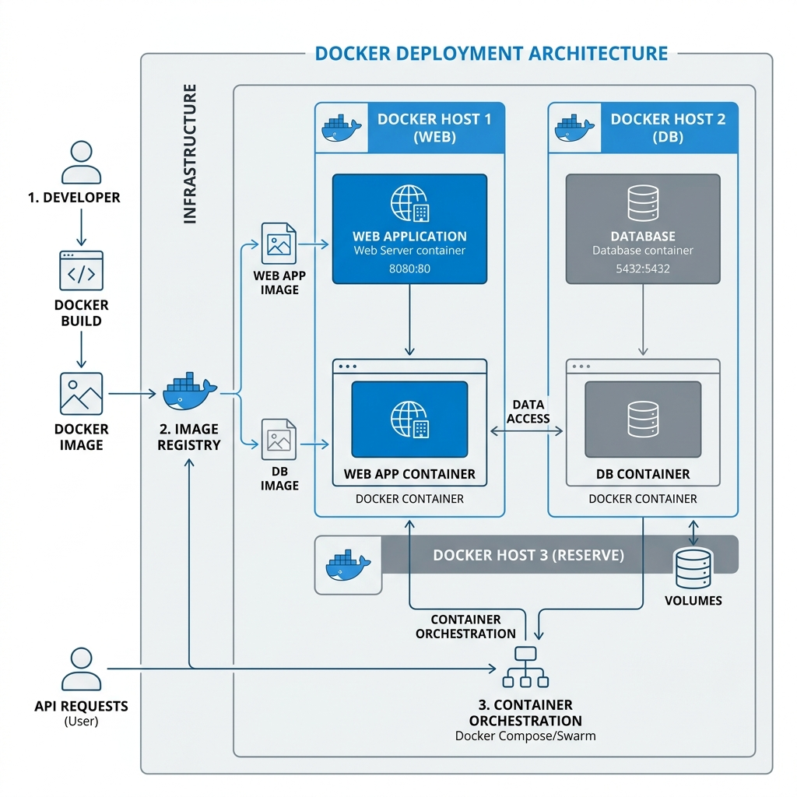

# Deployment

EduScribe AI relies heavily on low-level system dependencies (FFmpeg, OpenCV, libgl1) and massive Python AI packages (PyTorch, Whisper, PaddleOCR). To ensure a flawless deployment across any environment, the entire stack is heavily Dockerized.

## Docker Architecture


*Figure 7. Docker Container Deployment Architecture.*

```mermaid
graph TD
    subgraph Docker Network
        Web[Frontend: React/Vite - Port 5173]
        API[Backend: FastAPI - Port 5001]
    end
    
    subgraph External Dependencies
        DB[(Neon PostgreSQL)]
    end
    
    subgraph Host Machine Volumes
        V1[./storage/uploads]
        V2[./storage/transcripts]
        V3[./storage/frames]
        V4[./storage/images (Upcoming AI Images)]
    end

    Web <--> API
    API <--> DB
    API --> V1
    API --> V2
    API --> V3
    API --> V4
```

## Running Locally

1. Install Docker Desktop.
2. Clone the repository.
3. Configure your `.env` file (see [Configuration](Configuration.md)).
4. Run the stack:
```bash
docker compose up --build -d
```
5. View container logs to track the AI model downloads:
```bash
docker compose logs -f backend
```

## Production Considerations
- **VRAM Limitations**: If deploying to a cloud VM (AWS EC2, DigitalOcean), ensure the machine has at least 8GB of RAM. Processing Whisper and PaddleOCR concurrently will cause Out of Memory (OOM) crashes on 1GB/2GB instances.
- **GPU Acceleration**: The current `Dockerfile` defaults to the CPU version of PyTorch to maximize compatibility. For production, update the `Dockerfile` to pull the `nvidia/cuda` base image and install the `cu118` wheels for PyTorch to enable 100x faster transcription.
- **Database**: Do not run PostgreSQL inside Docker for production. Use a managed service like Neon, Supabase, or RDS.
