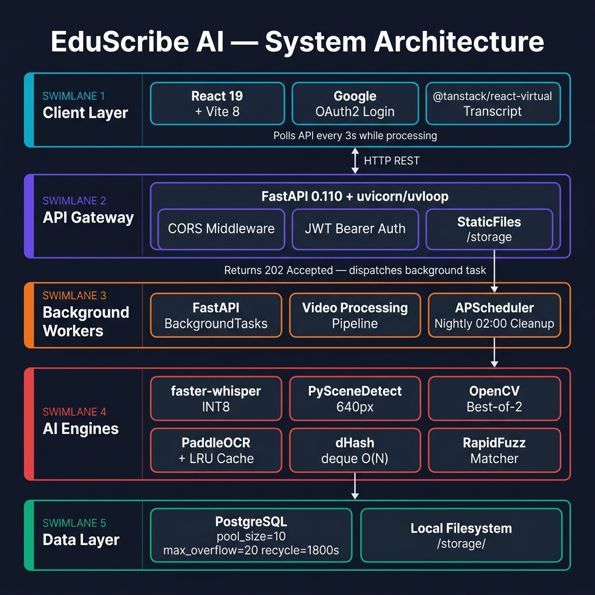

# Project Folder Structure

EduScribe AI is organized into distinct, decoupled directories ensuring maintainability and separation of concerns.

## Root Directory


*Figure 6. High-level Folder Directory Structure.*

```text
EduScribe-AI/
├── backend/                # FastAPI Python Application
├── frontend/               # React 19 + Vite 8 Application
├── docs/                   # Markdown Documentation
├── storage/                # Persistent Local File Storage (gitignored)
│   ├── uploads/            # Original uploaded video files (deleted after pipeline)
│   ├── temp/               # Temporary audio WAV files (deleted after transcription)
│   ├── transcripts/        # JSON + TXT transcript files
│   ├── frames/             # Extracted JPEG keyframes (per {video_id}/ subdir)
│   └── outputs/            # Smart Notes Markdown files (per {video_id}/ subdir)
├── docker-compose.yml      # Infrastructure orchestration
└── README.md               # Project overview
```

---

## Backend Structure

```text
backend/
├── api/
│   ├── routers/
│   │   ├── auth.py          # Google OAuth2 endpoints + JWT issuance
│   │   ├── video.py         # Upload, YouTube, status, delete, storage, analytics
│   │   ├── frames.py        # Frame list + manual vision pipeline trigger
│   │   └── notes.py         # Smart Notes fetch, download, delete
│   └── dependencies.py      # Auth/DB dependency injection
│
├── core/
│   ├── config.py            # pydantic-settings — all env vars
│   ├── database.py          # AsyncPG engine (pool_size=10, overflow=20, recycle=1800)
│   └── security.py          # JWT create_access_token + get_current_user
│
├── models/
│   ├── user.py              # User ORM (google_id, email, name, picture)
│   ├── video.py             # Video ORM (status, progress, file_size_bytes, expires_at)
│   ├── transcript.py        # Transcript ORM (video_id FK, language, word_count, source)
│   └── frame.py             # VideoFrame + FrameMetadata + OCRResult + FrameScore
│
├── schemas/
│   ├── video.py             # VideoCreate, VideoResponse, VideoDetail Pydantic models
│   └── frame.py             # VideoFrameResponse Pydantic models
│
├── services/
│   ├── audio.py             # FFmpeg extraction (--threads 4, loudnorm, afftdn)
│   ├── whisper_service.py   # faster-whisper INT8 + VAD + model unload
│   ├── youtube_service.py   # yt-dlp + youtube-transcript-api (two-tier bypass)
│   ├── storage_service.py   # Async file save/delete helpers
│   ├── merge_service.py     # Smart Notes Markdown generator
│   │
│   └── vision/
│       ├── __init__.py
│       ├── pipeline.py          # 9-stage orchestrator
│       │
│       ├── extraction/
│       │   ├── scene_detector.py    # PySceneDetect, 640px downscale, fallback
│       │   └── frame_extractor.py   # Best-of-2 adaptive, web-relative paths
│       │
│       ├── filtering/
│       │   ├── duplicate_detector.py # dHash, deque(maxlen=50) O(N)
│       │   └── blur_detector.py      # Laplacian CV_16S, adaptive threshold
│       │
│       ├── ocr/
│       │   ├── paddleocr_service.py  # Lazy-load, asyncio lock, edge pre-filter, resize
│       │   └── cache.py              # LRUCache(maxsize=500)
│       │
│       └── scoring/
│           ├── ranking_service.py    # Per-scene top_n via itertools.groupby
│           ├── importance_scorer.py  # Composite score: blur + similarity + OCR
│           └── feature_extractor.py # Feature vector builder
│
├── migrations/
│   ├── env.py
│   ├── script.py.mako
│   └── versions/
│       ├── 8a92f814b3d2_initial_schema.py          # Base schema
│       └── 63c689249d08_add_db_indexes_and_file_size_bytes.py
│
├── main.py                  # App startup, CORS, StaticFiles, APScheduler nightly cron
├── requirements.txt
├── Dockerfile
└── .env                     # Environment variables (gitignored)
```

---

## Frontend Structure

```text
frontend/
├── src/
│   ├── assets/              # Static SVGs and images
│   │
│   ├── components/
│   │   ├── Sidebar.jsx      # Navigation sidebar
│   │   ├── UploadModal.jsx  # Add Content modal (file upload + YouTube URL)
│   │   └── ...              # Other reusable UI components
│   │
│   ├── context/
│   │   └── AuthContext.jsx  # Google OAuth2 JWT state, login/logout
│   │
│   ├── pages/
│   │   ├── LandingPage.jsx      # Public landing page
│   │   ├── AuthCallback.jsx     # Handles OAuth redirect, extracts JWT from hash
│   │   ├── Dashboard.jsx        # Video library, live progress, analytics
│   │   └── ProjectWorkspace.jsx # Transcript (virtual), Frames gallery, Notes
│   │
│   ├── App.jsx              # React Router route definitions
│   └── index.css            # Global theme, glassmorphism, animations
│
├── package.json             # npm dependencies
│   # Key packages:
│   # - react 19
│   # - react-router-dom 7
│   # - @tanstack/react-virtual  ← virtual transcript scrolling
│   # - lucide-react
│   # - vite 8
│
└── vite.config.js           # Dev server proxy + build config
```

---

## Storage Layout

```text
storage/                          ← Served by FastAPI StaticFiles at /storage
├── uploads/
│   └── {video_id}.mp4            ← Deleted after pipeline completion
│
├── temp/
│   └── {video_id}.wav            ← Deleted in pipeline finally block
│
├── transcripts/
│   ├── {video_id}.json           ← [{start, end, text}, ...]
│   └── {video_id}.txt            ← Full plaintext
│
├── frames/
│   └── {video_id}/
│       ├── scene_0001_12345.jpg  ← Selected keyframe (is_selected=True)
│       └── scene_0002_45678.jpg
│
└── outputs/
    └── {video_id}/
        └── notes.md              ← Smart Notes Markdown
```

**Frame URL:** `http://localhost:5001/storage/frames/{video_id}/scene_0001_12345.jpg`

All frame paths stored in the database are **web-relative** (e.g. `storage/frames/{video_id}/scene_0001.jpg`) — not absolute OS paths — so URL construction works identically on any deployment.

---

## docs/ Structure

```text
docs/
├── 1.FIRST_HALF.md                  # Engineering Architecture Guide (Part 1)
├── 2.SECOND_HALF.md                 # LLD Document (Part 2)
├── Engineering_Architecture.md      # Performance optimization reference
├── Features.md                      # Complete feature list
├── System_Architecture.md           # High-level architecture + request lifecycle
├── Processing_Pipeline.md           # End-to-end processing stages
├── Audio_Transcription.md           # faster-whisper + FFmpeg pipeline
├── Vision_Pipeline.md               # 9-stage computer vision pipeline
├── Frame_Extraction_Architecture.md # Detailed frame extraction LLD
├── AI_Pipeline.md                   # All AI models + algorithms
├── Backend.md                       # Backend architecture + API reference
├── Database.md                      # Schema + indexes + migrations
├── API.md                           # REST API endpoint reference
├── Tech_Stack_and_Libraries.md      # All libraries with reasoning
├── Configuration.md                 # Full .env reference + tuning guide
├── Deployment.md                    # Local dev + Docker setup
├── Troubleshooting.md               # Common issues and fixes
├── Folder_Structure.md              # This file
└── images/                          # Architecture diagrams
```
