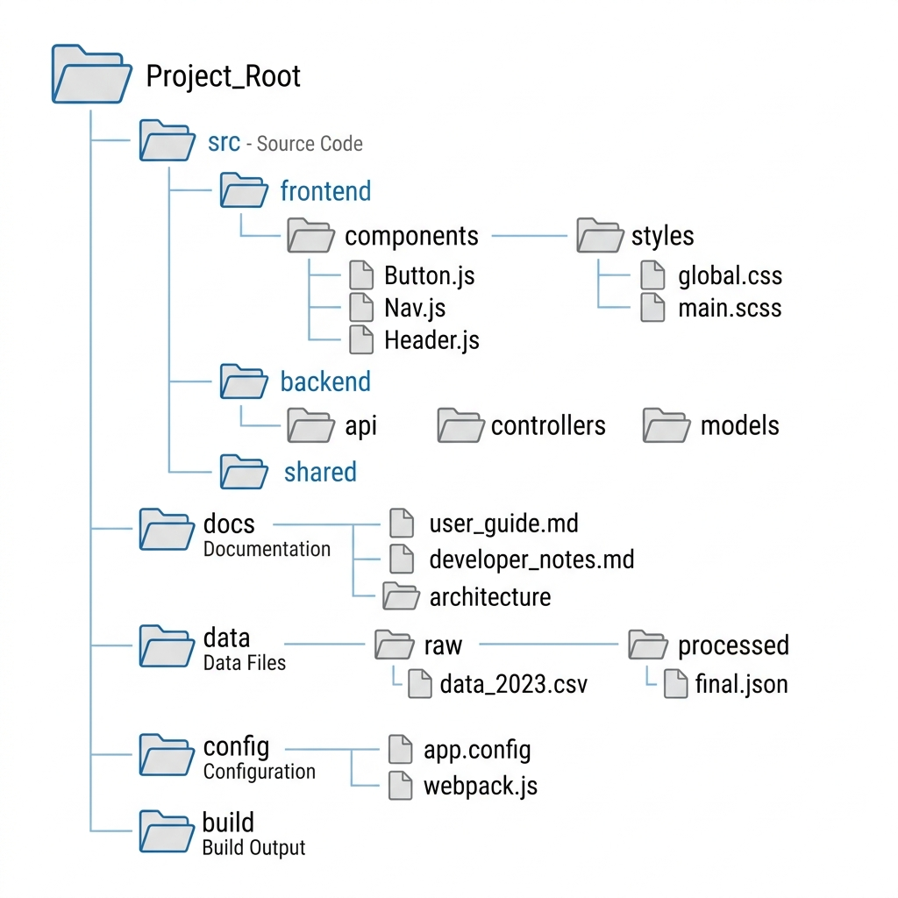

# Project Folder Structure

EduScribe AI is organized into distinct, decoupled directories to ensure maintainability and separation of concerns.

## Root Directory


*Figure 6. High-level Folder Directory Structure.*

```text
EduScribe-AI/
├── backend/                # FastAPI Application
├── frontend/               # React/Vite Application
├── docs/                   # Markdown Documentation
├── storage/                # Persistent Local Storage
│   ├── uploads/            # Raw .mp4 video files
│   ├── transcripts/        # JSON Whisper transcripts
│   ├── frames/             # Extracted OpenCV .jpg frames
│   └── images/             # (Upcoming) AI Generated educational images
├── docker-compose.yml      # Infrastructure deployment
└── README.md               # Project overview
```

## Backend Structure

```text
backend/
├── api/
│   ├── routers/            # REST API Endpoint Definitions
│   └── dependencies.py     # Auth/DB Dependency Injection
├── core/
│   ├── config.py           # Environment Variables
│   ├── database.py         # SQLAlchemy Setup
│   └── security.py         # JWT Token Handling
├── models/                 # SQLAlchemy DB Schemas (video.py, frame.py)
├── schemas/                # Pydantic Models for Input Validation
├── services/               # Core Business Logic
│   ├── vision/             # OpenCV & PaddleOCR handlers
│   ├── audio.py            # FFmpeg integration
│   ├── whisper_service.py  # PyTorch AI model
│   ├── youtube.py          # yt-dlp downloading
│   └── image_gen.py        # (Upcoming) Simple Image Generator
├── tests/                  # Pytest Suite
├── Dockerfile              # Container definition
├── main.py                 # FastAPI Application Entrypoint
└── tasks.py                # Background Task Orchestrator
```

## Frontend Structure

```text
frontend/
├── src/
│   ├── assets/             # Static SVGs/Images
│   ├── components/         # Reusable React components (Sidebar, UploadModal)
│   ├── context/            # Global State (AuthContext)
│   ├── pages/              # View layer (Dashboard, ProjectWorkspace)
│   ├── App.jsx             # React Router Definition
│   └── index.css           # Global Theme & Glassmorphism Styles
├── package.json            # NPM Dependencies
└── vite.config.js          # Build Configuration
```
