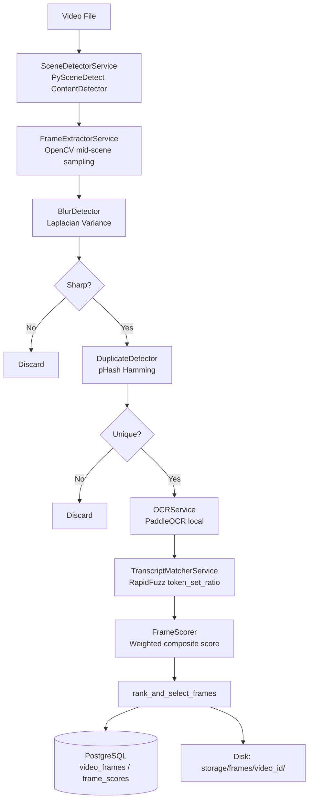
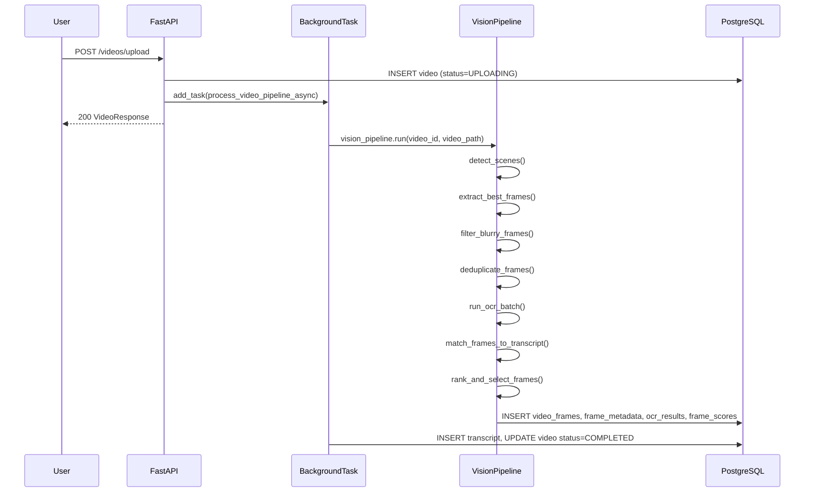

# Frame Extraction Architecture

## Table of Contents
1. [Introduction](#1-introduction)
2. [Problem Statement](#2-problem-statement)
3. [Existing Pipeline](#3-existing-pipeline)
4. [New Pipeline](#4-new-pipeline)
5. [Architecture Diagram](#5-architecture-diagram)
6. [Folder Structure](#6-folder-structure)
7. [Component Overview](#7-component-overview)
8. [Scene Detection](#8-scene-detection)
9. [Frame Extraction](#9-frame-extraction)
10. [Blur Detection](#10-blur-detection)
11. [Duplicate Removal](#11-duplicate-removal)
12. [OCR](#12-ocr)
13. [Transcript Matching](#13-transcript-matching)
14. [Frame Scoring](#14-frame-scoring)
15. [APIs](#15-apis)
16. [Database Schema](#16-database-schema)
17. [Configuration](#17-configuration)
18. [Error Handling](#18-error-handling)
19. [Logging](#19-logging)
20. [Testing Strategy](#20-testing-strategy)
21. [Performance Optimizations](#21-performance-optimizations)
22. [Security Considerations](#22-security-considerations)
23. [Deployment Notes](#23-deployment-notes)
24. [Future Improvements](#24-future-improvements)
25. [Troubleshooting](#25-troubleshooting)
26. [References](#26-references)

---

## 1. Introduction

The **Intelligent Frame Extraction Pipeline** is a production-ready module built into EduScribe AI that enhances AI-generated educational notes by automatically selecting the most informative visual frames from lecture videos. These frames — containing slide content, diagrams, code blocks, and equations — provide visual grounding for LLM-generated notes.

All processing runs **locally** using open-source libraries. No cloud OCR or paid API is used.

---

## 2. Problem Statement

The existing EduScribe pipeline converts audio to text via Whisper. However, educational lectures contain critical visual content — slide titles, bullet points, code examples, diagrams, and mathematical equations — that is **not captured in audio alone**.

LLM-generated notes without visual context miss:
- Code blocks visible on slides but not spoken aloud
- Mathematical notation
- Structured bullet hierarchies
- Diagram labels and chart data

---

## 3. Existing Pipeline

```
Video File / YouTube URL
        │
        ▼
  FFmpeg (audio extraction)
        │
        ▼
  Whisper (transcription)
        │
        ▼
    Transcript (JSON + TXT)
        │
        ▼
  LLM Notes Generation
```

**Limitation:** Zero visual context.

---

## 4. New Pipeline

```
Video File
    │
    ▼
Scene Detection (PySceneDetect)
    │   Detects slide transitions & scene changes
    ▼
Frame Extraction (OpenCV)
    │   Extracts sharpest frame from mid-scene window
    ▼
Blur Detection (Laplacian Variance)
    │   Discards frames below sharpness threshold
    ▼
Duplicate Removal (pHash)
    │   Removes visually identical frames
    ▼
OCR (PaddleOCR)
    │   Extracts text: titles, bullets, code, equations
    ▼
Transcript Matching (RapidFuzz)
    │   Scores visual-audio alignment via token_set_ratio
    ▼
Frame Scoring Engine
    │   Composite 0–1 importance score
    ▼
Best Frame Selection
    │   Marks top-N frames per video as selected
    ▼
Database Persistence
    │   video_frames / frame_metadata / ocr_results / frame_scores
    ▼
LLM Notes (with visual context)
```

---

## 5. Architecture Diagram



### Sequence Diagram – Upload Trigger



---

## 6. Folder Structure

```
backend/
├── services/
│   └── vision/
│       ├── __init__.py              # Package exports
│       ├── scene_detector.py        # PySceneDetect integration
│       ├── frame_extractor.py       # OpenCV frame extraction
│       ├── blur_detector.py         # Laplacian variance filtering
│       ├── duplicate_detector.py    # pHash deduplication
│       ├── ocr_service.py           # PaddleOCR integration
│       ├── transcript_matcher.py    # RapidFuzz matching
│       ├── frame_scorer.py          # Composite scoring engine
│       └── pipeline.py              # Orchestrator
├── api/
│   └── routers/
│       └── frames.py                # REST API endpoints
├── schemas/
│   └── vision.py                    # Pydantic response models
├── models/
│   └── vision.py                    # SQLAlchemy ORM tables
├── migrations/
│   └── versions/
│       └── 4f17a290ae78_add_vision_models.py
└── tests/
    └── vision/
        ├── test_blur_detector.py
        ├── test_duplicate_detector.py
        ├── test_frame_scorer.py
        └── test_transcript_matcher.py
```

Storage layout:
```
storage/
└── frames/
    └── {video_id}/
        ├── scene_0001_5420.jpg
        ├── scene_0002_18900.jpg
        └── ...
```

---

## 7. Component Overview

| Component | File | Responsibility |
|-----------|------|----------------|
| Scene Detector | `scene_detector.py` | Splits video into semantic scenes |
| Frame Extractor | `frame_extractor.py` | Extracts sharpest mid-scene frame |
| Blur Detector | `blur_detector.py` | Filters out blurry/unusable frames |
| Duplicate Detector | `duplicate_detector.py` | Removes near-identical frames |
| OCR Service | `ocr_service.py` | Extracts slide text locally |
| Transcript Matcher | `transcript_matcher.py` | Links frames to spoken content |
| Frame Scorer | `frame_scorer.py` | Computes composite importance |
| Pipeline | `pipeline.py` | Orchestrates all steps, persists DB |
| API Router | `routers/frames.py` | REST interface |

---

## 8. Scene Detection

**Library:** PySceneDetect  
**Detector:** `ContentDetector`

### How It Works

`ContentDetector` computes a delta score between adjacent frames by comparing HSV channel histograms. When the score exceeds `SCENE_DETECT_THRESHOLD`, a scene boundary is recorded.

**Why ContentDetector?**
- Designed for real-world video (not just cuts)
- Handles fade transitions common in lecture recordings
- Fast: processes downscaled frames

**Threshold Selection:**

| Threshold | Use Case |
|-----------|----------|
| `15–20` | Very sensitive – catches minor camera moves |
| `27.0` | ✅ Recommended – balances slide transitions and noise |
| `35–50` | Lenient – misses subtle slide changes |

**Fallback:** If no scenes are detected, the entire video is treated as a single scene using OpenCV to probe the duration.

---

## 9. Frame Extraction

**Library:** OpenCV  
**Strategy:** Mid-scene sharpest frame

### Algorithm

For each scene `[start_ms, end_ms]`:
1. Compute the **middle third** window: `[start + duration/3, end - duration/3]`
2. Sample up to **5 evenly spaced positions** within this window
3. For each position, read the frame and compute Laplacian variance
4. Write the frame with highest variance to disk as JPEG (quality=92)

This avoids:
- Transition blur (at scene start/end)
- Animation frames (first few frames of a slide)

**Naming Convention:** `scene_{scene_number:04d}_{timestamp_ms}.jpg`

---

## 10. Blur Detection

**Algorithm:** Variance of Laplacian

```python
gray = cv2.cvtColor(frame, cv2.COLOR_BGR2GRAY)
score = float(cv2.Laplacian(gray, cv2.CV_64F).var())
```

The Laplacian operator is a second-order derivative that highlights edges. Sharp images have high edge contrast → high variance. Blurry images have smoothed edges → low variance.

| Score Range | Classification |
|-------------|----------------|
| `< 50` | Very blurry |
| `50–100` | Blurry (discarded at default threshold) |
| `100–300` | Acceptable |
| `> 300` | Sharp |

**Default Threshold:** `BLUR_THRESHOLD = 100.0`

---

## 11. Duplicate Removal

**Library:** ImageHash (pHash)  
**Algorithm:** Perceptual Hash + Hamming Distance

### pHash Process

1. Resize image to 32×32
2. Apply Discrete Cosine Transform (DCT)
3. Keep the top-left 8×8 DCT coefficients (low frequencies)
4. Compute mean; set bits above mean to 1, below to 0
5. Result: 64-bit hash

Two frames are duplicates if their Hamming distance `< PHASH_THRESHOLD`.

**Default Threshold:** `PHASH_THRESHOLD = 5`  
(Out of 64 bits; ~8% difference tolerance)

| Distance | Meaning |
|----------|---------|
| 0 | Identical |
| 1–4 | Near-identical (same slide, minor compression artifact) |
| 5–10 | Similar content |
| > 15 | Different |

---

## 12. OCR

**Library:** PaddleOCR (local, CPU mode)

### Configuration

```python
PaddleOCR(
    use_angle_cls=True,   # Handles rotated text
    lang="en",
    show_log=False,
    use_gpu=False,
)
```

### Text Cleaning Pipeline

1. Filter blocks with `confidence < OCR_MIN_CONFIDENCE` (default: 0.70)
2. Deduplicate lines (preserve order)
3. Remove single-character noise lines
4. Normalise Unicode (smart quotes → straight quotes)
5. Collapse multiple spaces

### Thread Safety

PaddleOCR's inference is not thread-safe. An `asyncio.Lock()` prevents concurrent calls. The service is lazy-loaded to avoid slow startup.

---

## 13. Transcript Matching

**Library:** RapidFuzz  
**Method:** `fuzz.token_set_ratio`

### Algorithm

For each frame:
1. Find the transcript segment whose time window contains `timestamp_ms`
2. If no exact match, find the segment with nearest midpoint (fallback)
3. Compute `token_set_ratio(ocr_text, segment_text)`
4. Normalise to `[0, 1]`

### Why `token_set_ratio`?

Unlike `ratio` or `partial_ratio`, `token_set_ratio` first tokenises both strings, then computes the ratio of sorted intersection vs sorted remainder. This handles:
- Word order differences (OCR reads top-to-bottom, transcript is spoken order)
- Subset relationships (slide heading matching part of a sentence)
- Case insensitivity (applied manually before calling)

**Example:**
- OCR: `"Binary Search O(log n) Array"`
- Transcript: `"Binary search runs in O of log n time on a sorted array"`
- Score: ~85

---

## 14. Frame Scoring

### Weighted Formula

```
score = 0.30 × transcript_similarity
      + 0.30 × ocr_richness
      + 0.20 × educational_heuristic
      + 0.10 × sharpness
      + 0.10 × scene_duration
```

### Factor Descriptions

| Factor | Weight | Description |
|--------|--------|-------------|
| `transcript_similarity` | 30% | RapidFuzz token_set_ratio to nearest segment |
| `ocr_richness` | 30% | Normalised OCR character count (max 800 chars) |
| `educational_heuristic` | 20% | Code, equations, or bullet points detected |
| `sharpness` | 10% | Laplacian variance normalised to 1000 cap |
| `scene_duration` | 10% | Normalised against 60 s max |

### Educational Heuristic Patterns

| Pattern | Bonus |
|---------|-------|
| Code keywords (`def`, `class`, `import`, `{`, `}`) | +0.4 |
| Math symbols (`=`, `∑`, `∫`, `≤`, `√`) | +0.3 |
| Bullet markers (`•`, `-`, `*`, numbered lists) | +0.3 |

---

## 15. APIs

### `POST /videos/{video_id}/extract-frames`

**Trigger frame extraction pipeline.**

| Property | Value |
|----------|-------|
| Auth | Bearer JWT required |
| Response | `202 Accepted` |
| Body | None |

**Response:**
```json
{
  "video_id": "uuid",
  "scenes": 0,
  "frames_extracted": 0,
  "frames_selected": 0,
  "message": "Frame extraction pipeline started..."
}
```

**Errors:**
- `400` – Video not in COMPLETED state
- `400` – Video has no local file path (YouTube-only)
- `404` – Video not found

---

### `GET /videos/{video_id}/frames`

**List frames for a video.**

| Query Param | Type | Default | Description |
|-------------|------|---------|-------------|
| `selected_only` | bool | false | Return only top-selected frames |

**Response:** Array of `VideoFrameResponse`

---

### `GET /frames/{frame_id}`

**Full metadata for one frame.** Returns `VideoFrameResponse` including OCR text, blur score, pHash, transcript similarity, and visual importance score.

---

### `DELETE /videos/{video_id}/frames`

**Delete all frames** for a video (DB records + disk files).

```json
{
  "video_id": "uuid",
  "frames_deleted": 12,
  "message": "Deleted 12 frame(s) and associated metadata."
}
```

---

## 16. Database Schema

```sql
-- video_frames: one row per extracted frame
CREATE TABLE video_frames (
    id            UUID PRIMARY KEY,
    video_id      UUID NOT NULL REFERENCES videos(id) ON DELETE CASCADE,
    timestamp_ms  INTEGER NOT NULL,      -- Frame position in video
    frame_path    VARCHAR NOT NULL,      -- Absolute disk path
    scene_number  INTEGER NOT NULL,      -- Scene index (1-based)
    created_at    TIMESTAMP
);

-- frame_metadata: quality metadata per frame
CREATE TABLE frame_metadata (
    id          UUID PRIMARY KEY,
    frame_id    UUID NOT NULL REFERENCES video_frames(id) ON DELETE CASCADE,
    blur_score  FLOAT,     -- Laplacian variance
    phash       VARCHAR,   -- Hex pHash string
    duration_ms INTEGER    -- Scene duration in ms
);

-- ocr_results: extracted text per frame
CREATE TABLE ocr_results (
    id                  UUID PRIMARY KEY,
    frame_id            UUID NOT NULL REFERENCES video_frames(id) ON DELETE CASCADE,
    raw_text            TEXT,   -- All OCR lines joined
    clean_text          TEXT,   -- Deduplicated, cleaned text
    average_confidence  FLOAT   -- Mean OCR confidence score
);

-- frame_scores: scoring and selection results
CREATE TABLE frame_scores (
    id                      UUID PRIMARY KEY,
    frame_id                UUID NOT NULL REFERENCES video_frames(id) ON DELETE CASCADE,
    transcript_similarity   FLOAT,
    visual_importance_score FLOAT,
    is_selected             BOOLEAN DEFAULT FALSE
);
```

---

## 17. Configuration

All settings are in `core/config.py` and overridable via `.env`:

```env
# Vision Pipeline
SCENE_DETECT_THRESHOLD=27.0     # PySceneDetect content delta threshold
SCENE_MIN_LEN_FRAMES=15         # Minimum scene length in frames
BLUR_THRESHOLD=100.0            # Laplacian variance cutoff
PHASH_THRESHOLD=5               # Max Hamming distance for duplicate detection
OCR_MIN_CONFIDENCE=0.70         # PaddleOCR confidence filter
TRANSCRIPT_MATCH_MIN_SCORE=10.0 # Minimum similarity to log a match

# Storage
FRAMES_DIR=../storage/frames    # Root directory for extracted frames
```

---

## 18. Error Handling

| Error | Location | Handling |
|-------|----------|---------|
| Video file not found | All services | `FileNotFoundError` → logged, pipeline aborted |
| Scene detection failure | `SceneDetectorService` | `SceneDetectionError` → caught in pipeline, re-raised as `VisionPipelineError` |
| No scenes detected | Pipeline | Logged as warning, returns empty result (not an error) |
| Frame read failure | `FrameExtractorService` | `None` returned per scene, warnings logged |
| Disk write failure | Frame extractor | Logged as error, frame skipped |
| OCR model not installed | `OCRService` | `OCRServiceError` with install instructions |
| OCR per-frame failure | Pipeline `_run_ocr_batch` | Frame gets empty OCR, pipeline continues |
| Missing transcript | `TranscriptMatcherService` | Warning logged, similarity = 0.0 |
| Invalid JSON transcript | Transcript matcher | Error logged, all frames get 0.0 similarity |
| DB connection failure | `VisionPipeline._persist` | Exception propagates to pipeline, video status set to FAILED |
| Disk full | Any file write | OSError caught, logged as critical |

### Frame Extraction is Non-Fatal

The vision pipeline is invoked inside a `try/except` in `tasks.py`. If it fails, the video transcription still completes. This prevents a vision library bug from breaking the core product.

---

## 19. Logging

All modules use Python's standard `logging` module. The root logger is configured in `main.py`:

```
2026-07-28 20:30:01 [INFO]  services.vision.pipeline: VisionPipeline.run() started for video abc-123
2026-07-28 20:30:03 [INFO]  services.vision.scene_detector: Detected 14 scenes in /storage/uploads/abc-123.mp4
2026-07-28 20:30:04 [INFO]  services.vision.frame_extractor: Extracted 14 frames for video abc-123
2026-07-28 20:30:04 [INFO]  services.vision.blur_detector: Blur filter: 12 sharp, 2 blurry (threshold=100.0)
2026-07-28 20:30:04 [INFO]  services.vision.duplicate_detector: Dedup: 10 unique, 2 duplicates removed
2026-07-28 20:30:15 [INFO]  services.vision.pipeline: Persisted 10 frames for video abc-123
2026-07-28 20:30:15 [INFO]  services.vision.pipeline: VisionPipeline complete for video abc-123: 14 scenes, 14 extracted, 1 selected
```

---

## 20. Testing Strategy

### Unit Tests

| File | Coverage |
|------|----------|
| `test_blur_detector.py` | Laplacian variance, is_blurry, batch filter, missing files |
| `test_duplicate_detector.py` | pHash computation, hamming distance, deduplication logic |
| `test_frame_scorer.py` | Score computation, heuristics, selection, edge cases |
| `test_transcript_matcher.py` | Segment matching, similarity scoring, missing transcript |

Run:
```bash
cd backend
source venv/bin/activate
python -m pytest tests/vision/ -v
```

### Integration Tests

Test the full pipeline with a real video file:
```bash
python -c "
import asyncio
from services.vision.pipeline import vision_pipeline
result = asyncio.run(vision_pipeline.run('test-uuid', '/path/to/video.mp4'))
print(result)
"
```

### Edge Cases Tested

- Uniform/blurry video (all frames blurry → graceful degradation)
- Single-scene video (no cuts detected)
- Empty OCR results (no text on slides)
- Missing transcript (zero similarity, pipeline continues)
- Duplicate slides (pHash deduplication)

---

## 21. Performance Optimizations

| Optimization | Details |
|--------------|---------|
| **Downscaled scene detection** | `video_manager.set_downscale_factor()` reduces resolution before analysis |
| **Mid-scene sampling** | Only 5 frames sampled per scene; no full-video decode |
| **Lazy OCR load** | PaddleOCR model loaded only on first call |
| **Asyncio.to_thread** | All blocking operations offloaded from event loop |
| **JPEG quality 92** | Balances file size and OCR accuracy |
| **Idempotent persist** | Old frames deleted before re-insert; safe to re-trigger |

---

## 22. Security Considerations

- **No external API calls.** All processing is local.
- **Ownership verification.** Every API endpoint verifies the JWT user owns the requested video via `Video.user_id`.
- **Path traversal prevention.** Frame paths are constructed by joining `FRAMES_DIR` + `video_id` + filename; the `video_id` is always a validated UUID.
- **UUID validation.** All `video_id` and `frame_id` parameters are validated with `uuid.UUID(...)` before use; `422` is returned on malformed input.
- **Disk write limits.** Frame storage uses configurable `FRAMES_DIR` which should be on a volume-limited mount in production.

---

## 23. Deployment Notes

1. **`storage/frames/`** must be writable by the backend process.
2. PaddleOCR downloads model weights on first run (~500 MB). Pre-warm in Docker `CMD` or startup event.
3. The migration `4f17a290ae78_add_vision_models.py` must be applied: `alembic upgrade head`
4. Add `FRAMES_DIR` to `.env` to override the default path.
5. The existing `docker-compose.yml` mounts the `storage/` directory – frames are automatically persisted.

---

## 24. Future Improvements

| Feature | Description | Effort |
|---------|-------------|--------|
| **GPU OCR** | `use_gpu=True` in PaddleOCR for 5–10× speedup | Low |
| **SentenceTransformers** | Replace RapidFuzz with semantic embeddings for better matching | Medium |
| **Slide classifier** | CNN to classify slide vs. face-cam vs. whiteboard | High |
| **Whiteboard detector** | Detect hand-drawn diagrams | High |
| **Formula detector** | MathPix-style local LaTeX extraction | High |
| **Celery workers** | Offload vision pipeline from FastAPI process | Medium |
| **Per-chunk selection** | Select top frame per transcript chunk (not per video) | Low |
| **Vision-language model** | LLaVA for rich image captioning | High |

---

## 25. Troubleshooting

**Problem:** `PaddleOCR is not installed` error  
**Fix:** `pip install paddlepaddle paddleocr`

**Problem:** Scene detection finds 0 scenes  
**Fix:** Lower `SCENE_DETECT_THRESHOLD` (try 15.0) or check video codec compatibility

**Problem:** All frames are blurry  
**Fix:** Lower `BLUR_THRESHOLD` (try 50.0) – common with webcam footage

**Problem:** Duplicate frames not removed  
**Fix:** Increase `PHASH_THRESHOLD` (try 8–10) for compression-heavy streams

**Problem:** OCR extracts no text  
**Fix:** Verify PaddleOCR model weights downloaded; check `storage/frames/` for saved JPEGs

**Problem:** Migration fails  
**Fix:** Ensure `DATABASE_URL` is correctly set in `.env`; run `alembic upgrade head`

---

## 26. References

- [PySceneDetect Documentation](https://scenedetect.com/en/stable/)
- [OpenCV Laplacian](https://docs.opencv.org/4.x/d5/db5/tutorial_laplace_operator.html)
- [ImageHash pHash](https://github.com/JohannesBuchner/imagehash)
- [PaddleOCR GitHub](https://github.com/PaddlePaddle/PaddleOCR)
- [RapidFuzz Documentation](https://rapidfuzz.github.io/RapidFuzz/)
- [EduScribe Phase 1 Spec](./phase_1.md)
