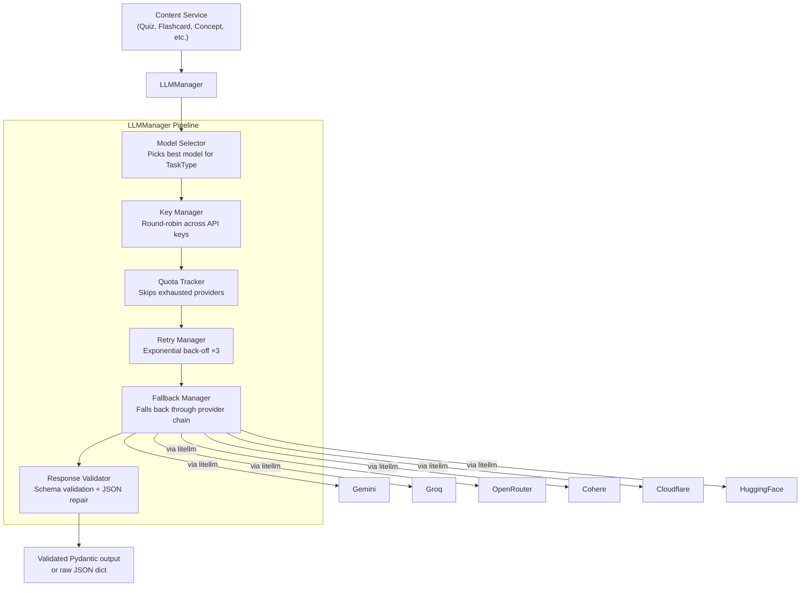

# LLM & Content Generation

EduScribe AI uses a multi-provider LLM system to generate structured educational content from video transcripts. The system is designed for resilience — no single API key or provider is a point of failure.

---

## Architecture Overview



---

## LLM Provider System

### Supported Providers

| Provider | Key Format | API Docs |
|---|---|---|
| Gemini (Google AI Studio) | `GEMINI_API_KEYS=key1,key2,...` | [aistudio.google.com](https://aistudio.google.com) |
| Groq | `GROQ_API_KEYS=gsk_key1,gsk_key2,...` | [console.groq.com](https://console.groq.com) |
| OpenRouter | `OPENROUTER_API_KEYS=sk-or-v1-key1,...` | [openrouter.ai](https://openrouter.ai) |
| Cohere | `COHERE_API_KEYS=key1,key2,...` | [dashboard.cohere.com](https://dashboard.cohere.com) |
| Cloudflare AI | `CLOUDFLARE_ACCOUNT_ID_N` + `CLOUDFLARE_API_KEY_N` | [dash.cloudflare.com](https://dash.cloudflare.com) |
| HuggingFace | `HUGGINGFACE_API_KEYS=hf_key1,...` | [huggingface.co](https://huggingface.co/settings/tokens) |

All providers are used via **litellm**, which normalises the OpenAI-compatible interface across all of them.

Multiple keys per provider are supported with comma-separated values. `KeyManager` round-robins across them to spread load and bypass per-key rate limits.

---

### Model Selector (`services/llm/model_selector.py`)

Each content task maps to a `TaskType` enum. The model selector picks the appropriate primary model and fallback chain based on task requirements (speed vs. quality, context window size, structured output support).

| TaskType | Example Task | Notes |
|---|---|---|
| `QUIZ` | Quiz question generation | Needs structured JSON output |
| `FLASHCARD` | Flashcard pair generation | Fast model preferred |
| `CONCEPT` | Concept extraction | Needs high accuracy |
| `SUMMARY` | Topic/section summarisation | Long-context preferred |
| `MINDMAP` | Mind map JSON | Structured output |
| `FORMULA` | Formula sheet | Needs code/math capability |
| `INTERVIEW` | Interview Q&A | Open-ended generation |
| `REVISION` | Revision plan | Long output |
| `EMBED` | Embedding generation | Delegates to EmbeddingManager |

---

### Key Manager (`services/llm/key_manager.py`)

- Reads all `*_API_KEYS` env vars at startup
- Maintains a round-robin pointer per provider
- On 429 / quota error: marks the key as temporarily exhausted
- On provider-level quota exhaustion: removes provider from active pool

---

### Quota Tracker (`services/llm/quota_tracker.py`)

Tracks token usage per provider. When a provider's remaining quota falls below a threshold, `QuotaTracker.has_quota(provider)` returns `False` and the model selector skips it.

---

### Retry Manager (`services/llm/retry_manager.py`)

Exponential back-off with jitter. Default: 3 retry attempts.

```
Attempt 1: immediate
Attempt 2: 2s delay
Attempt 3: 4s delay
After 3 failures: raise ProviderTransientError → Fallback Manager
```

---

### Fallback Manager (`services/llm/fallback_manager.py`)

Maintains a prioritised fallback chain per task type. When the primary model fails after retries, the fallback manager selects the next provider in the chain and repeats the request.

---

### Response Validator (`services/llm/validation/`)

All LLM responses are validated before returning to the content service:

1. `RawResponseParser` — extracts text from provider response object
2. `JSONExtractor` — strips markdown code fences, repairs malformed JSON
3. `SchemaRegistry` — validates the extracted dict against the task-specific Pydantic schema

If validation fails after retries, returns `None` (content service logs the failure and the orchestrator continues).

---

### Embedding Manager (`services/llm/embedding_manager.py`)

Accessed via `LLMManager.embed(text)`. Used by the RAG pipeline for:
- Indexing transcript chunks at pipeline completion
- Querying the index on `GET /notes/{video_id}/search`

Uses **Jina AI** embedding model (`JINA_API_KEY` env var).

---

## Content Services (`services/content/`)

Each service generates one category of educational content. All extend `BaseContentService` which provides `execute_with_retry` (wraps the service call in retry + status tracking) and `_safe_dump` (safely serialises LLM output).

| Service | Output | File |
|---|---|---|
| `NotesService` | Topics + formatted notes | `notes.py` |
| `ConceptService` | Key concept list | `concept.py` |
| `QuizService` | Quiz questions with answers | `quiz.py` |
| `FlashcardService` | Flashcard pairs | `flashcard.py` |
| `MindmapService` | Mind map JSON | `mindmap.py` |
| `FormulaService` | LaTeX formula sheet | `formula.py` |
| `InterviewService` | Interview Q&A | `interview.py` |
| `RevisionService` | Revision schedule + plan | `revision.py` |

---

### ContentPipeline (`services/content/pipeline.py`)

Orchestrates the content services using a dependency graph:

```
Level 1 (concurrent):
  NotesService    — no dependencies
  ConceptService  — no dependencies

Level 2 (concurrent, after Level 1):
  QuizService         — depends on Notes + Concepts
  FlashcardService    — depends on Concepts
  MindmapService      — depends on Concepts
```

The orchestrator (`pipeline/orchestrator.py`) calls `FormulaService`, `InterviewService`, and `RevisionService` directly — they are not part of `ContentPipeline` to avoid double-invocation.

---

### LectureState + LectureContext

`LectureState` (in `schemas/content.py`) is a dataclass holding all generated content:

```python
@dataclass
class LectureState:
    topics: List[Topic]
    concepts: List[Concept]
    definitions: List[Definition]
    summaries: List[Summary]
    quiz: List[Any]
    flashcards: List[Any]
    mindmap: Dict[str, Any]
    interview: List[Any]
    revision: Dict[str, Any]
    formula: Dict[str, Any]
    status: Dict[str, ServiceStatus]
    errors: Dict[str, str]
    metadata: Dict[str, GenerationMetadata]
```

`LectureContext` wraps `LectureState` and exposes proxy properties for all fields. All content services accept a `LectureContext` and write results back into it.

---

## RAG Pipeline (`services/rag/`)

| Module | Responsibility |
|---|---|
| `pipeline.py` | Top-level `vector_store.index()` and `vector_store.search()` |
| `chunker.py` | Splits transcript into chunks (4 strategies: `token`, `semantic`, `timestamp`, `topic`) |
| `structure_detector.py` | Classifies chunks (equation, code, definition, narrative, etc.) |
| `context_optimizer.py` | Re-ranks and trims retrieved chunks to fit model context window |
| `embedding_store.py` | Stores/loads embedding vectors to/from `storage/embeddings/{video_id}/` |
| `retriever.py` | Hybrid retrieval: BM25 (`HYBRID_BM25_ALPHA=0.5`) + dense embeddings, MMR re-rank (`MMR_LAMBDA=0.7`) |

### Search Request Flow

```
GET /notes/{video_id}/search?query=gradient+descent
    ↓
notes router validates ownership (get_owned_video dependency)
    ↓
vector_store.search(video_id, query, top_k=TOP_K_RESULTS)
    ↓
retriever: BM25 + embedding retrieval → MMR re-rank → top N results
    ↓
[{"chunk_text": "...", "timestamp": 142.3, "score": 0.87}, ...]
```

---

## Prompt Templates (`backend/prompts/`)

Each content service uses a Jinja2 template managed by `PromptManager` (`services/content/prompts.py`). Templates are stored as `.md` files in `backend/prompts/`:

- `concept_extraction.md`
- `flashcards.md`
- `formula_sheet.md`
- (one per service type)

`PromptManager.render(template_name, **kwargs)` renders the template with the transcript and context as variables.
