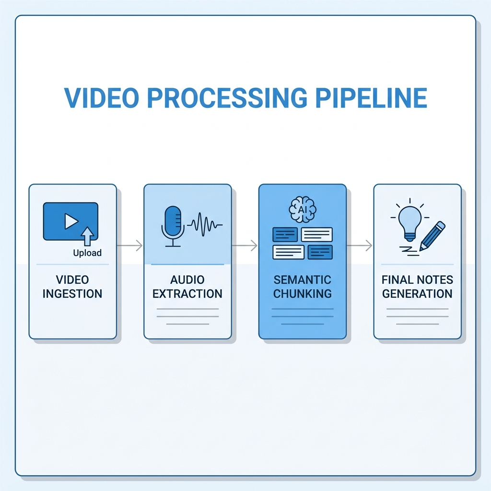
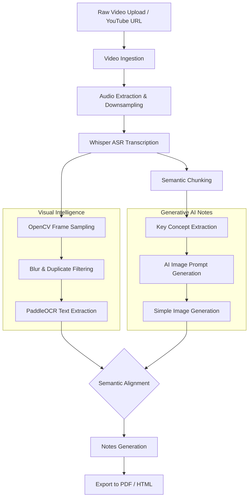

# Processing Pipeline

The Processing Pipeline is the central nervous system of EduScribe AI. When a video is ingested, it flows sequentially through multiple micro-pipelines to extract audio, visual data, and ultimately generate comprehensive educational notes.

## 🔄 End-to-End Workflow

*Figure 2. End-to-End Video Processing Pipeline.*

## Pipeline Stages

### 1. Ingestion & Audio Prep
Whether the source is a direct file upload or a YouTube link (via `yt-dlp`), the first step is separating the audio track. `FFmpeg` is utilized to extract and downsample the audio to a standard `16kHz Mono WAV` format, which is required for optimal AI ingestion.

### 2. Transcription
The audio is fed into the local **Whisper** model, which outputs a highly accurate transcript mapped with exact timestamps.

### 3. Visual & Generative Parallel Processing
Once transcription completes, the pipeline forks:
- **Visual Branch**: The video file is sampled by OpenCV. Blurry frames are discarded, duplicates are grouped via perceptual hashing (pHash), and PaddleOCR extracts text from the highest-quality keyframes.
- **Generative Branch (Upcoming)**: The transcript undergoes *Semantic Chunking*. Key concepts are identified, which trigger the generation of simple, educational textbook-style illustrations (e.g., flowcharts, block diagrams).

### 4. Alignment & Export
The final step merges the OCR data, the audio transcript, and the AI-generated educational images. The system semantically aligns them by timestamps and concepts, culminating in a comprehensive, formatted set of notes exported as PDF or HTML.
