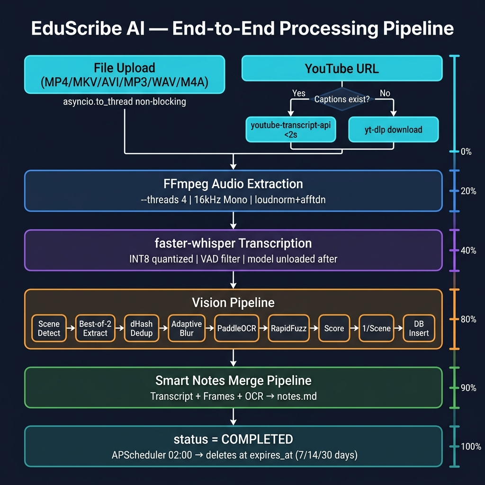
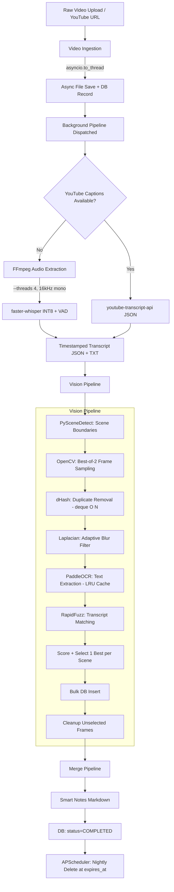

# Processing Pipeline

The Processing Pipeline is the central nervous system of EduScribe AI. When a video is ingested, it flows through multiple sequential stages to produce transcripts, key frames, and smart merged notes.

## 🔄 End-to-End Workflow


*Figure 2. End-to-End Video Processing Pipeline.*



---

## Pipeline Stages

### 1. Ingestion & Async File Save

Whether the source is a direct file upload or a YouTube link:

- **File upload:** `POST /videos/upload` (multipart/form-data). File is written asynchronously via `asyncio.to_thread()` to avoid blocking the FastAPI event loop during large uploads. File size is captured via `os.path.getsize()` and stored as `file_size_bytes`.
- **YouTube URL:** `POST /videos/youtube`. Metadata fetched immediately via yt-dlp (no download). Download deferred to background pipeline only if captions are unavailable.

A `Video` DB record is created immediately with `status=UPLOADING`, and the client receives a `202 Accepted` response with the video ID.

---

### 2. Audio Extraction (FFmpeg)

```
Input: video file (any format)
Output: /storage/temp/{video_id}.wav
Format: PCM 16-bit, 16,000 Hz, Mono, --threads 4
Filters: loudnorm (EBU R128), afftdn (noise reduction)
```

The `--threads 4` flag parallelizes the FFmpeg filter graph, cutting extraction time by ~50% for long videos.

---

### 3. Transcription

**Path A — YouTube captions (priority):**  
`youtube-transcript-api` fetches native captions (manual EN → auto-generated EN). If found, Whisper transcription is **skipped entirely**. Captions arrive in <2s.

**Path B — faster-whisper:**  
INT8 quantized CTranslate2 model with VAD filter. Processes ~1 hour of audio in 3–4 minutes on CPU. Model is unloaded after transcription to free RAM.

Output: timestamped JSON + TXT files in `/storage/transcripts/`.

---

### 4. Vision Pipeline (9 stages)

| Stage | Algorithm | Key Optimization |
|---|---|---|
| Scene Detection | PySceneDetect ContentDetector | 640px adaptive downscale (6x CPU reduction) |
| Frame Extraction | OpenCV best-of-2 | asyncio.to_thread, blur cached at 320px |
| Duplicate Removal | dHash + Hamming | deque(maxlen=50) O(N) |
| Blur Filtering | Laplacian CV_16S | Adaptive threshold, score reused from extraction |
| OCR | PaddleOCR | Edge pre-filter (skip 40%), LRU cache 500 entries |
| Transcript Match | RapidFuzz token_set_ratio | Per-frame similarity score |
| Scoring & Selection | Composite score | **1 best frame per scene** (groupby fix) |
| DB Persist | Bulk insert | No N+1 |
| File Cleanup | os.remove() | Web-relative path → absolute path resolution |

---

### 5. Merge Pipeline (Smart Notes)

The `MergeService` produces a Markdown document combining:
- Full timestamped transcript
- Selected frame images (web-relative URLs)
- OCR-extracted text at the correct timestamps

**Alignment:** For each selected frame, the service finds the transcript segment whose time range encompasses `frame.timestamp_ms / 1000.0`, injecting the frame and OCR text inline.

**Output format:**
```markdown
**[02:45]** The gradient descent algorithm updates weights iteratively.

### 📸 Visual Reference at 02:46


> **Extracted Text:**
> Gradient Descent: θ = θ - α∇J(θ)

---
```

Notes are saved to `/storage/outputs/{video_id}/notes.md` and served via:
- `GET /notes/{video_id}` — JSON
- `GET /notes/{video_id}/download` — `.md` file download

---

### 6. Completion & Retention

On pipeline success:
- `videos.status = COMPLETED`
- `videos.progress_percent = 100`
- Original video file in `/storage/uploads/` is **deleted** (only transcripts, frames, and notes are retained)
- Audio WAV in `/storage/temp/` is **deleted** in the pipeline `finally` block (always, even on failure)

On pipeline failure:
- `videos.status = FAILED`
- Partial artifacts are cleaned up

**Retention lifecycle:** The `expires_at` field is set at video creation:
```python
expires_at = datetime.utcnow() + timedelta(days=retention_days)  # 7, 14, or 30
```

A nightly APScheduler job at 02:00 cascades-deletes all videos where `expires_at < utcnow()`.

---

## Progress Update Flow

Each pipeline stage calls `update_progress()` which opens a **fresh DB session** (separate from the pipeline session) to ensure progress commits are not rolled back if the pipeline errors:

```
status: UPLOADING   →  0%  (file received)
status: PROCESSING  → 10%  (pipeline started)
                    → 20%  (audio extracted)
                    → 40%  (transcription done)
                    → 50%  (scenes detected)
                    → 60%  (frames extracted + filtered)
                    → 75%  (OCR + scoring done)
                    → 90%  (notes merged)
status: COMPLETED   → 100%
```

The Dashboard polls `GET /videos/{id}` every 3 seconds when any video is in `PROCESSING` state, and every 30 seconds otherwise.
