# Processing Pipeline

When a video is submitted, it flows through a multi-stage pipeline orchestrated by `pipeline/orchestrator.py` and executed inside an ARQ worker process.

---

## End-to-End Flow

```mermaid
graph TD
    A["POST /videos/upload OR /videos/youtube"] --> B["API: Create Video DB record (status=UPLOADING)"]
    B --> C["enqueue_video_job → Redis"]
    C --> D["ARQ Worker dequeues job"]

    D --> E{"Source type?"}
    E -->|YouTube| F["yt-dlp: Download video+audio MP4"]
    E -->|Upload| G["File already on disk"]

    F & G --> H["FFmpeg: Extract 16kHz mono WAV"]

    H --> I{"YouTube captions available?"}
    I -->|Yes| J["youtube-transcript-api: Fetch JSON captions"]
    I -->|No| K["faster-whisper INT8: Transcribe WAV"]

    J & K --> L["Save timestamped JSON + TXT transcript"]

    L --> M["Vision Pipeline"]

    subgraph "Vision Pipeline (9 Stages)"
        M1["PySceneDetect: Scene boundaries"]
        M2["OpenCV: Best-of-2 frame extraction"]
        M3["dHash: Duplicate frame removal"]
        M4["Laplacian: Adaptive blur filter"]
        M5["Edge density: Pre-filter for OCR"]
        M6["PaddleOCR: Text extraction"]
        M7["RapidFuzz: Frame ↔ transcript match"]
        M8["Composite score + per-scene selection"]
        M9["Bulk DB insert + unselected frame cleanup"]
        M1 --> M2 --> M3 --> M4 --> M5 --> M6 --> M7 --> M8 --> M9
    end

    M --> M1
    M9 --> N["LLM Content Pipeline"]

    subgraph "LLM Content Pipeline (parallel phases)"
        N1["Phase 1: Topics + Notes"]
        N2["Phase 2: Concepts, Objectives, Prerequisites (parallel)"]
        N3["Phase 3: Definitions, Examples, Misconceptions (parallel)"]
        N4["Phase 4: Quiz, Flashcards, Mind Map (parallel)"]
        N5["Phase 5: Formula Sheet, Interview Prep, Revision Plan (parallel)"]
        N6["Phase 6: QA Fact Check + Quality Eval"]
        N1 --> N2 --> N3 --> N4 --> N5 --> N6
    end

    N --> N1
    N6 --> O["Merge Service → merged_transcript.md"]
    O --> P["RAG: Chunk + Embed + Index"]
    P --> Q["DB: status=COMPLETED, progress=100%"]
    Q --> R["APScheduler: Nightly delete at expires_at"]
```



---

## Stage Details

### Stage 1 — Content Ingestion

| Path | Mechanism |
|---|---|
| YouTube URL | yt-dlp downloads `bestvideo+bestaudio/mp4` (audio+video stream so OpenCV can open the file) |
| File upload | File already written to `storage/uploads/` by the API upload endpoint |

The API creates the `Video` DB record immediately with `status=UPLOADING` and returns `202 Accepted` with the `video_id`. The heavy work begins only after the ARQ worker picks up the job.

---

### Stage 2 — Audio Extraction (FFmpeg)

```
Input:   storage/uploads/{video_id}.mp4 (any format)
Output:  storage/temp/{video_id}.wav
Format:  PCM 16-bit, 16,000 Hz, Mono
Filters: loudnorm (EBU R128), afftdn (noise reduction)
Flags:   --threads 4  (~50% faster filter graph)
```

---

### Stage 3 — Transcription

**Path A — YouTube native captions (preferred):**
`youtube-transcript-api` fetches captions (manual EN preferred, auto-generated EN fallback). If found, Whisper is **skipped entirely** — saves 3–4 minutes per video.

**Path B — faster-whisper:**
```python
WhisperModel("base", device="cpu", compute_type="int8")
model.transcribe(wav_path, vad_filter=True, beam_size=5)
```
- INT8 quantization: 4–8× faster than openai-whisper on CPU
- VAD filter: skips silence (~20% additional speed gain)
- Model is unloaded after transcription to free ~75 MB for OCR

Output: `storage/transcripts/{video_id}.json` (timestamped segments) and `.txt`.

---

### Stage 4 — Vision Pipeline (9 Sub-Stages)

| Stage | Algorithm | Key Detail |
|---|---|---|
| Scene detection | PySceneDetect `ContentDetector` | `threshold=27.0`, 640px adaptive downscale (6× CPU reduction) |
| Frame extraction | OpenCV best-of-2 | Mid-point + 66%, keep sharper; blur computed at 320px |
| Duplicate removal | dHash Hamming distance | `deque(maxlen=50)` → O(N), not O(N²) |
| Blur filter | Laplacian variance (`CV_16S`) | Adaptive threshold: `max(global_min, median_score × 0.5)` |
| OCR pre-filter | Edge density check | Skips ~40% of frames with no detectable text |
| OCR | PaddleOCR | Async lock, LRU cache 500 entries, resize to ≤1280px |
| Transcript match | RapidFuzz `token_set_ratio` | Links each frame to the active transcript segment |
| Scoring + selection | Composite score | 1 best frame per scene; `blur + similarity + OCR count + confidence` |
| DB persist + cleanup | Bulk insert | Unselected frame files deleted from disk |

---

### Stage 5 — LLM Content Generation

The `ContentPipeline` runs domain services concurrently using `asyncio.gather`:

```
Phase 1 (sequential prerequisite):
  NotesService   → Topics + formatted notes
  ConceptService → Key concepts extracted from transcript

Phase 2 (parallel, depends on Phase 1):
  QuizService        → Quiz questions
  FlashcardService   → Flashcard pairs
  MindmapService     → Mind map JSON

Phase 3 (handled by orchestrator directly):
  FormulaService     → Formula sheet
  InterviewService   → Interview Q&A
  RevisionService    → Revision plan
```

The `LLMManager` routes each request through:
1. **Model Selector** — picks the best model for the task type (e.g., `QUIZ`, `CONCEPT`, `SUMMARY`)
2. **Key Manager** — round-robin across multiple API keys per provider
3. **Quota Tracker** — skips exhausted providers
4. **Retry Manager** — exponential back-off (3 retries)
5. **Fallback Manager** — falls back through provider chain if all retries fail
6. **Response Validator** — validates structured JSON output against schema

---

### Stage 6 — Merge Service

`MergeService` (`services/content/merge.py`) builds a single Markdown document:

```markdown
**[02:45]** The gradient descent algorithm updates weights iteratively.

### 📸 Visual Reference at 02:46


> **Extracted Text:**
> Gradient Descent: θ = θ - α∇J(θ)

---
```

For each selected frame, the merge service locates the transcript segment active at `frame.timestamp_ms / 1000.0` and injects the frame and OCR text inline.

Saved to: `storage/outputs/{video_id}/merged_transcript.md`

---

### Stage 7 — RAG Embedding

`vector_store.index(video_id, transcript_text)` in `services/rag/pipeline.py`:

1. **Chunker** — splits transcript into overlapping chunks (strategy: `timestamp` | `token` | `semantic` | `topic`, default `timestamp`, size `CHUNK_SIZE=1000`)
2. **Structure Detector** — classifies chunks by content type (equation, code, definition, etc.)
3. **Embedding** — `LLMManager.embed()` → Jina AI embedding model
4. **Store** — saved to `storage/embeddings/{video_id}/`

Enables: `GET /notes/{video_id}/search?query=gradient+descent`

---

## Progress Update Sequence

Each stage calls `update_status()` which opens a **fresh DB session** (separate from the pipeline session to prevent rollback-on-error swallowing progress writes):

```
UPLOADING       →   0%   File received
                →  10%   Pipeline started
                →  20%   Audio extracted
                →  35%   Transcription complete
                →  50%   Scenes detected
                →  60%   Frames extracted + filtered
                →  75%   OCR + scoring done
                →  80%   LLM content generated
                →  90%   Notes merged
                →  95%   RAG indexed
COMPLETED       → 100%
```

The frontend SSE stream at `GET /videos/{id}/progress/stream` pushes a JSON event every 2 seconds. Stream closes automatically when status is `COMPLETED` or `FAILED`.

---

## Retention Lifecycle

`expires_at = created_at + timedelta(days=retention_days)`

- Valid values: 1–30 days (default 7)
- `MAX_RETENTION_DAYS = 30` (matches frontend "30 Days (Maximum)" option)
- APScheduler nightly job at 02:00 UTC cascade-deletes all expired videos
