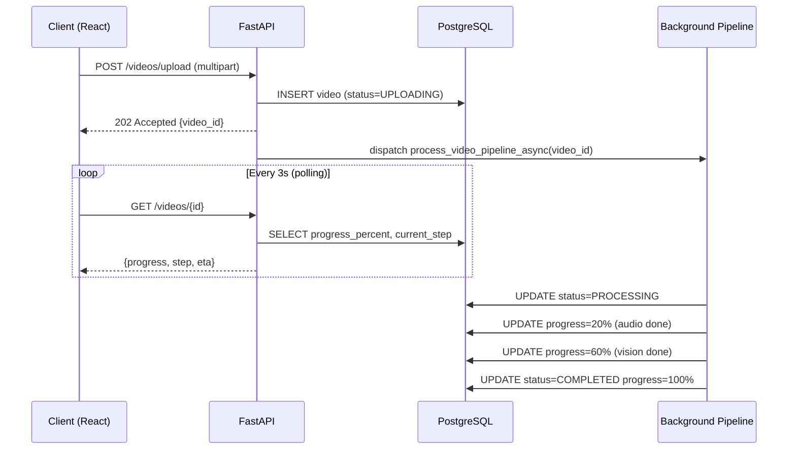

# System Architecture

EduScribe AI follows a modular, decoupled architecture where a high-speed asynchronous backend orchestrates heavy AI processing tasks in the background.

## 🏗️ High-Level Architecture Diagram


*Figure 1. EduScribe AI System Architecture.*

```mermaid
graph TD
    subgraph Client Layer
        UI[React 19 + Vite 8]
        Auth[Google OAuth2 Login]
        Virtual[@tanstack/react-virtual Transcript]
    end

    subgraph API Gateway
        API[FastAPI 0.110 + uvicorn/uvloop]
        CORS[CORS Middleware]
        Bearer[Bearer Auth - JWT]
        Static[StaticFiles /storage]
    end

    subgraph Background Workers
        BG[FastAPI BackgroundTasks]
        Pipe[Video Processing Pipeline]
        Sched[APScheduler Nightly Cleanup]
    end

    subgraph AI Engines
        Whisper[faster-whisper INT8 CPU]
        Scene[PySceneDetect ContentDetector]
        CV[OpenCV Frame Extractor]
        OCR[PaddleOCR + LRU Cache]
        Fuzz[RapidFuzz Matcher]
    end

    subgraph Data Layer
        DB[(PostgreSQL Pool size=10)]
        FS[Local Filesystem /storage/]
    end

    UI <-->|REST API| API
    UI <--> Auth
    API <-->|SQLAlchemy AsyncPG| DB
    API --> BG
    BG --> Pipe
    BG --> Sched

    Pipe --> Whisper
    Pipe --> Scene
    Pipe --> CV
    Pipe --> OCR
    Pipe --> Fuzz

    Pipe -->|Frames, Transcripts, Notes| FS
```

---

## Component Breakdown

### 1. The Client (Frontend)
The React 19 application handles user interaction. It authenticates via Google OAuth, allows file upload or YouTube URL submission, and polls the API every 3 seconds for progress updates (30s when idle).

**Transcript Explorer** uses `@tanstack/react-virtual` windowed rendering — only ~20–30 DOM nodes are rendered regardless of transcript length, preventing render lag on 10,000+ segment lectures.

### 2. The API (FastAPI)
Built on **FastAPI 0.110** with **uvicorn/uvloop** (C-based event loop, ~2x throughput vs. default asyncio). Provides RESTful endpoints for authentication, video management, frames, and notes. Stateless — all session info is in the JWT.

**Key middleware:**
- CORS configured for frontend origin.
- `HTTPBearer` auth scheme on all protected routes.
- `StaticFiles` mount at `/storage` for frame image serving.

### 3. Background Workers
**FastAPI BackgroundTasks** dispatch the video processing pipeline immediately after a video upload returns 202. The pipeline runs asynchronously without blocking the API for other requests.

**APScheduler** (`AsyncIOScheduler`) runs a nightly cron at 02:00 that cascades-deletes all videos whose `expires_at < now()` — cleaning transcript files, frame directories, notes, and DB records.

### 4. AI Engines

| Engine | Task | Implementation |
|---|---|---|
| faster-whisper | Speech-to-text | CTranslate2, INT8, VAD filter, auto-unload |
| PySceneDetect | Scene boundary detection | ContentDetector, 640px adaptive downscale |
| OpenCV | Frame extraction | Best-of-2 adaptive, blur pre-cached |
| PaddleOCR | Text from frames | Async lock, edge pre-filter, LRU cache |
| RapidFuzz | Frame↔transcript matching | token_set_ratio |

### 5. Data Layer

**PostgreSQL** (Neon serverless or local) with SQLAlchemy 2.0 AsyncPG driver.

**Connection pool:**
```python
create_async_engine(
    url,
    pool_size=10,       # Persistent connections
    max_overflow=20,    # Burst capacity
    pool_recycle=1800,  # Prevent Neon idle timeout (30 min)
)
```

**Indexes applied:**
```sql
CREATE INDEX idx_videos_user_id ON videos(user_id);
CREATE INDEX idx_transcripts_video_id ON transcripts(video_id);
```

**File Storage** on local filesystem. All frame paths stored as web-relative strings (`storage/frames/{video_id}/...`) for portable URL construction. `file_size_bytes` tracked in DB for O(1) storage aggregate queries.

---

## Request Lifecycle



---

## Storage Layout

| Path | Contents | Deleted When |
|---|---|---|
| `/storage/uploads/` | Original video files | After pipeline completes |
| `/storage/temp/` | Audio WAV files | In pipeline `finally` block |
| `/storage/transcripts/` | JSON + TXT transcripts | At `expires_at` (nightly cron) |
| `/storage/frames/{video_id}/` | Selected JPEG frames | At `expires_at` (nightly cron) |
| `/storage/outputs/{video_id}/` | Merged Markdown notes | At `expires_at` (nightly cron) |
