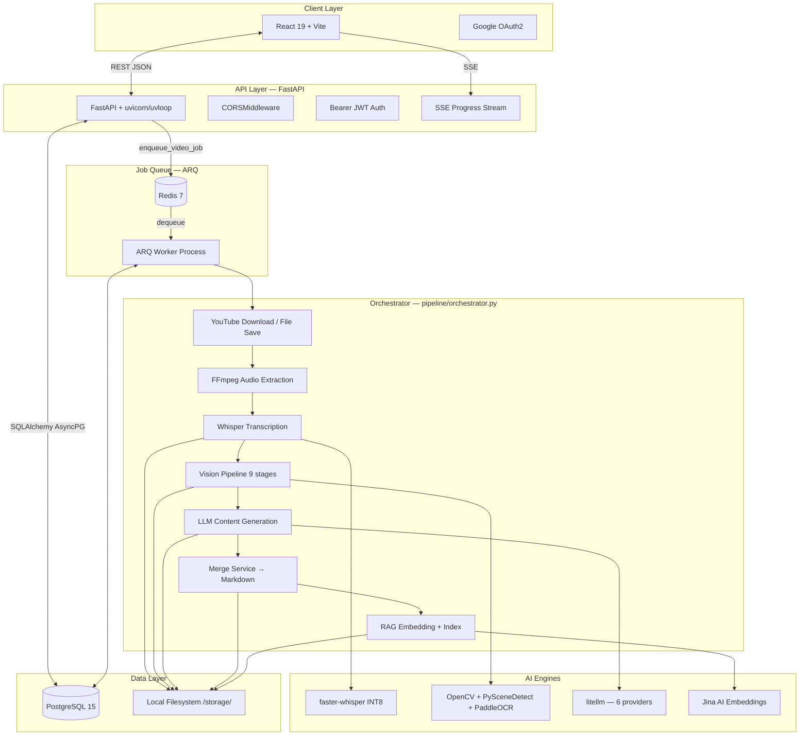
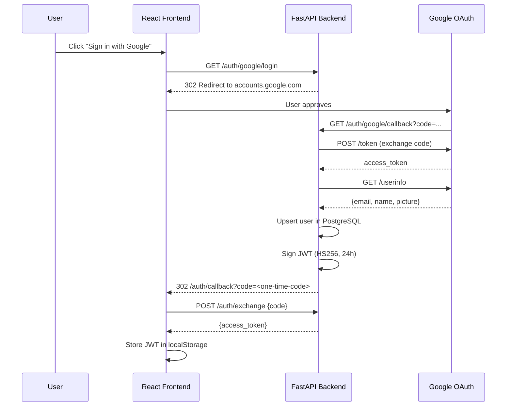

# System Architecture

EduScribe AI follows a layered, async-first architecture. Heavy AI workloads run in a separate ARQ worker process and never block the FastAPI server.

---

## Component Diagram



---

## Component Descriptions

### 1. Frontend (React 19 + Vite)

The SPA handles authentication, content ingestion, and workspace display.

| Route | Component | Purpose |
|---|---|---|
| `/login` | `Login.jsx` | Google OAuth2 "Sign in" button |
| `/auth/callback` | `AuthCallback.jsx` | Reads `?code=`, exchanges for JWT |
| `/dashboard` | `Dashboard.jsx` | Video library, upload modal, analytics |
| `/video/:id` | `ProjectWorkspace.jsx` | Transcript + frames + notes workspace |
| `/settings` | `Settings.jsx` | Account and retention settings |

**Virtual scrolling:** `@tanstack/react-virtual` renders only ~30 DOM nodes regardless of transcript length (handles 10,000+ segments without lag).

**Real-time progress:** `useProgressStream` hook connects to the SSE endpoint (`GET /videos/{id}/progress/stream`) for live pipeline status updates.

---

### 2. API Layer (FastAPI)

All routes are async. Each router module owns its domain:

| Module | Prefix | Responsibility |
|---|---|---|
| `auth.py` | `/auth` | Google OAuth login, JWT issuance, `/me` |
| `video.py` | `/videos` | Upload, YouTube ingest, list, delete, storage stats |
| `frames.py` | `/frames` | Keyframe retrieval, serving frame images |
| `notes.py` | `/notes` | Markdown notes retrieval, download, delete, search |
| `progress.py` | `/videos` | SSE progress stream |
| `admin.py` | `/admin` | Admin-only stats (requires `is_admin=True`) |

**Middleware:**
- `CORSMiddleware` — origins from `ALLOWED_ORIGINS` env var (not wildcard)
- Bearer token auth via `HTTPBearer` dependency on all protected routes
- Global exception handler — logs full traceback with `request_id`, returns generic 500

---

### 3. Job Queue (ARQ + Redis)

Background video processing runs in a **separate ARQ worker process**, completely decoupled from the API server.

```
POST /videos/youtube  →  enqueue_video_job(video_id)  →  Redis
                                                             ↓
                          arq worker.WorkerSettings   ←  dequeue
                                     ↓
                          process_video_job(ctx, video_id)
                                     ↓
                          process_video_pipeline_async(video_id)
```

**ARQ advantages over FastAPI BackgroundTasks:**
- Job persists in Redis across server restarts
- Automatic retry (attempts 1 → 30s → 5min → 30min → fail)
- Job deduplication (prevent double-processing)
- Worker health check via `arq` CLI

---

### 4. Orchestrator (`pipeline/orchestrator.py`)

The orchestrator runs the full pipeline in a single `async with AsyncSessionLocal()` context, calling `update_status()` between stages for SSE progress updates.

| Step | Action | Progress |
|---|---|---|
| 1 | YouTube download or file validation | 5% |
| 2 | FFmpeg audio extraction (WAV 16kHz) | 15% |
| 3 | Whisper transcription (or YouTube captions) | 35% |
| 4 | Vision pipeline (9 sub-stages) | 60% |
| 5 | LLM content generation (parallel phases) | 80% |
| 6 | Merge service → Markdown notes | 90% |
| 7 | RAG embedding + FAISS indexing | 95% |
| 8 | Mark COMPLETED | 100% |

---

### 5. Data Layer

**PostgreSQL 15** via SQLAlchemy 2 async (asyncpg driver). Connection pool: `pool_size=10, max_overflow=20, pool_recycle=1800`.

**File system** (`/storage/` relative to backend working directory):

| Path | Contents | Lifecycle |
|---|---|---|
| `uploads/` | Incoming video files | Deleted after pipeline completes |
| `temp/` | Audio WAV files | Deleted in pipeline `finally` block |
| `transcripts/` | JSON + TXT transcript files | Retained until `expires_at` |
| `frames/{video_id}/` | Selected JPEG keyframes | Retained until `expires_at` |
| `outputs/{video_id}/` | Merged Markdown notes | Retained until `expires_at` |
| `embeddings/{video_id}/` | RAG vector index | Retained until `expires_at` |

---

## OAuth2 + JWT Flow



---

## Nightly Cleanup

APScheduler (`AsyncIOScheduler`) runs at **02:00 UTC** each night. For every video where `expires_at < now()`:

1. Delete transcript file from disk
2. Delete video file from disk
3. Delete frames directory from disk
4. Delete `embeddings/` and `outputs/` directories
5. Delete OCR temp files
6. Delete DB record (cascades to transcripts, frames, scores, OCR results)

`misfire_grace_time=3600` — fires up to 1 hour late if the server was down at 02:00.
