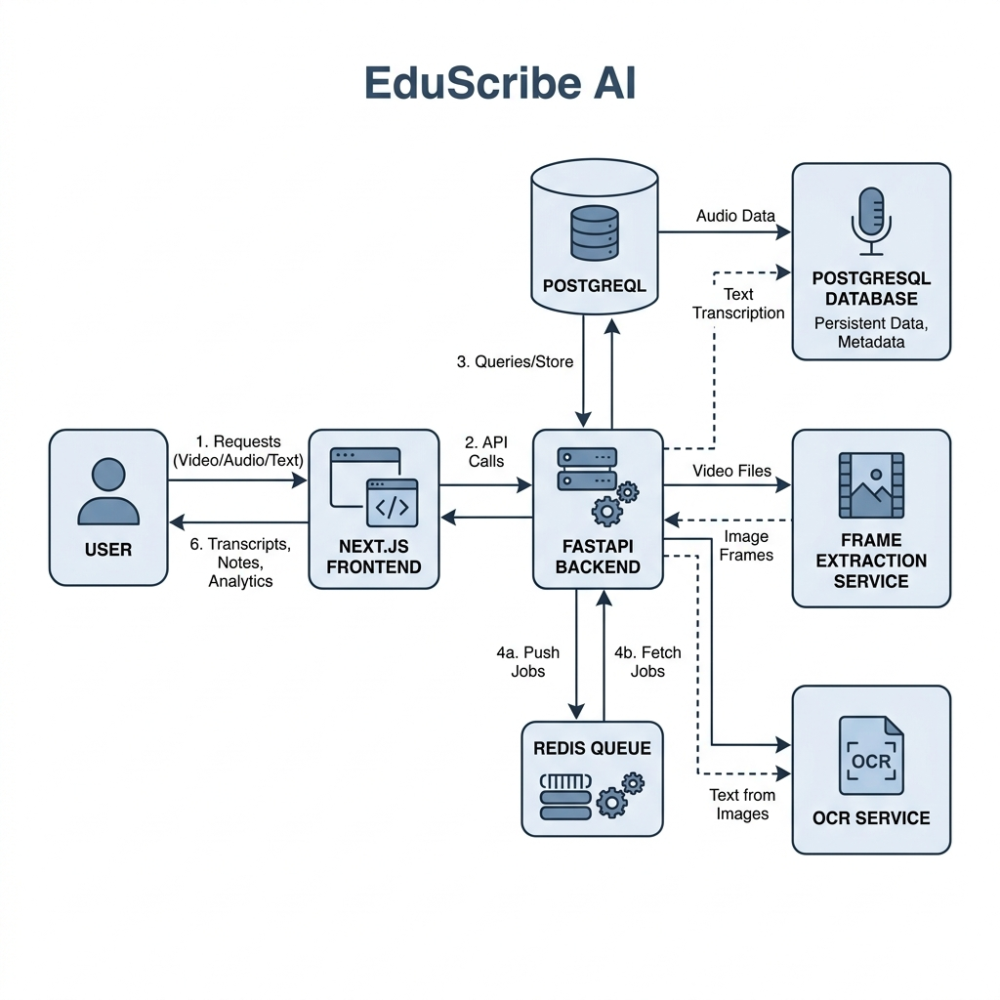
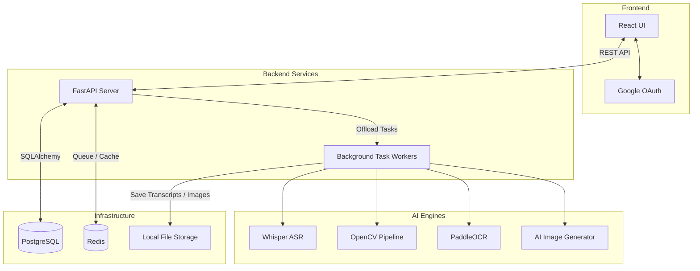

# System Architecture

EduScribe AI follows a modular, decoupled architecture where a high-speed asynchronous backend orchestrates heavy AI processing tasks in the background.

## 🏗️ High-Level Architecture Diagram

*Figure 1. EduScribe AI System Architecture.*

## Component Breakdown

### 1. The Client (Frontend)
The React application is responsible for user interaction. It securely authenticates users via Google OAuth, allowing them to upload local `.mp4` files or provide YouTube URLs. The client frequently polls the API to update the progress bars of background processing tasks.

### 2. The API (Backend)
Built on **FastAPI**, this service provides the RESTful interface. It runs asynchronously, meaning video uploads or long database queries do not block other users. When a video is submitted, the API immediately creates a database record, returns a `202 Accepted` status, and pushes the heavy processing to the Background Task Workers.

### 3. Background Workers
These workers execute the AI models without slowing down the web server. They are responsible for the end-to-end flow described in the [Processing Pipeline](Processing_Pipeline.md).

### 4. Infrastructure Layer
- **PostgreSQL**: Stores relational data (Users, Videos, Frame Metadata, Transcripts).
- **Redis**: Serves as a high-speed cache and queue for managing background worker state and rate limiting.
- **File Storage**: Raw videos, extracted JPEGs, and final generated PDF notes are stored locally in `/storage/`.
