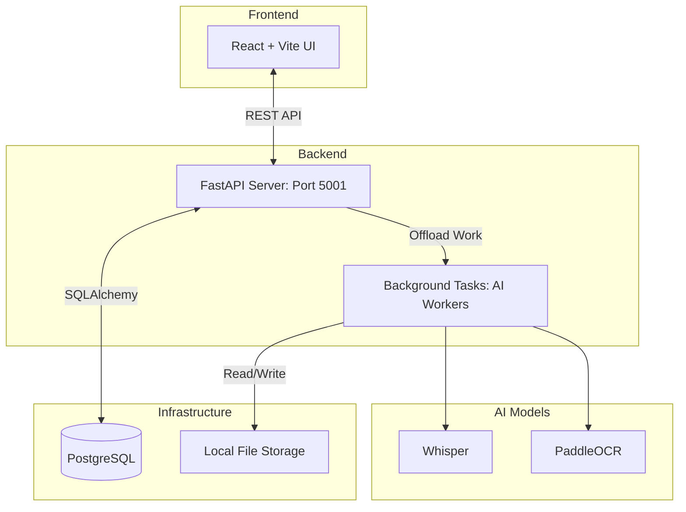

# Open Source Tech Stack & Libraries

EduScribe AI was built using a modern, scalable architecture composed of powerful open-source libraries. Below is a detailed breakdown of the tools that power the project.

## System Architecture Overview

## 🎨 Frontend (Client)
- **React 18**: The core UI framework, allowing for a reactive, component-based dashboard.
- **Vite**: A lightning-fast build tool and development server that replaces Webpack.
- **React Router (v6)**: Handles client-side navigation (Dashboard -> Workspace).
- **Lucide React**: Provides the clean, premium SVG iconography used throughout the interface.
- **Custom CSS**: Implements advanced web design principles like Glassmorphism (`backdrop-filter`) and dynamic CSS gradients for a premium feel.

## ⚙️ Backend (API & Processing)
- **FastAPI**: A modern, extremely fast Python web framework based on standard Python type hints. Chosen for its native asynchronous (`async`/`await`) support, which is critical for handling long-running AI tasks without blocking web requests.
- **Uvicorn**: An ASGI web server implementation for Python, powering FastAPI.
- **SQLAlchemy & Asyncpg**: The ORM used to interact with the PostgreSQL database asynchronously.
- **yt-dlp**: A highly advanced command-line audio/video downloader used to securely bypass YouTube's anti-bot protections.

## 🧠 Artificial Intelligence & Machine Learning
- **PyTorch**: The foundational tensor library used to run the deep learning models on the CPU/GPU.
- **OpenAI Whisper**: A pre-trained model for automatic speech recognition (ASR). It runs entirely locally, ensuring data privacy and zero API costs.
- **PaddleOCR**: An ultra-lightweight optical character recognition system developed by Baidu. Chosen over Tesseract for its superior accuracy on varied backgrounds (like presentation slides).
- **OpenCV (`opencv-python-headless`)**: The industry standard computer vision library, used for frame extraction, grayscale conversion, and Laplacian blur detection.
- **ImageHash**: Used for Perceptual Hashing (pHash) to detect duplicate frames by analyzing structural similarities rather than exact byte matches.

## 🐳 Infrastructure & Deployment
- **Docker & Docker Compose**: The entire application (Frontend, Backend, DB, Redis) is containerized. This ensures that massive system dependencies (like `ffmpeg` and `libgl1`) are automatically installed for the user, guaranteeing a "works on my machine" experience.
- **PostgreSQL**: The robust relational database used to store users, video metadata, and frame scores.
- **Redis**: An in-memory data structure store, capable of acting as a message broker for heavy task queues (like video processing).
