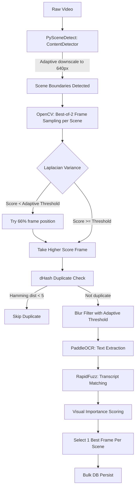

# Vision & Frame Extraction Pipeline

The core of EduScribe AI's visual intelligence is its multi-stage computer vision pipeline. It takes a dense video file and automatically distills it to semantically meaningful, sharp keyframes per scene — completely unattended.

## Architecture Flow



---

## Pipeline Stages

### 1. Scene Detection (PySceneDetect)

`ContentDetector` with threshold 27.0. Before detection, video frames are downscaled:

```python
downscale = frame_width // 640   # e.g. 3x for 1920px → 640px
```

This reduces data volume by 75–90%, cutting CPU usage by ~6x with no loss in boundary accuracy.

**Fallback:** If no scenes are detected (static screen recording), `generate_adaptive_fallback()` creates time-based segments every N seconds, preventing pipeline abort.

**Result caching:** Scenes are cached in-process. Repeated calls on the same video skip re-detection.

---

### 2. Frame Extraction (OpenCV, best-of-2 adaptive)

For each detected scene the extractor:
1. Seeks to the **midpoint** timestamp via `cv2.CAP_PROP_POS_MSEC`.
2. Resizes the frame to 320px width before blur scoring.
3. Computes Laplacian variance (sharpness score).
4. If score is below the adaptive blur threshold, seeks to **66%** of the scene duration and evaluates a second candidate.
5. Writes the **better** frame as JPEG quality 92.
6. Returns metadata including the pre-computed `blur_score`.

This adaptive sampling examines at most 2 frames per scene (vs. naive 5–10), reducing CPU decode cost by ~4x.

**Frame paths** are stored as **web-relative strings** (e.g., `storage/frames/{video_id}/scene_0001_12345.jpg`) so URLs work correctly across all deployments:

```python
web_relative_path = os.path.join("storage", "frames", video_id, filename)
```

Frontend constructs: `http://localhost:5001/${frame.frame_path}`

---

### 3. Duplicate Removal (dHash)

Uses `imagehash.dhash()` with Hamming distance threshold of 5.

**Why dHash over pHash?**  
dHash uses integer pixel gradient comparisons vs. pHash's Discrete Cosine Transform (floating-point matrix). dHash is 5–10x faster with equivalent accuracy for video frame deduplication.

**Two-stage algorithm:**

- **Stage 1 (Fast path):** Compare against last unique frame hash only — O(1).
- **Stage 2 (Global check):** Compare against a `deque(maxlen=50)` of recent unique hashes — O(50N) = O(N).

```python
# Optimized: deque caps memory and prevents O(N²) worst case
seen_hashes: deque = deque(maxlen=50)
```

Recurring slides cluster in time. Hashes older than 50 unique frames are not worth the quadratic search cost.

**Pillow `.draft()` optimization:**  
`img.draft("RGB", (32, 32))` tells libjpeg to decode at reduced resolution via DCT coefficient dropping — dramatically lowering I/O and decode overhead vs. `cv2.imread()`.

---

### 4. Blur Filtering (Adaptive Laplacian)

The Laplacian variance is computed on grayscale frames using **`cv2.CV_16S`** (16-bit signed int) rather than default CV_64F, reducing matrix memory by 4x and improving CPU cache efficiency.

**Adaptive threshold:**

```python
def adaptive_blur_threshold(frames):
    scores = [f["blur_score"] for f in frames if "blur_score" in f]
    median_score = statistics.median(scores)
    return max(BLUR_THRESHOLD, median_score * 0.5)
```

A single global threshold (e.g. 30.0) is too aggressive for low-contrast content like screen recordings or dark lecture slides. The adaptive threshold (`max(global_min, median * 0.5)`) adjusts to the video's inherent sharpness range.

**Score reuse:** The `blur_score` pre-computed during extraction is reused here — eliminating all disk I/O in this stage.

---

### 5. OCR Extraction (PaddleOCR)

PaddleOCR is lazy-loaded with a global asyncio lock preventing concurrent GPU inference.

**Pre-filter:** `has_meaningful_text()` runs an edge density check and skips ~40% of frames with no detectable text — saving GPU inference cost.

**Resize:** Frames >1280px wide are resized to 1280px before inference — reduces memory and inference time without impacting OCR accuracy on slide text.

**LRU cache:**
```python
from cachetools import LRUCache
_backend = LRUCache(maxsize=500)   # Replaces unbounded dict
```
Caps cache at ~500 frame results, preventing unbounded memory growth on long videos.

---

### 6. Transcript Matching (RapidFuzz)

`token_set_ratio` similarity scoring between OCR-extracted text and audio transcript segments. Each frame is linked to the transcript segment active at its timestamp, enabling synchronized text+visual output.

---

### 7. Frame Scoring & Selection (per-scene)

Each frame receives a `visual_importance_score` combining:
- Blur score (sharpness quality)
- Transcript similarity (semantic relevance)
- OCR line count (content richness)
- OCR confidence

**Critical fix — per-scene selection:**

```python
from itertools import groupby

# Sort by scene, then by score descending within each scene
scored_frames.sort(key=lambda x: (x["scene_number"], -x["visual_importance_score"]))

for scene_num, scene_iter in groupby(scored_frames, key=lambda x: x["scene_number"]):
    scene_frames = list(scene_iter)
    for i, frame in enumerate(scene_frames):
        if i < top_n:   # top_n applied per scene, not globally
            frame["is_selected"] = True
```

Before this fix, `top_n=1` selected 1 frame across ALL scenes. A 30-scene lecture showed 1 frame. Now it shows 30 frames (1 per scene).

---

### 8. Database Persistence (Bulk Insert)

Selected frames are bulk-inserted in a single transaction with no N+1 queries. Each record includes:

| Column | Description |
|---|---|
| `frame_path` | Web-relative path (e.g. `storage/frames/{id}/scene_0001.jpg`) |
| `timestamp_ms` | Frame timestamp in milliseconds |
| `scene_number` | Scene index from PySceneDetect |
| `blur_score` | Laplacian variance score |
| `is_selected` | True for best frame per scene |
| `visual_importance_score` | Composite ranking score |

---

### 9. File Cleanup

Unselected frames are physically deleted. Web-relative paths are resolved to absolute OS paths for filesystem operations:

```python
abs_path = os.path.join(settings.BASE_DIR, "backend", web_relative_path)
os.remove(abs_path)
```

---

## Performance Summary

| Stage | CPU Cost | Key Optimization |
|---|---|---|
| Scene Detection | Medium | 640px downscale (6x reduction) |
| Frame Extraction | Low | Best-of-2 sampling (4x less than naive) |
| Duplicate Removal | Very Low | dHash O(N), deque(maxlen=50) |
| Blur Filtering | Near Zero | Score reuse from extraction |
| OCR | High | Edge pre-filter skips 40%, LRU cache |
| Transcript Match | Very Low | token_set_ratio on pre-indexed segments |
| Scoring | Very Low | Pure Python in-memory |
| DB Persist | Low | Bulk insert, no N+1 |
