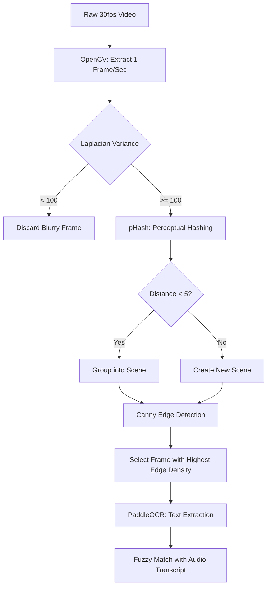

# Vision & Frame Extraction Pipeline

The core of EduScribe AI's visual intelligence is its multi-stage computer vision pipeline. It is designed to take a dense, 30fps video file and automatically distill it down to a handful of semantically meaningful, sharp slides or scenes, completely unattended.

## Architecture Flow

When a video finishes audio transcription, it is passed to the Vision Pipeline in a background task:

### 1. Frame Sampling (OpenCV)
Instead of analyzing every single frame (which would be 9,000 frames for a 5-minute video at 30fps), the system uses `cv2.VideoCapture` to sample exactly **1 frame per second**. This dramatically reduces the initial compute load while ensuring no meaningful slide transition is missed.

### 2. Blur Detection (Laplacian Variance)
To ensure the OCR model can accurately read the text on the screen, the system calculates the **Variance of the Laplacian** for each sampled frame. 
- The Laplacian operator measures the 2nd derivative of the image (highlighting edges).
- If the variance falls below a strict threshold (e.g., `< 100`), the frame is deemed blurry (likely a transition or crossfade) and is instantly discarded.

### 3. Duplicate Scene Detection (Perceptual Hashing)
To prevent the dashboard from being cluttered with 60 identical frames of the same presentation slide, the pipeline uses **pHash (Perceptual Hashing)** via the Python `ImageHash` library.
- The system generates a 64-bit hash for each frame.
- It calculates the Hamming distance between consecutive hashes.
- If the distance is `< 5`, the frames are grouped into the same "Scene".

### 4. Visual Importance Scoring
Once frames are grouped into scenes, the system must pick the best "representative" frame for that scene. It runs a **Canny Edge Detector** to calculate the edge density of each frame in the scene. The frame with the highest edge density (the most text/diagrams) is crowned the "Top Pick".

### 5. Optical Character Recognition (PaddleOCR)
The winning frame from each scene is passed to **PaddleOCR**, a highly accurate, lightweight OCR engine. 
- It uses a custom-trained detection and recognition model.
- It extracts bounding boxes and text strings, concatenating them into a `clean_text` payload.

### 6. Semantic Transcript Matching
Finally, the extracted text from the image is fuzzy-matched against the Whisper audio transcript segments to establish exactly *when* the speaker was talking about the contents of that slide, enabling synchronized viewing.
